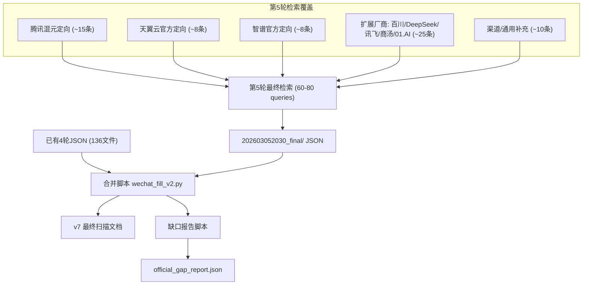

## 用户需求

一次性全面完成 OpenClaw 中国厂商布局微信公众号文章全量扫描，产出交付一个完整的最终版本（v7），不再小步迭代。

## 产品概述

基于已有4轮检索批次（136个JSON），进行第5轮（最终轮）全面补齐检索，覆盖所有已知缺口，然后将5轮数据合并生成最终版扫描文档。

## 核心功能

1. **补齐严重缺口厂商**：腾讯混元（仅10条/官方0）、天翼云（官方仅4）、智谱（官方仅2）的定向官方号检索
2. **新增扩展厂商覆盖**：百川、DeepSeek、科大讯飞（星火）、商汤（日日新）、01.AI（Yi）等此前完全未覆盖的厂商
3. **扩充渠道/通用检索**：补充 OpenClaw 生态横向对比类文章
4. **更新生成脚本**：扩充官方白名单、厂商前缀映射、厂商排序，加入第5轮JSON目录
5. **一次性生成最终版 v7 文档**：合并全部5轮检索数据，按"官方优先+去重"策略输出完整扫描文档
6. **生成最终缺口报告**：验证各厂商官方覆盖率提升情况

## 技术栈

- 检索工具：Node.js `search_wechat.js`（搜狗微信搜索）
- 数据处理/合并：Python3 脚本 `wechat_fill_v2.py` + `wechat_official_gap.py`
- 输出格式：Markdown 文档

## 实现方案

**整体策略**：编写一份完整的最终轮 queries 文件（约60-80条查询），一次性批量检索落盘到新目录 `202603052030_final/`，然后更新生成脚本的所有配置（JSON_DIRS/OFFICIAL_SOURCES/VENDOR_PREFIX/ORDER/OUT_PATH），最后一次运行生成 v7 文档和最终缺口报告。

**关键技术决策**：

1. 最终轮 queries 聚焦"官方号名称 + 产品关键词"组合，优先补齐官方覆盖率最低的厂商
2. 新增厂商（百川/DeepSeek/讯飞/商汤/01.AI）使用独立的文件名前缀（`baichuan_`/`deepseek_`/`iflytek_`/`sensetime_`/`01ai_`），便于自动归类
3. 扩充 OFFICIAL_SOURCES 白名单：腾讯混元加入"腾讯混元大模型"等、天翼云加入"电信风尚"/"长沙电信天翼文化"等电信体系号、智谱加入"GLM大模型"等
4. OUT_PATH 直接指向最终版 `OpenClaw-中国厂商布局全量扫描-202603052030-v7.md`

## 实施注意事项

- 检索命令使用 `-n 30 -r` 参数（30条结果 + 解析真实URL），每条 query 间 sleep 1 秒避免限流
- 查询词不超过 shell 管道单行长度限制，按批次分组执行
- 生成脚本修改需一次性完成所有配置项（OUT_PATH/JSON_DIRS/OFFICIAL_SOURCES/VENDOR_PREFIX/ORDER），避免反复 replace 失效
- 最终文档生成后需用 `wc -l` 和 `ls -la` 验证文件确实写出

## 架构设计



## 目录结构

```
workflows/
├── wechat_articles/
│   ├── 202603051717/               # 第1轮 (已有)
│   ├── 202603051902_official/      # 第2轮 (已有)
│   ├── 202603051931_matrix/        # 第3轮 (已有)
│   ├── 202603051958_matrix2/       # 第4轮 (已有)
│   └── 202603052030_final/         # [NEW] 第5轮最终检索
│       ├── queries_final_full.txt  # [NEW] 最终轮完整queries文件
│       ├── hunyuan_*.json          # [NEW] 腾讯混元定向结果
│       ├── ctyun_*.json            # [NEW] 天翼云定向结果
│       ├── zhipu_*.json            # [NEW] 智谱定向结果
│       ├── baichuan_*.json         # [NEW] 百川检索结果
│       ├── deepseek_*.json         # [NEW] DeepSeek检索结果
│       ├── iflytek_*.json          # [NEW] 科大讯飞检索结果
│       ├── sensetime_*.json        # [NEW] 商汤检索结果
│       ├── 01ai_*.json             # [NEW] 01.AI检索结果
│       ├── channel_*.json          # [NEW] 渠道/通用补充结果
│       └── official_gap_report.json # [NEW] 最终缺口报告
├── openclaw_research_data/
│   ├── wechat_fill_v2.py           # [MODIFY] 更新OUT_PATH/JSON_DIRS/OFFICIAL_SOURCES/VENDOR_PREFIX/ORDER
│   └── wechat_official_gap.py      # (已有，无需修改)
OpenclawAIco/
└── OpenClaw-中国厂商布局全量扫描-202603052030-v7.md  # [NEW] 最终版扫描文档
```

## Agent Extensions

### Skill

- **wechat-article-search**
- 用途：执行第5轮最终检索，批量搜索各厂商定向公众号文章
- 预期结果：产出60-80个JSON文件到 `202603052030_final/` 目录

### SubAgent

- **code-explorer**
- 用途：在修改 `wechat_fill_v2.py` 前确认当前脚本的完整结构（render_md函数、去重逻辑等），确保一次性修改不遗漏
- 预期结果：获取脚本完整结构信息，支撑一次性准确修改