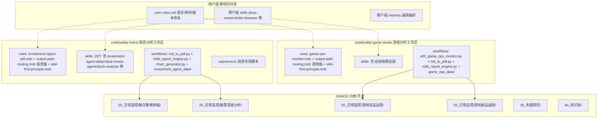

## 用户需求

将当前 `/Users/zewujiang/Desktop/AICo/codebuddy-invest/` 项目中的"游戏分析"相关内容，完整迁移到一个独立的新项目 `/Users/zewujiang/Desktop/AICo/codebuddy-game-studio/`，实现投资分析与游戏分析的彻底隔离。

## 产品概述

采用"方案三"：在 `AICo/` 下新建独立的 `codebuddy-game-studio/` 项目目录，拥有自己独立的 `.codebuddy/`（规则、Skills、记忆、配置），与 `codebuddy-invest/` 项目完全解耦。用户级配置（语言、称呼等）自动跨项目共享，无需重复配置。

## 核心工作内容

1. **新建 codebuddy-game-studio 项目结构**：创建完整的 `.codebuddy/` 配置目录（rules/skills/memory/settings）和 `workflows/` 工作目录
2. **迁移游戏相关文件**：将游戏规则（`game-ops-monitor.mdc`）、游戏工作流脚本（`wf5_game_ops_monitor.py`）、游戏数据（`game_ops_data/` 整个目录含4款游戏数据和26张图片）迁移到新项目
3. **复制共用工具**：将 `md_to_pdf.py` 和 `mbb_report_engine.py` 复制到新项目的 workflows 目录
4. **拆分混合规则**：将 `output-path-routing.mdc` 拆分为投资版（保留在 codebuddy-invest）和游戏版（放入 codebuddy-game-studio）
5. **清理 codebuddy-invest 项目**：删除已迁移的游戏文件，更新 `MEMORY.md` 移除游戏相关引用
6. **初始化 codebuddy-game-studio 记忆**：创建 `MEMORY.md` 和首条工作日志，记录迁移事实
7. **创建项目说明文件**：在 codebuddy-game-studio 根目录创建 `README.md`，说明项目定位和使用方式

## 技术栈

- 操作系统命令：`mkdir -p`、`cp -r`、`mv`、`rm -rf` 用于目录创建、文件复制/移动/删除
- 文件格式：Markdown（`.md`、`.mdc`）、JSON、Python 脚本
- 无需安装任何新依赖，所有工具链（Python3、weasyprint、reportlab 等）已在系统中就绪

## 实施策略

采用"先建后迁再清"的三阶段策略：

1. **第一阶段 — 构建**：在 `AICo/codebuddy-game-studio/` 下创建完整的目录骨架和配置文件，确保新项目能独立运行
2. **第二阶段 — 迁移**：将游戏相关的数据、脚本、规则从 codebuddy-invest 复制（非移动）到 codebuddy-game-studio，先复制后验证
3. **第三阶段 — 清理**：验证 codebuddy-game-studio 结构完整后，从 codebuddy-invest 中删除已迁移的游戏文件，更新 codebuddy-invest 的规则和记忆

关键技术决策：

- **复制而非移动**：第二阶段使用 `cp` 而非 `mv`，避免操作中途失败导致文件丢失。验证完整后在第三阶段统一删除源文件
- **保持相对路径结构**：`wf5_game_ops_monitor.py` 内部使用 `SCRIPT_DIR` 和 `os.path.join` 做相对路径定位，只要保持 `workflows/game_ops_data/` 的同级目录结构，脚本无需修改任何代码
- **规则拆分而非共享**：`output-path-routing.mdc` 按领域拆分为两个独立版本，各自只包含本项目相关的路由，减少上下文噪音和 token 消耗

## 实施注意事项

### 路径安全

- `game-ops-monitor.mdc` 中所有路径引用（如 `workflows/game_ops_data/game_registry.json`）均为相对路径，在 codebuddy-game-studio 中保持相同目录结构即可，无需修改
- `investment-report-pdf.mdc` 中的绝对路径 `/Users/zewujiang/Desktop/AICo/codebuddy-invest/workflows` 是投资专用，留在 codebuddy-invest 不动
- 两个项目的 OrbitOS 归档输出路径完全不变

### 向后兼容

- codebuddy-invest 项目中投资相关的所有功能（每日策略简报、股票深度分析、chart_generator.py 等）完全不受影响
- codebuddy-game-studio 中 `game-ops-monitor.mdc` 的触发关键词和执行流程保持不变，用户在新工作区中仍可用"超自然行动组 监控周报"一句指令触发

### 配置继承

- 用户级 `user-rules.md`（语言、称呼、版本命名）自动跨项目生效，无需在 game-studio 中重复配置
- 用户级 skills（deep-research、dev-browser 等）自动继承，无需重新安装
- 项目级 skills 如后续需要（如 game-analysis 等），可在 codebuddy-game-studio 中独立安装

## 架构设计

迁移后的两个项目架构关系：



## 目录结构

```
/Users/zewujiang/Desktop/AICo/codebuddy-game-studio/          # [NEW] 游戏分析独立工作区根目录
├── .codebuddy/                                      # [NEW] 项目级配置目录
│   ├── rules/                                       # [NEW] 游戏项目专用规则
│   │   ├── game-ops-monitor.mdc                     # [NEW] 从 codebuddy 迁移，游戏竞品运营监控自动执行规则，内容不变
│   │   ├── output-path-routing.mdc                  # [NEW] 拆分自 codebuddy 版本，仅保留游戏相关路由（游戏竞品运营/游戏新品追踪/游戏行业同步/AI+游戏前沿动态/游戏产品）
│   │   └── skill-first-principle.mdc                # [NEW] 从 codebuddy 复制，Skill优先原则通用规则，内容不变
│   ├── skills/                                      # [NEW] 空目录，后续按需安装游戏相关 skills
│   ├── memory/                                      # [NEW] 项目级每日工作日志
│   │   └── 2026-03-16.md                            # [NEW] 首条日志，记录项目创建和迁移事实
│   ├── MEMORY.md                                    # [NEW] 长期记忆，记录游戏项目的文件存放规则、归档路径、用户偏好
│   └── settings.local.json                          # [NEW] 从 codebuddy 复制，启用相同的三个插件
├── workflows/                                       # [NEW] 游戏工作流脚本和数据
│   ├── wf5_game_ops_monitor.py                      # [NEW] 从 codebuddy 迁移，游戏竞品运营监控报告生成主脚本（447行），无需修改代码
│   ├── game_ops_report_guide.md                     # [NEW] 从 codebuddy 迁移，游戏竞品运营使用说明文档
│   ├── md_to_pdf.py                                 # [NEW] 从 codebuddy 复制，MD转PDF通用工具（514行）
│   ├── mbb_report_engine.py                         # [NEW] 从 codebuddy 复制，MBB风格PDF渲染引擎（501行）
│   └── game_ops_data/                               # [NEW] 从 codebuddy 整体迁移，游戏监控数据目录
│       ├── game_registry.json                       # 4款已注册游戏的信息源配置
│       ├── template.json                            # 周报数据JSON标准模板v2.0
│       ├── 超自然行动组/                              # week_08_2026.json + images/(3张图片)
│       ├── 三角洲行动/                                # week_08_2026.json + images/(8张图片)
│       ├── 无畏契约/                                  # week_08_2026.json + images/(9张图片)
│       └── 无畏契约手游/                              # week_08_2026.json + images/(6张图片)
└── README.md                                        # [NEW] 项目说明文档，描述项目定位、目录结构、使用方式

/Users/zewujiang/Desktop/AICo/codebuddy-invest/             # 投资分析工作区（已有，需修改部分文件）
├── .codebuddy/
│   ├── rules/
│   │   ├── investment-report-pdf.mdc                # [保留] 不变
│   │   ├── output-path-routing.mdc                  # [MODIFY] 移除游戏相关路由，仅保留投资+通用路由
│   │   └── skill-first-principle.mdc                # [保留] 不变
│   │   （game-ops-monitor.mdc 已删除）
│   ├── MEMORY.md                                    # [MODIFY] 移除游戏竞品运营归档路径引用，新增说明游戏分析已迁移到 game-studio
│   └── memory/
│       └── 2026-03-16.md                            # [MODIFY] 追加迁移记录
├── workflows/                                       # 移除游戏文件后的状态
│   ├── md_to_pdf.py                                 # [保留] 投资报告仍需使用
│   ├── mbb_report_engine.py                         # [保留] 投资报告仍需使用
│   ├── chart_generator.py                           # [保留] 投资专用
│   ├── investment_agent_data/                       # [保留] 投资数据
│   │   （game_ops_data/ 已删除）
│   │   （wf5_game_ops_monitor.py 已删除）
│   │   （game_ops_report_guide.md 已删除）
│   └── ...                                          # OpenClaw相关文件保留
└── ...                                              # 其余文件不变
```

## Agent Extensions

### SubAgent

- **code-explorer**
- 用途：在迁移前后验证文件结构完整性，确认游戏相关文件已全部从 codebuddy-invest 清除、codebuddy-game-studio 结构完整
- 预期结果：输出两个项目的文件清单对比，确认无遗漏无残留

### Skill

- **skill-creator**
- 用途：如果后续需要在 codebuddy-game-studio 中创建游戏分析专属 skill（如将 game-ops-monitor 从 rule 升级为标准 skill），可使用此 skill 指导创建
- 预期结果：按照 CodeBuddy Skill 标准格式创建游戏分析 skill