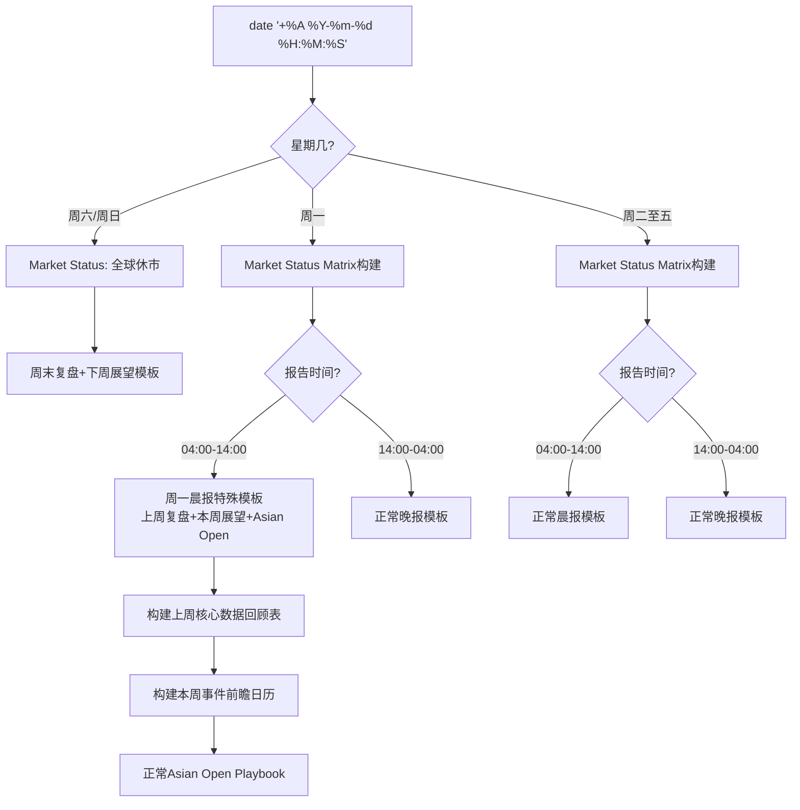

## 用户需求

修复投资Agent每日策略报告工作流中"全球市场开盘时间感知不足"的系统性缺陷，升级`investment-agent-daily.mdc`规则文件至v15.8。

## 产品概述

当前v15.7版本的铁律66仅做了"周末/工作日"的二元判断，缺少对全球各资本市场精确开盘/收盘时间的矩阵式感知。导致：(1) 周六晨报虽标注了"今日休市"但仍缺乏系统性市场状态表；(2) 没有"周一特殊模板"概念（周一晨报应包含上周复盘+本周展望+当日开盘推演三合一）；(3) 生成报告前没有构建完整的全球市场状态表（Market Status Matrix），无法精确判定各市场"已收盘/交易中/尚未开盘/休市"状态。

## 核心功能

1. **全球主要资本市场开盘/收盘时间矩阵（北京时间）**：覆盖A股/港股/日股/韩股/欧股/美股/加密货币7大市场的精确交易时间，含冬令时/夏令时切换说明
2. **报告类型决策矩阵**：基于"当天星期几 + 报告生成时间 + 市场状态"的组合，自动匹配5种报告模板（周六/日晨报、周一晨报、周二至五晨报、周一至五晚报、节假日特殊）
3. **周一晨报特殊模板框架**：包含"上周市场复盘"小节（SPX/VIX/10Y等核心指标周度涨跌、上周核心事件时间线）+"本周展望"小节（关键事件前瞻日历、本周核心矛盾预判）+ 当日亚太开盘推演（Asian Open Playbook）
4. **第零阶段升级：全球市场状态表（Market Status Matrix）构建**：报告生成前必须构建完整的7大市场状态表（确认星期几、排除节假日、确认各市场当前状态），基于状态表决定报告模板类型和内容边界
5. **新增铁律68（全球市场状态感知铁律）**：将v15.7铁律66的二元判断升级为全市场状态矩阵驱动，强制要求报告生成前构建Market Status Matrix
6. **晨报/晚报差异化撰写指引新增周一晨报特殊要求**：在现有周二至五晨报/晚报差异化表之外，新增周一晨报差异化要点表
7. **致命错误清单新增第9项**：周一晨报缺失上周复盘/本周展望模块
8. **周末/节假日报告框架调整规则表扩展**：新增"周一晨报"行，明确与正常工作日晨报、周末晨报的区别

## 技术栈

- 目标文件: `/Users/zewujiang/Desktop/AICo/codebuddy-invest/.codebuddy/rules/investment-agent-daily.mdc`（Markdown规则文件，当前1541行）
- 修改性质: 纯文本规则文件的结构化内容升级，无代码逻辑变更

## 实现方案

### 整体策略

在现有v15.7规则基础上进行**增量式升级**至v15.8，保持所有v15.7及之前的规则不变。核心思路是将铁律66的"周末/工作日"二元判断升级为"全球市场状态矩阵"驱动的多维度判断体系，并新增"周一晨报"特殊模板。

### 关键技术决策

1. **新增铁律68而非修改铁律66**：铁律66（v15.7）已经在多处被引用（第158行、第543行、第1455行等），为避免引用断裂，保留铁律66作为基础交易日检测，新增铁律68作为"全球市场状态感知"的增强层，铁律68在铁律66的基础上进一步要求构建完整的Market Status Matrix
2. **报告类型决策矩阵采用5种模板**：周六/日晨报（复盘+下周展望）、周一晨报（上周复盘+本周展望+当日开盘推演）、周二至五晨报（正常美股复盘+亚太推演）、周一至五晚报（正常亚太欧复盘+美股推演）、节假日特殊（搜索确认后决定）
3. **第零阶段扩展而非重写**：在现有第零阶段（第528-556行）的bash脚本和交易日判断表之后，追加Market Status Matrix构建步骤和报告模板选择逻辑

## 实现细节

### 修改点清单（7处精确位置）

**修改点A**: 第9行版本号 + 第27行版本更新说明

- `v15.6` → `v15.8`（标题行）
- 第27行前插入v15.8版本更新说明block

**修改点B**: 第143行致命错误清单

- 在第143行（第8项致命错误）之后追加第9项

**修改点C**: 第157-181行 铁律66区域

- 第165-173行的"周末/节假日报告框架调整规则"表扩展新增"周一晨报"行
- 第181行之后新增铁律68完整定义（全球市场状态感知铁律）

**修改点D**: 第528-556行 第零阶段

- 第547行交易日判断逻辑表扩展（新增"周一"独立行）
- 第556行之后追加：全球资本市场开盘/收盘时间矩阵 + Market Status Matrix构建步骤 + 报告模板选择逻辑决策树

**修改点E**: 第666-696行 晨报/晚报差异化撰写指引

- 第681行之后（晨报差异化要点表结束位置）新增"周一晨报特殊差异化要点"子节，含周一专属模板框架

**修改点F**: 第254行 核心原则铁律计数

- `49条铁律` → `50条铁律`（新增铁律68）

**修改点G**: 第1455-1461行 铁律53(v15.7)详细定义

- 在第1461行之后追加铁律68的详细定义（与修改点C的简要版对应的完整展开版）

### 架构设计

升级后的报告生成决策流程：



### 核心数据结构：全球市场状态表（Market Status Matrix）

报告生成前必须输出的状态表模板：

| 市场 | 交易日 | 开盘BJT | 收盘BJT | 当前状态 | 备注 |
| --- | --- | --- | --- | --- | --- |
| A股 | 周一-周五 | 09:30 | 15:00 | [已收盘/交易中/尚未开盘/休市] | 含中国法定假日 |
| 港股 | 周一-周五 | 09:30 | 16:00 | ... | 含香港公众假期 |
| 日股 | 周一-周五 | 08:00 | 14:00 | ... | 含日本假日 |
| 韩股 | 周一-周五 | 08:00 | 14:30 | ... | 含韩国假日 |
| 欧股 | 周一-周五 | 16:00(冬)/15:00(夏) | 00:30(冬)/00:00(夏) | ... | 3月最后周日-10月最后周日为夏令时 |
| 美股 | 周一-周五 | 21:30(冬)/20:30(夏) | 04:00(冬)/03:00(夏) | ... | 3月第二周日-11月第一周日为夏令时 |
| 加密 | 7x24 | 全天 | 全天 | 交易中 | 无休市 |


### 报告模板选择决策表

| 当日 | 报告时间 | 模板类型 | 核心内容 |
| --- | --- | --- | --- |
| 周六/日 | 任意 | 周末复盘+下周展望 | 上周复盘+下周事件前瞻，无任何开盘推演 |
| 周一 | 04:00-14:00 | 周一晨报（特殊） | 上周整体复盘+本周展望+当日亚太开盘推演 |
| 周一 | 14:00-04:00 | 正常晚报 | 亚太欧复盘+美股开盘推演 |
| 周二-五 | 04:00-14:00 | 正常晨报 | 美股收盘复盘+亚太开盘推演 |
| 周二-五 | 14:00-04:00 | 正常晚报 | 亚太欧复盘+美股开盘推演 |
| 节假日 | 任意 | 搜索确认后决定 | 根据具体休市安排定制 |


### 周一晨报特殊模板框架

- 1.1 上周市场核心回顾（SPX/VIX/10Y/DXY/Gold/BTC周度涨跌汇总表 + 上周核心事件时间线）
- 1.2 本周关键事件前瞻（日历表：日期/事件/预期影响/交易策略）
- 1.3 本周核心矛盾预判（从上周数据+本周日历推导本周主线矛盾）
- 1.4 Asian Open Playbook（正常三锚，但基于上周五而非昨夜数据）

## 目录结构

```
.codebuddy/rules/
└── investment-agent-daily.mdc  # [MODIFY] 投资Agent每日策略报告工作流规则文件。
                                 # 从v15.7升级至v15.8，新增全球市场状态感知机制、
                                 # 报告类型决策矩阵、周一晨报特殊模板、铁律68。
                                 # 修改7处：版本号/致命错误/铁律66扩展+铁律68/
                                 # 第零阶段/晨报撰写指引/铁律计数/铁律详细定义。
```

## Agent Extensions

### SubAgent

- **code-explorer**
- 用途: 在修改规则文件前，系统性搜索文件中所有引用"铁律66""周末""交易日""开盘"等关键词的位置，确保升级不遗漏任何引用点
- 预期产出: 完整的引用位置清单，确保所有相关位置同步更新

### Skill

- **deep-research**
- 用途: 在编写全球市场开盘/收盘时间矩阵时，验证各市场的精确交易时间、夏令时/冬令时切换日期、2026年主要节假日安排
- 预期产出: 经过验证的精确市场交易时间矩阵数据