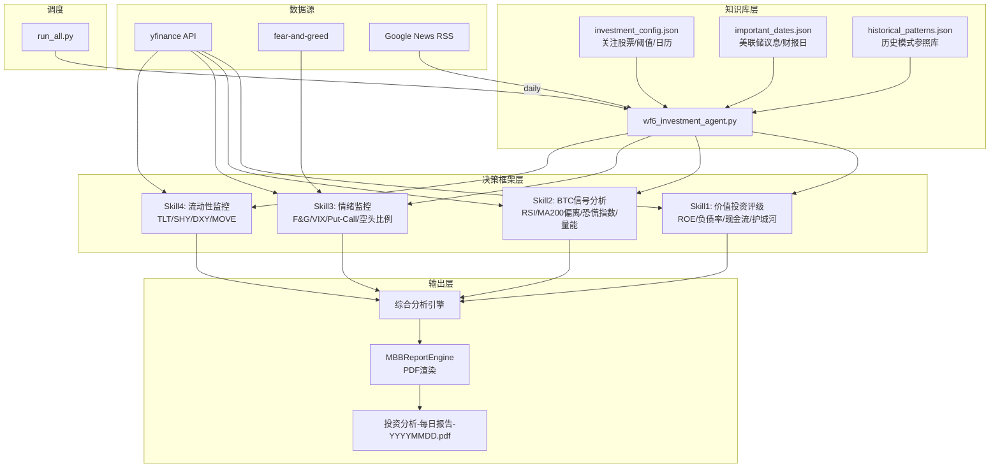

## 用户需求

基于 xingpt 文章中"投资Agent"部分的方法论，构建一个投资Agent工作流，产出每日投资分析结论和预测报告（PDF格式）。

## 产品概述

投资Agent是一个每日自动化运行的投资分析工作流（wf6），采用三层架构：知识库层（历史数据、重要指标、个人经验）、决策框架层（4大Skill分析引擎）、自动化执行层（定时调度+PDF报告）。最终产出为一份MBB咨询风格的投资分析报告，包含Overnight市场摘要、四维决策分析结果和每日预测与操作建议。

## 核心功能

1. **Overnight市场摘要**：美股隔夜表现、全球央行动态、原油/黄金/BTC行情、今日重点事件一览
2. **Skill 1 - 美股价值投资评级**：基于财报数据（ROE、负债率、自由现金流、护城河），对持仓和关注股票输出A/B/C/D投资评级
3. **Skill 2 - BTC抄底信号**：基于RSI周线、MVRV、恐慌指数、成交量萎缩、矿机关机价等指标，输出抄底信号等级
4. **Skill 3 - 市场情绪监控**：基于恐惧贪婪指数、VIX结构、Put/Call比率、机构配置等维度，输出情绪评级和仓位建议
5. **Skill 4 - 宏观流动性监控**：追踪美联储资产负债表、TGA账户、SOFR利率、MOVE指数等，输出流动性预警
6. **综合决策与预测**：汇总四大Skill结果，生成今日操作建议（加仓/减仓/持有）、关键事件提醒、风险预警
7. **投资知识库配置**：JSON配置文件管理重要日期（美联储议息日、财报日）、关注股票列表、历史模式库、指标阈值

## 技术栈

- **语言**：Python 3.10+
- **数据采集**：yfinance（股票/ETF/BTC行情、财报数据）、feedparser（Google News RSS）、fear-and-greed（恐惧贪婪指数）
- **数据分析**：pandas、numpy
- **PDF报告**：复用现有 `mbb_report_engine.py`（ReportLab渲染引擎，支持Header/Section/InsightCard/InfoCard/Timeline/Actions组件）
- **配置管理**：JSON知识库
- **包管理**：uv（与现有工作流一致）
- **调度**：集成到 `run_all.py` 统一调度系统

## 实现方案

### 整体策略

采用与现有wf1-wf5完全一致的工作流模式：一个主Python文件 `wf6_investment_agent.py` + 一个配置数据目录 `investment_agent_data/`。主文件实现4个分析Skill函数，每个Skill通过yfinance实时采集数据并执行规则引擎判断，最终汇总所有Skill结果生成MBB风格PDF报告。

复用现有 `analyze_stock.py` 中的成熟模式：yfinance数据采集含retry机制、RSI/MA等技术指标计算、市场上下文分析（VIX/SPY/QQQ）、恐惧贪婪指数获取、情绪分析5子指标并行获取。不直接import该脚本（避免依赖复杂），而是在wf6中按相同模式实现精简版本。

### 关键技术决策

1. **规则引擎而非ML模型**：文章方法论是明确的阈值规则（ROE>15%、RSI<30、MVRV<1.0等），使用确定性规则引擎比ML更可靠、可解释、可调试
2. **yfinance统一数据源**：项目已广泛使用yfinance（stock-analysis、financial-analysis-agent均依赖），BTC数据通过BTC-USD ticker获取，VIX通过^VIX获取，国债通过TLT/SHY获取——无需引入新数据源
3. **JSON知识库而非数据库**：与game_ops_data的JSON模式一致，配置文件包含关注股票列表、阈值参数、重要日期日历、历史模式参照库
4. **Overnight数据用隔夜收盘价**：美股收盘后（北京时间早上）运行，获取前一交易日完整数据
5. **BTC链上指标（MVRV等）的降级处理**：yfinance无法提供MVRV/LTH供应占比等链上数据，采用可获取的替代指标（RSI周线、成交量变化率、恐惧贪婪指数、与MA200偏离度）作为BTC信号的判断依据，在报告中注明数据来源限制

### 性能与可靠性

- yfinance请求采用指数退避重试（max 3次），与analyze_stock.py模式一致
- 多股票数据采集采用批量下载（`yf.download(tickers_list)`）减少API调用
- 单个Skill失败不阻塞其他Skill，采用try/except隔离，报告中标注"数据获取失败"
- 总体执行时间预估：30-60秒（10-15只股票 + 市场指数 + BTC）

## 实现笔记

### 数据采集注意点

- yfinance在非交易时段返回的是最近交易日数据，无需特殊处理交易日判断
- BTC-USD是7x24交易，始终有最新数据
- Fear & Greed Index通过 `fear_and_greed` 包获取（analyze_stock.py已验证可用）
- VIX term structure通过 `^VIX` 和 `^VIX9D` 获取（现有代码模式）

### 报告引擎复用

- 完全复用 `MBBReportEngine` 的 `draw_header`, `draw_section_title`, `draw_insight_card`, `draw_info_card`, `draw_timeline`, `draw_actions`, `draw_footer` 方法
- 新增 `draw_rating_card` 方法到wf6中（本地函数，不修改引擎），用于展示4个Skill的评级结果面板
- page_scale设为6.0（内容多于wf4的5.0）

### 向后兼容

- wf6是纯新增文件，不修改任何现有文件（wf1-wf5、mbb_report_engine.py均不动）
- run_all.py中仅新增一行import和一条注册，对现有调度逻辑无侵入

## 架构设计

### 系统架构



### 数据流

1. 读取知识库JSON配置 -> 获取关注股票列表和阈值参数
2. yfinance批量下载隔夜行情数据 + 财报数据
3. 4个Skill并行分析 -> 各自输出结构化评级结果
4. 综合分析引擎汇总 -> 生成操作建议
5. MBBReportEngine渲染 -> 输出PDF

## 目录结构

```
workflows/
├── investment_agent_data/
│   ├── investment_config.json       # [NEW] 投资Agent核心配置。定义关注股票列表（含ticker/名称/权重）、4个Skill的阈值参数（ROE阈值、RSI阈值、MVRV替代阈值等）、BTC关注参数、仓位管理规则。模板参照game_ops_data/template.json的设计模式。
│   ├── important_dates.json         # [NEW] 重要日期日历。包含2026年美联储FOMC议息日期、重点公司财报日期、期权到期日（OpEx）、CPI/非农数据发布日。用于报告中"今日关注"提醒和Skill4流动性预警的事件驱动触发。
│   └── historical_patterns.json     # [NEW] 历史模式参照库。收录5-10个典型市场模式（如2022年8月日元套利平仓、2020年3月流动性危机、2024年8月Carry Trade Unwind），每个模式含触发信号集、发展路径、结果。供综合分析引擎做模式匹配参考。
├── wf6_investment_agent.py          # [NEW] 投资Agent主工作流。实现4个分析Skill（value_investing_rating、btc_signal_analysis、sentiment_monitor、liquidity_monitor）、overnight市场摘要采集、综合分析引擎、PDF报告生成。遵循wf1-wf5的generate()函数签名约定。
├── run_all.py                       # [MODIFY] 统一调度入口。新增 import wf6_investment_agent，在DAILY_WORKFLOWS中注册 '6': ('投资Agent', wf6_investment_agent)。改动极小（2行）。
└── mbb_report_engine.py             # [不修改] 现有MBB报告引擎，wf6直接复用其全部组件。
```

## 关键代码结构

```python
# wf6_investment_agent.py 核心接口定义

@dataclass
class SkillResult:
    """单个Skill的分析结果"""
    skill_name: str                    # 'value_investing' | 'btc_signal' | 'sentiment' | 'liquidity'
    rating: str                        # 评级文本 (如 'A', '强烈看多', '恐慌', '流动性充裕')
    score: float                       # -1.0 ~ 1.0 归一化评分
    signals: list[dict]                # 触发的信号列表 [{name, value, threshold, status}]
    action: str                        # 该Skill建议的操作 ('加仓'/'减仓'/'持有'/'观望')
    detail: str                        # 分析详情文本
    confidence: float                  # 置信度 0-1

@dataclass  
class DailyAnalysis:
    """每日综合分析结果"""
    date: str
    overnight_summary: dict            # 隔夜市场摘要
    skill_results: list[SkillResult]   # 4个Skill结果
    overall_rating: str                # 综合评级
    overall_action: str                # 综合操作建议
    key_warnings: list[str]            # 关键风险预警
    upcoming_events: list[dict]        # 近期重要事件
    pattern_matches: list[dict]        # 历史模式匹配结果
```

## Agent Extensions

### Skill

- **stock-analysis**
- 用途：利用其成熟的yfinance数据采集模式、RSI/MA等技术指标算法、市场上下文分析逻辑作为wf6实现的参考范本
- 预期效果：确保wf6中的数据采集和技术分析代码质量与现有最佳实践一致

- **financial-analysis-agent**
- 用途：参考其基本面分析模块（ROE/利润率/负债率计算）和风险评估模块（VaR/Sharpe/波动率）的实现模式
- 预期效果：wf6 Skill1价值投资评级的基本面分析逻辑完整准确

- **market-news-analyst**
- 用途：参考其6步市场新闻分析工作流和影响力评分方法论，集成到overnight摘要的新闻分析环节
- 预期效果：overnight市场摘要中的新闻分析具有专业深度和结构化评估

- **canvas-design**
- 用途：在PDF报告中生成高质量的评级可视化元素（如评级仪表盘、信号指示灯样式）
- 预期效果：报告视觉效果达到MBB咨询报告水准

- **pdf**
- 用途：PDF报告生成的最终产出和质量验证
- 预期效果：确保PDF文件正确生成、可裁剪、可阅读

### MCP

- **ai-news**
- 用途：通过 `fetch_ai_news` 获取最新AI相关资讯作为overnight摘要中科技行业动态的补充数据源
- 预期效果：报告中包含AI行业重大动态对科技股持仓的潜在影响分析

### SubAgent

- **code-explorer**
- 用途：在实现过程中跨文件搜索现有代码模式（如yfinance调用模式、报告引擎组件用法），确保代码风格一致
- 预期效果：wf6代码与wf1-wf5保持统一的架构模式和编码风格

### Integration

- **cloudStudio**
- 用途：部署投资Agent工作流到CloudStudio，支持每日定时执行
- 预期效果：工作流可在云端自动化调度运行