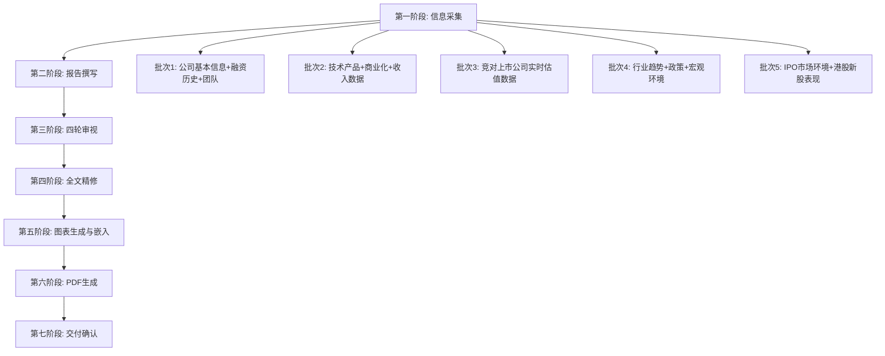

## 用户需求

用户要求对阶跃星辰（StepFun）进行全面且系统的深度分析，评估其Pre-IPO投资价值。核心问题：若阶跃星辰2026年6月上市，Pre-IPO定价为40亿美元估值、锁定三年，是否值得投资？要求从顶级投行视角完成公司深度研究及投资决策建议。

## 产品概述

产出一份顶级投行标准的阶跃星辰深度研究报告，包含Markdown源文件、PDF版本和8张投行级可视化图表。报告需覆盖公司基本面、技术实力、商业化能力、竞争格局、估值合理性、投资回报测算、风险评估及明确的投资决策建议。

## 核心特征

1. **Pre-IPO特殊场景适配**：阶跃星辰为未上市公司，需去除标准工作流中无法获取的上市公司数据模块（如技术面分析、股价涨跌幅对比、Finviz数据、PE历史分位数等），替换为Pre-IPO特有分析维度（IPO溢价测算、锁定期风险、退出路径分析、对标已上市可比公司估值）
2. **对标公司估值对比**：与已上市的智谱AI（02513.HK）、MiniMax（00100.HK）及月之暗面等进行多维度估值对比，计算PS倍数、隐含增长预期等
3. **投资回报测算**：Pre-IPO 40亿美元→IPO基石定价约100亿美元的溢价空间，锁定三年后退出价值情景分析
4. **三年锁定期风险评估**：流动性风险、行业竞争风险、技术迭代风险、港股市场风险、AI行业泡沫风险等
5. **一级市场估值方法论**：采用PS倍数法、可比公司法、DCF（适配亏损期公司）、VC/PE回报倍数法等Pre-IPO适用的估值方法
6. **数据实时性**：所有市场数据、竞对估值均通过实时搜索获取，严禁使用训练数据
7. **投行级图表**：8张可视化图表（适配Pre-IPO场景调整，如将EPS瀑布图替换为估值倍数对比等）
8. **最终投资决策**：明确给出"投/不投"建议，附详细条件和对价谈判建议

## 技术栈

- **报告撰写**：Markdown格式（`.md`）
- **图表生成**：Python3 + matplotlib（`valueinvest/generate_charts.py` + `workflows/chart_generator.py`）
- **PDF生成**：Python3 + markdown + weasyprint + pdfplumber（`workflows/md_to_pdf.py`）
- **图表嵌入**：Python3（`valueinvest/embed_charts_and_pdf.py`）
- **数据源**：实时web_search获取最新市场数据、竞对估值、行业信息

## 实施方案

### 总体策略

沿用项目已有的「价值投资Agent七阶段工作流v9」框架，但需对Pre-IPO未上市公司场景进行重大适配调整。核心改动：

1. **去除不可获取的上市公司模块**：

- 去除 Section 1.1 股价涨跌幅对比（无公开股价）
- 去除 Section 1.2 机构持仓分析（非公开信息）
- 去除 Section 1.3 PE/PB/PS等二级市场估值指标及历史分位数
- 去除 Section 7 技术面分析（无K线/成交量数据）
- 去除 Finviz/StockAnalysis 等二级市场数据源依赖
- 去除 EPS相关计算和瀑布图（亏损期公司无EPS意义）

2. **新增Pre-IPO特有分析维度**：

- **融资历史与估值演进**：种子轮→A轮→B轮→B+轮→Pre-IPO，各轮估值倍数和投资者分析
- **可比已上市公司估值对标**：智谱AI（02513.HK）、MiniMax（00100.HK）的PS、市值/融资额等多维对比
- **投资回报倍数测算**：40亿→100亿（IPO）→锁定期三年后退出价值的三阶段收益模型
- **锁定期风险矩阵**：流动性风险×三年技术迭代风险×市场周期风险×竞争格局变化风险
- **退出路径分析**：港股二级市场卖出、大宗交易、协议转让等退出方式评估
- **对价谈判建议**：是否应争取更低估值、更短锁定期、回售条款等条件优化

3. **估值方法适配**：

- **PS倍数法**（主力）：基于2026E收入12亿元×PS倍数区间，对标智谱/MiniMax
- **可比交易法**：参考同期大模型公司融资估值倍数
- **DCF法（亏损期适配）**：采用概率加权多情景DCF，假设3-5年后盈亏平衡
- **VC/PE回报倍数法**：Pre-IPO→IPO→解锁期的MOIC（Multiple on Invested Capital）
- **反向推导法**：当前估值隐含的增长假设是否合理

### 关键技术决策

1. **图表JSON适配**：修改`chart_data_stepfun.json`模板，将EPS瀑布图替换为"融资估值演进图"，将DCF敏感性替换为"MOIC敏感性矩阵"（IRR × 退出估值），将PE对比替换为PS/营收增速对比
2. **报告结构重组**：保留10大模块框架但内容大幅重组——Section 1改为"估值演进与融资数据"，Section 7改为"退出路径与锁定期分析"，Section 9改为"Pre-IPO投资决策"
3. **货币统一**：报告全文使用美元（$）为主（Pre-IPO以美元计价），涉及人民币收入时标注汇率

## 实施注意事项

1. **数据精确度**：阶跃星辰为未上市公司，大量数据来自新闻报道和市场传闻，必须标注数据来源和可靠度等级（官方披露/权威媒体报道/市场传闻），"传闻"级数据需加注
2. **可比公司数据实时性**：智谱AI和MiniMax已港股上市，其市值、PS等数据必须通过实时搜索获取当日最新值
3. **图表生成分步执行**：遵循v6.1防卡点规则——先生成JSON→再生成图表→再嵌入MD→最后生成PDF，每步独立执行
4. **报告命名规范**：`股票深度分析-阶跃星辰-20260228-HHMM-v1.md`，存放于`valueinvest/`目录

## 架构设计

### 工作流程



### 报告结构（Pre-IPO适配版）

保留10大模块框架，但内容重组为Pre-IPO场景：

- **Executive Summary**：投资评级+核心判断+MOIC测算+关键风险
- **Section 1**：融资估值演进与数据侧（替代原股价/二级市场数据）
- **Section 2**：业务历程与发展复盘
- **Section 3**：基本面研判（技术实力/商业化/竞争格局/管理团队/风险）
- **Section 4**：最新财务与融资解读
- **Section 5**：近期重大事件与公告
- **Section 6**：IPO前瞻与市场环境
- **Section 7**：退出路径与锁定期分析（替代原技术面分析）
- **Section 8**：投资决策框架（适配Pre-IPO）
- **Section 9**：估值分析与投资结论（多法交叉验证）
- **Section 10**：附录

## 目录结构

```
valueinvest/
├── 股票深度分析-阶跃星辰-20260228-HHMM-v1.md    # [NEW] Markdown深度研究报告，Pre-IPO场景适配的10模块结构
├── 股票深度分析-阶跃星辰-20260228-HHMM-v1.pdf    # [NEW] PDF版本，单页长图嵌入8张图表
├── chart_data_stepfun.json                          # [NEW] 图表数据JSON，Pre-IPO适配版（融资演进/PS对比/MOIC敏感性等8类）
└── charts/
    ├── 01_revenue_trend.png                          # [NEW] 营收预测趋势图（历史+预测）
    ├── 02_business_mix.png                           # [NEW] 业务/产品矩阵构成图
    ├── 03_margin_trend.png                           # [NEW] 融资估值演进图（各轮估值+投资者）
    ├── 04_valuation_comp.png                         # [NEW] 可比公司PS/市值对比图
    ├── 05_risk_matrix.png                            # [NEW] 风险评估矩阵（四象限气泡图）
    ├── 06_dcf_sensitivity.png                        # [NEW] MOIC/IRR敏感性热力图
    ├── 07_valuation_range.png                        # [NEW] 估值区间Football Field图
    └── 08_eps_waterfall.png                          # [NEW] 估值倍数阶梯/瀑布图（替代EPS）
```

## Agent Extensions

### Skill

- **deep-research**
- 目的：对阶跃星辰进行企业级深度研究，从10+信息源综合采集公司基本面、融资历史、技术实力、商业化进展、竞争格局、IPO市场环境等全维度数据
- 预期结果：获取经交叉验证的完整数据集，包括阶跃星辰各轮融资金额/估值/投资者、2025-2026年收入数据、产品矩阵、技术排名、竞对上市公司最新市值/PS等

- **stock-analysis**
- 目的：获取已上市可比公司（智谱AI 02513.HK、MiniMax 00100.HK）的实时市值、PS倍数、财务数据等，作为阶跃星辰估值对标的精确基准
- 预期结果：获取智谱AI和MiniMax的最新股价、市值、收入、PS、估值指标等精确数据

- **market-news-analyst**
- 目的：分析近期AI大模型行业和港股IPO市场的最新动态，评估阶跃星辰上市的市场时机窗口
- 预期结果：获取近10天AI行业重大事件、港股新股表现、市场情绪等分析

- **financial-analysis-agent**
- 目的：构建Pre-IPO投资分析模型，包括多情景DCF、MOIC测算、PS对标估值等，进行严格的投资回报和风险量化分析
- 预期结果：完成Pre-IPO→IPO→解锁期的三阶段收益模型、敏感性矩阵、风险量化

- **pdf**
- 目的：使用项目工具链（md_to_pdf.py）将最终Markdown报告转换为精美的投行级PDF
- 预期结果：生成高质量单页长图PDF，嵌入8张可视化图表

### SubAgent

- **code-explorer**
- 目的：在图表生成和PDF转换过程中，快速定位和验证工具链脚本的参数和接口
- 预期结果：确保图表生成和PDF转换流程顺利执行