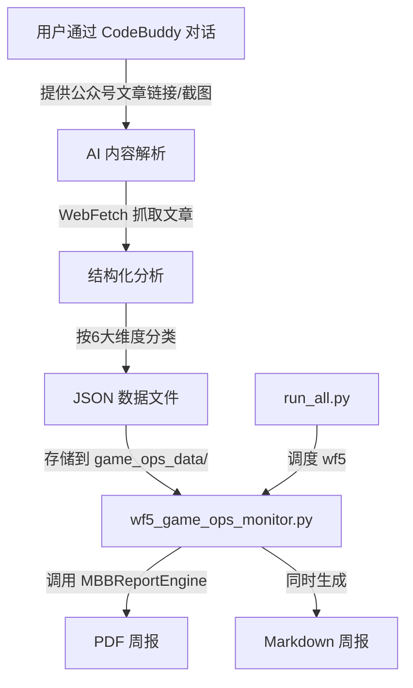

## 用户需求

每周监控十几款游戏产品（先从"超自然行动组"一款开始）的日常运营动作，信息来源为游戏官方微信公众号（https://mp.weixin.qq.com/），每周一早上8点生成一份结构化周报。

## 产品概述

游戏竞品日常运营监控系统 —— 一个半自动化的工作流工具，通过 CodeBuddy 对话式交互输入微信公众号文章内容，经 AI 结构化分析后按6大维度分类整理，最终生成 MBB 咨询风格的 PDF 周报。

## 核心功能

### 1. 标准化数据输入模板

- 提供 JSON 格式的标准化数据输入模板，涵盖6大监控维度
- 按游戏产品分目录存储每周监控数据
- 支持文章链接、标题、摘要、图文内容等字段

### 2. 六大监控维度分类（按优先级）

- **高优先级**（必须全面覆盖）：
- 玩法内容：重大版本更新（新玩法、角色、地图、武器等）、不定期玩法活动
- 活跃活动：节庆活动、留存活动、邀请好友活动等
- 商业化：IP联动、新皮肤上架、充值活动、售价变化等
- **中优先级**（有则记录重点）：
- 内容营销：创作者计划、热门内容、KOL直播
- 电竞赛事：重大赛事节点、高关注度赛事
- **低优先级**（特别重要才记录）：
- 其他重大事件：线下活动、品牌联动等

### 3. 周报生成

- 复用现有 MBB 报告引擎，生成专业 PDF 周报
- 包含：标题区、维度总览、各维度详情卡片（含优先级标签）、时间线、行动建议
- 报告内容要求图文说明、附链接，每个运营动作描述清晰
- 关注玩家反馈（尤其玩法内容更新和商业化板块）

### 4. 工作流调度集成

- 作为第5号工作流集成到现有统一调度系统
- 支持 `python3 run_all.py 5` 单独运行
- 支持 `python3 run_all.py weekly` 批量运行

### 5. 数据采集辅助

- 通过 CodeBuddy 对话读取微信公众号文章内容（利用 WebFetch 抓取公众号文章页）
- 支持长图形式文章的内容识别和结构化
- AI 辅助将原始内容按6大维度分类，提取关键运营动作

## 技术栈

- 语言：Python 3
- PDF 渲染：ReportLab（复用现有 `mbb_report_engine.py`）
- 数据存储：JSON 文件（按游戏/周次组织）
- 字体：STHeiti（中文），与现有报告引擎一致
- 调度：集成到现有 `run_all.py` 统一调度入口

## 实现方案

### 整体策略

采用**半自动化工作流**架构：用户通过 CodeBuddy 对话输入微信公众号文章链接或内容 → AI 自动解析并结构化为标准 JSON → Python 脚本读取 JSON 数据生成 MBB 风格 PDF 周报。

微信公众号没有开放 API，无法全自动爬取，因此数据输入环节采用"人机协作"模式：用户提供文章链接或截图，CodeBuddy 利用 WebFetch 读取文章内容并辅助结构化。这是在技术限制下最可靠的方案。

### 关键技术决策

1. **数据格式选择 JSON 而非 YAML**：与现有工作流（wf1-wf4 均使用 Python dict/JSON 风格数据）保持一致，无需引入新依赖。

2. **复用 MBBReportEngine 而非新建渲染器**：现有引擎已提供 draw_header/draw_section_title/draw_insight_card/draw_info_card/draw_timeline/draw_actions 等完整组件，完全满足周报需求。需要新增一个 `draw_ops_summary_card` 组件用于维度总览展示。

3. **按游戏/周次组织数据目录**：`workflows/game_ops_data/{游戏名}/week_{周次}_{年份}.json`，便于历史查询和对比分析。

4. **page_scale 设为 6.0**：游戏运营监控周报信息量大（6大维度 x 多条运营动作），需要比现有日报（2.5-4.5）更长的画布。

### 性能与可靠性

- JSON 数据文件轻量，单个周报数据文件预计 < 50KB
- PDF 生成基于 ReportLab 本地渲染，无网络依赖，秒级完成
- 数据校验层确保必填字段完整，避免渲染时出错

## 实现注意事项

1. **复用现有模式**：严格遵循 wf1-wf4 的代码结构（`generate(news_data=None)` 函数签名、默认 mock 数据、`if __name__ == "__main__"` 入口），确保与 run_all.py 调度器兼容。

2. **报告引擎扩展**：在 `mbb_report_engine.py` 中新增 `draw_ops_summary_card` 方法时，保持向后兼容，不修改任何现有方法签名。

3. **中文字体兼容**：沿用 STHeiti Light/Medium 字体配置，确保微信公众号文章中的 emoji 和特殊字符不会导致渲染失败（通过 try-except 降级处理）。

4. **数据模板设计**：JSON 模板需包含 `meta`（游戏名、周次、日期范围）和6大维度的 `entries` 数组，每条 entry 包含：标题、日期、详情、来源链接、优先级、玩家反馈（可选）。

## 架构设计

### 系统架构



### 数据流

```
微信公众号文章 → CodeBuddy 对话解析 → JSON 结构化数据
    ↓
game_ops_data/超自然行动组/week_08_2026.json
    ↓
wf5_game_ops_monitor.py (读取 JSON + 调用报告引擎)
    ↓
游戏竞品运营监控-超自然行动组-第08周-20260222.pdf
游戏竞品运营监控-超自然行动组-第08周-20260222.md
```

## 目录结构

```
workflows/
├── mbb_report_engine.py              # [MODIFY] 新增 draw_ops_summary_card 和 draw_dimension_card 方法，用于游戏运营监控周报的维度总览卡片和运营动作详情卡片。保持所有现有方法不变，仅追加新方法。
├── run_all.py                        # [MODIFY] 在 WEEKLY_WORKFLOWS 字典中添加 '5': ('游戏竞品运营监控', wf5_game_ops_monitor)，并在顶部添加 import wf5_game_ops_monitor。
├── wf5_game_ops_monitor.py           # [NEW] 游戏竞品运营监控工作流主脚本。实现 generate(news_data=None) 函数，读取 game_ops_data 目录下的 JSON 数据，按6大维度渲染 MBB 风格 PDF 周报和 Markdown 周报。包含默认 mock 数据（超自然行动组示例），支持多游戏批量生成。使用 GAME_OPS 专属配色方案。
├── game_ops_data/
│   ├── template.json                 # [NEW] 标准化数据输入模板。定义完整的 JSON Schema，包含 meta 信息（游戏名、公众号名、周次、日期范围）和6大维度的 entries 数组结构。每条 entry 含：title、date、detail、source_url、priority(1-3)、player_feedback(可选)、images(可选)。
│   └── 超自然行动组/
│       └── week_08_2026.json         # [NEW] 超自然行动组第08周监控数据示例文件。基于微信公众号"超自然行动组官方"的实际文章内容，包含春节期间的运营动作数据（荧光棒皮肤曝光、新春贺年活动、红包封面福利等），作为系统的第一份真实数据和后续录入的参考样例。
└── game_ops_report_guide.md          # [NEW] 游戏竞品运营监控工作流使用指南。包含：工作流概览、数据录入流程（如何通过 CodeBuddy 对话录入公众号文章）、监控维度说明（6大维度定义和优先级）、报告生成命令、质量检查标准、常见问题排查。遵循现有 MBB 工作流文档风格。
```

## 关键代码结构

```python
# template.json 核心数据结构
{
    "meta": {
        "game_name": "超自然行动组",
        "wechat_account": "超自然行动组官方",
        "week_number": 8,
        "year": 2026,
        "date_range": ["2026-02-16", "2026-02-22"],
        "analyst": "AI Assistant"
    },
    "dimensions": {
        "gameplay_content": {
            "priority_level": "high",
            "display_name": "玩法内容",
            "entries": [
                {
                    "title": "str - 运营动作标题",
                    "date": "str - YYYY-MM-DD",
                    "detail": "str - 200字以内详细描述",
                    "source_url": "str - 微信文章链接",
                    "priority": "int - 1(T0)~3(T2)",
                    "player_feedback": "str|null - 玩家反馈摘要",
                    "images": ["str - 关键截图描述"]
                }
            ]
        },
        "active_events": {},
        "monetization": {},
        "content_marketing": {},
        "esports": {},
        "other_major": {}
    }
}
```

## Agent Extensions

### Skill

- **deep-research**
- 用途：对"超自然行动组"微信公众号进行深度研究，搜集该游戏的基础信息（游戏类型、开发商、主要玩法等），为第一份周报提供背景上下文
- 预期结果：获取游戏基本信息和近期运营动态的研究报告

- **pdf**
- 用途：生成和处理 MBB 风格的 PDF 周报文件
- 预期结果：高质量的可打印 PDF 格式周报

- **canvas-design**
- 用途：为周报设计专属的视觉风格和配色方案，确保报告达到 MBB 咨询级别的专业视觉水准
- 预期结果：游戏竞品运营监控专属的设计哲学文档

### SubAgent

- **code-explorer**
- 用途：在实现过程中深度探索现有工作流代码（wf1-wf4）的模式和约定，确保新工作流与现有架构完全一致
- 预期结果：确认所有代码约定（函数签名、数据结构、配色方案、调度接口等）

### Integration

- **cloudStudio**
- 用途：部署周报生成的 Web 预览页面（可选），方便用户在线查看周报
- 预期结果：可通过 URL 访问的周报预览服务