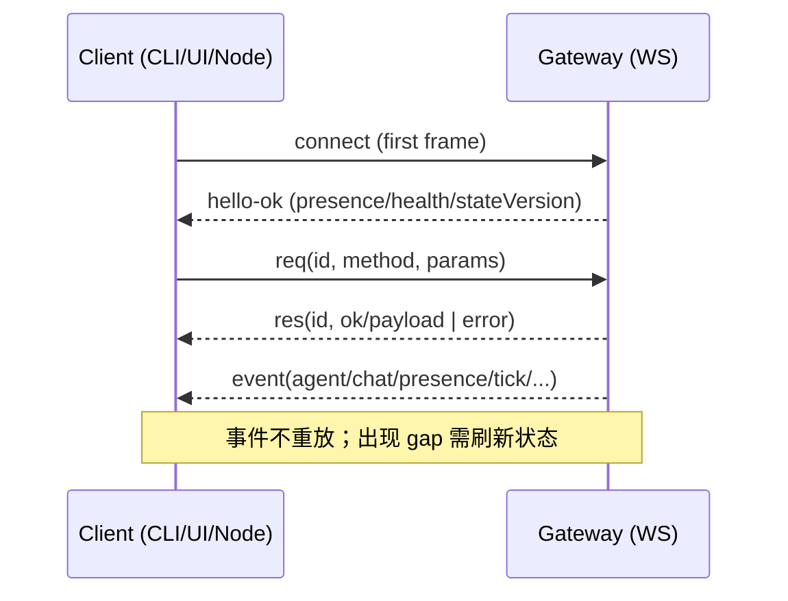

# OpenClaw 爆发式增长驱动与 A/B/C 综合研究（v2｜可量化 + 可追溯 + 配图表）

- **版本**：202603051608-v2
- **研究对象（口径）**：**OpenClaw（开源个人 AI 助手/AI Agent 平台）**，GitHub 组织 `openclaw`，核心仓库 `openclaw/openclaw`。
- **你关心的问题**：
  - **Q1：爆发式增长是否“有数据可查”**？如果有，哪些数据能量化、哪里能查？
  - **Q2：A（产品洞察）、B（技术拆解）、C（安全治理）怎么系统性沉淀成“可读+可用”的资料？**

---

## 0. Executive Summary（结论先行｜你可以先看这一页）

### 0.1 “可量化驱动”有没有数据可查？

**结论**：
- **用户新增/渠道分布/留存强度**这类“产品内指标”，目前在官方公开渠道里**不可直接查到完整口径**（至少我们无法从官网/Docs/GitHub/Trust 直接拿到 DAU、留存、转化等）。
- 但存在一组**公开可查的“增长代理指标”**，可以相当强地证明“爆发式扩散”与“社区参与度”：
  - **GitHub**：stars / forks / commits / 版本发布节奏（作为开发者扩散与采用强度 proxy）。
  - **Discord**：成员数 / 在线数（作为社区热度与活跃度 proxy）。
  - **生态仓库**：`openclaw/clawhub`、`openclaw/skills` 的规模与更新（作为生态活跃 proxy）。
  - **安全与治理**：Trust/SECURITY/CHANGELOG 中高密度安全治理动作（作为“信任背书”与“可放心装到机器上”驱动 proxy）。

### 0.2 “为什么会爆发式增长”（用“事实 + 可解释假设”分层）

- **可证事实（可点开来源核验）**：
  - OpenClaw 核心仓库已经达到 **263k stars / 50.3k forks**（见 GitHub 仓库页 `https://github.com/openclaw/openclaw`）。
  - Discord 社区邀请 `clawd` 显示 **约 126,519 成员、约 22,780 在线**（Discord 公共 invite API：`https://discord.com/api/v9/invites/clawd?with_counts=true&with_expiration=true`）。
  - 版本节奏是 CalVer（如 `v2026.3.3`），并且 **2026 年 2–3 月出现高频发布**，且安全修复密度高（`CHANGELOG.md`：`https://raw.githubusercontent.com/openclaw/openclaw/main/CHANGELOG.md`）。
  - 官方把安全当“核心叙事”而非附录：有 `SECURITY.md` 与 Trust 站点（`https://raw.githubusercontent.com/openclaw/openclaw/main/SECURITY.md`、`https://trust.openclaw.ai/`）。
  - 官方把 ClawHub 技能市场引入 VirusTotal 扫描并公布（`https://openclaw.ai/blog/virustotal-partnership`）。

- **可解释假设（明确标注为 hypothesis，供你后续验证）**：
  - **低摩擦分发**（npm/一键脚本/多平台）+ **“渠道即入口”**（WhatsApp/Telegram/Slack/Discord 等）降低试用成本 → 形成扩散。
  - **工具可执行 + 生态可扩展**（ClawHub）让“能做事”的 demo 更容易变成可复用工作流 → 增强复用强度。
  - **“安全与治理”被放到第一优先级**（Trust、审计、默认最小权限、快速加固基线、VirusTotal）让更多人敢在自己的机器/服务器上长期运行 → 促进留存。

---

## 1. 可量化增长代理指标（你问的“有数据可查吗？”这里给你一份“可查清单”）

> 说明：这一节只写“公开可查且可复现”的口径；看不到的会写清楚“为什么看不到”和“替代指标”。

### 1.1 GitHub：stars / forks / 发布节奏（采用强度 proxy）

- **核心仓库规模（快照）**：
  - stars：约 **263k**
  - forks：约 **50.3k**
  - watchers：约 **1.4k**
  - commits：约 **16,914**
  - 语言占比：TypeScript 86.5% / Swift 8.9% / Kotlin 2.1%（多端）
  - **来源**：GitHub 仓库页 `https://github.com/openclaw/openclaw`

- **生态仓库星标分布（组织维度）**：
  - `openclaw/clawhub` ~4.1k stars：技能目录/注册表（来源：`https://github.com/openclaw/clawhub`）
  - `openclaw/skills` ~2.0k stars：技能归档（来源：`https://github.com/openclaw/skills`）
  - `openclaw/lobster` ~729 stars：workflow shell（来源：`https://github.com/openclaw/lobster`）
  - **来源**：GitHub org 页 `https://github.com/openclaw`

- **星标时间曲线（趋势，而非精确数据导出）**：
  - `star-history` 的项目曲线可视化：`https://www.star-history.com/#openclaw/openclaw`
  - 说明：该站点默认页面更偏“榜单+可视化”，我们未找到直接 CSV/JSON 导出入口；如果你要自己做精确分析，通常需要 GitHub API 或第三方数据服务。

### 1.2 Discord：成员数 / 在线数（社区活跃 proxy）

- **邀请链接**：`https://discord.gg/clawd`
- **可量化字段（实时）**：
  - `approximate_member_count`：**126,519**
  - `approximate_presence_count`：**22,780**
  - **来源（可复现）**：`https://discord.com/api/v9/invites/clawd?with_counts=true&with_expiration=true`

### 1.3 Releases / CHANGELOG：版本节奏与“安全密度”（工程可信度 proxy）

- **Releases 列表**：`https://github.com/openclaw/openclaw/releases`
  - 说明：Releases 页面在我们抓取时未直接展示“资产下载次数”（Assets 处为动态加载），因此“下载量”这一维**无法从公开 HTML 稳定抓到**。

- **CHANGELOG（事实最密）**：`https://raw.githubusercontent.com/openclaw/openclaw/main/CHANGELOG.md`
  - 你可以重点用它做两件事：
    1) 观察版本节奏（CalVer 高密度迭代）；
    2) 观察安全条目密度（SSRF、webhook 认证、沙箱边界、路径别名 guard 等）。

### 1.4 分发下载量（npm/Homebrew 等）

- **npm downloads**：理论上是一个很好的“采用强度 proxy”，但我们访问 `npmjs.com` 页面时遇到 **403**（不可抓取）。
- **替代口径**：
  - GitHub stars/forks + Discord 成员数 + 版本发布密度 + 生态仓库规模。

### 1.5 ClawHub “安装量/热门技能”是否可查？

- **事实**：ClawHub 的 CLI 在登录状态下会发送最小遥测以计算安装计数，并可通过 `CLAWHUB_DISABLE_TELEMETRY=1` 禁用（官方文档：`https://docs.openclaw.ai/tools/clawhub`）。
- **限制**：ClawHub 网站是 SPA 动态渲染，我们无法从静态 HTML 直接抓到“Top skills/安装量榜单”等可复现列表。
- **替代口径**：
  - 参考 `openclaw/skills` 仓库（所有技能版本归档，含安全提醒）：`https://github.com/openclaw/skills`
  - 参考 `openclaw/clawhub` 仓库（注册表系统本身、遥测口径、治理机制）：`https://github.com/openclaw/clawhub`

---

## 2. 下一步A（产品洞察向）：3C + JTBD + 30 个真实用例抽样

### 2.1 3C 框架（Company / Customer / Competitor）

- **Company（OpenClaw 的“产品本质”）**：
  - 从 README / Docs 来看，它是“**个人助手 + 本地网关控制平面 + 多渠道接入 + 工具与节点能力**”的组合。
  - 关键话术：Gateway 是控制平面（Docs：`https://docs.openclaw.ai/concepts/architecture`；README raw：`https://raw.githubusercontent.com/openclaw/openclaw/main/README.md`）。

- **Customer（谁在用？为什么用？）**：
  - 个人生产力用户：希望“随时可触达、能执行、能自动化”。
  - 重度开发者/自动化用户：希望“可编排、可扩展、可控（权限/沙箱/路由）”。
  - 小团队：希望“一个网关 + 多代理隔离 + 强默认安全 + 远程访问（VPN/SSH）”。
  - 来源支撑：Gateway 安全模型强调“个人助手/单操作员边界”（Docs：`https://docs.openclaw.ai/gateway/security`；SECURITY：`https://raw.githubusercontent.com/openclaw/openclaw/main/SECURITY.md`）。

- **Competitor（竞争/替代）**：
  - 直接替代：其它 agent 框架 + 本地工具执行框架 + 多渠道机器人平台。
  - 间接替代：纯对话型助手（只“建议”不“执行”）。
  - 注意：这块如果你要严谨做“对比表”，需要另开一轮研究并为每个对比项提供同样严格的来源链。

### 2.2 JTBD（Jobs-To-Be-Done）范式（从用例归纳而来）

把真实用例按“工作流范式”归并（MECE）：
1. **信息聚合与摘要**：多源订阅→评分/过滤→每日简报（新闻、Reddit、YouTube）。
2. **内容生产流水线**：选题→研究→写作→配图/分发（YouTube/播客/社媒）。
3. **项目与执行自动化**：任务拆分→并行子代理→状态管理（STATE.yaml）→落地产物。
4. **基础设施与运维**：自愈服务器、cron、SSH/远程修复、n8n webhook 编排。
5. **学习与研究**：构建个人知识库、市场研究、构思验证（扫描 GitHub/HN/npm/PyPI/PH）。
6. **家庭与生活助手**：家庭日程、库存管理、健康追踪、电话通知。

### 2.3 30 个“真实用例”抽样（可追溯链接）

> 主要来源：`Awesome OpenClaw Use Cases` 仓库（18.5k stars，明确要求“提交者需至少运行一天验证有效”）
> - 索引页（raw）：`https://raw.githubusercontent.com/hesamsheikh/awesome-openclaw-usecases/main/README.md`
> - 仓库主页：`https://github.com/hesamsheikh/awesome-openclaw-usecases`

下面抽样 30 个，按范式分组；每条都给你一个可点开的原文链接（你后续想深挖哪条，直接点进去看完整配置/skills/流程）。

#### A. 信息聚合与摘要（6）
1. Daily Reddit Digest：`https://github.com/hesamsheikh/awesome-openclaw-usecases/blob/main/usecases/daily-reddit-digest.md`
2. Daily YouTube Digest：`https://github.com/hesamsheikh/awesome-openclaw-usecases/blob/main/usecases/daily-youtube-digest.md`
3. Multi-Source Tech News Digest：`https://github.com/hesamsheikh/awesome-openclaw-usecases/blob/main/usecases/multi-source-tech-news-digest.md`
4. Inbox De-clutter（Newsletter 摘要→邮件）：`https://github.com/hesamsheikh/awesome-openclaw-usecases/blob/main/usecases/inbox-declutter.md`
5. Custom Morning Brief：`https://github.com/hesamsheikh/awesome-openclaw-usecases/blob/main/usecases/custom-morning-brief.md`
6. Dynamic Dashboard（实时并行拉取数据源）：`https://github.com/hesamsheikh/awesome-openclaw-usecases/blob/main/usecases/dynamic-dashboard.md`

#### B. 内容生产流水线（7）
7. YouTube Content Pipeline：`https://github.com/hesamsheikh/awesome-openclaw-usecases/blob/main/usecases/youtube-content-pipeline.md`
8. Multi-Agent Content Factory：`https://github.com/hesamsheikh/awesome-openclaw-usecases/blob/main/usecases/content-factory.md`
9. Podcast Production Pipeline：`https://github.com/hesamsheikh/awesome-openclaw-usecases/blob/main/usecases/podcast-production-pipeline.md`
10. Autonomous Game Dev Pipeline：`https://github.com/hesamsheikh/awesome-openclaw-usecases/blob/main/usecases/autonomous-game-dev-pipeline.md`
11. Automated Meeting Notes & Action Items：`https://github.com/hesamsheikh/awesome-openclaw-usecases/blob/main/usecases/meeting-notes-action-items.md`
12. X Account Analysis：`https://github.com/hesamsheikh/awesome-openclaw-usecases/blob/main/usecases/x-account-analysis.md`
13. Goal-Driven Autonomous Tasks（含 overnight mini-app builder）：`https://github.com/hesamsheikh/awesome-openclaw-usecases/blob/main/usecases/overnight-mini-app-builder.md`

#### C. 项目与执行自动化（6）
14. Autonomous Project Management（STATE.yaml 模式）：`https://github.com/hesamsheikh/awesome-openclaw-usecases/blob/main/usecases/autonomous-project-management.md`
15. Project State Management（事件驱动的上下文捕获）：`https://github.com/hesamsheikh/awesome-openclaw-usecases/blob/main/usecases/project-state-management.md`
16. Multi-Agent Specialized Team：`https://github.com/hesamsheikh/awesome-openclaw-usecases/blob/main/usecases/multi-agent-team.md`
17. Second Brain（记忆→自建 dashboard）：`https://github.com/hesamsheikh/awesome-openclaw-usecases/blob/main/usecases/second-brain.md`
18. Personal CRM（从邮件/日历发现联系人）：`https://github.com/hesamsheikh/awesome-openclaw-usecases/blob/main/usecases/personal-crm.md`
19. Todoist Task Manager（透明度日志同步）：`https://github.com/hesamsheikh/awesome-openclaw-usecases/blob/main/usecases/todoist-task-manager.md`

#### D. 基础设施与运维（4）
20. n8n Workflow Orchestration（webhook 编排，agent 不碰凭证）：`https://github.com/hesamsheikh/awesome-openclaw-usecases/blob/main/usecases/n8n-workflow-orchestration.md`
21. Self-Healing Home Server（SSH + cron + 自愈）：`https://github.com/hesamsheikh/awesome-openclaw-usecases/blob/main/usecases/self-healing-home-server.md`
22. OpenClaw as Desktop Cowork（桌面协作/远程修复）：`https://github.com/hesamsheikh/awesome-openclaw-usecases/blob/main/usecases/aionui-cowork-desktop.md`
23. Pre-Build Idea Validator（构思前扫描 GitHub/HN/npm/PyPI/PH）：`https://github.com/hesamsheikh/awesome-openclaw-usecases/blob/main/usecases/pre-build-idea-validator.md`

#### E. 学习与研究（3）
24. Personal Knowledge Base (RAG)：`https://github.com/hesamsheikh/awesome-openclaw-usecases/blob/main/usecases/knowledge-base-rag.md`
25. Market Research & Product Factory：`https://github.com/hesamsheikh/awesome-openclaw-usecases/blob/main/usecases/market-research-product-factory.md`
26. Semantic Memory Search：`https://github.com/hesamsheikh/awesome-openclaw-usecases/blob/main/usecases/semantic-memory-search.md`

#### F. 家庭与生活助手（4）
27. Family Calendar & Household Assistant：`https://github.com/hesamsheikh/awesome-openclaw-usecases/blob/main/usecases/family-calendar-household-assistant.md`
28. Health & Symptom Tracker：`https://github.com/hesamsheikh/awesome-openclaw-usecases/blob/main/usecases/health-symptom-tracker.md`
29. Habit Tracker & Accountability Coach：`https://github.com/hesamsheikh/awesome-openclaw-usecases/blob/main/usecases/habit-tracker-accountability-coach.md`
30. Event Guest Confirmation（电话逐个确认出席）：`https://github.com/hesamsheikh/awesome-openclaw-usecases/blob/main/usecases/event-guest-confirmation.md`

---

## 3. 下一步B（技术拆解向）：以 Docs 主线做“源码对照式”拆解（含图表）

> 本节的原则：**每个技术结论旁边给你一个“Docs 链接 + 源码/目录链接”**，你可以快速从文字跳到原文。

### 3.1 总体拓扑（Docs 架构 → 代码位置）

- Docs（架构）：`https://docs.openclaw.ai/concepts/architecture`
- DeepWiki（代码地图）：`https://deepwiki.com/openclaw/openclaw`

```mermaid
flowchart LR
  U[用户/消息平台
WhatsApp/Telegram/Slack/Discord/...] -->|入站消息| CH[Channels / Extensions]
  CH -->|规范化事件| GW[Gateway 进程
WS+HTTP@18789]
  UI[Control UI / CLI / macOS App] -->|WS RPC| GW
  NODE[iOS/macOS/Android Node] -->|WS role=node| GW
  GW -->|agent turn| AR[Agent Runtime
pi-coding-agent]
  AR -->|tools.invoke| TOOLS[Tools
browser/exec/memory/pdf/...]
  TOOLS --> FS[本地文件/网络/API]
  GW -->|出站消息| CH --> U

  subgraph Repo[对应代码位置（参考）]
    GW -.-> P1[src/index.ts & CLI entry]
    GW -.-> P2[src/cli/* & program/build-program.js]
    CH -.-> P3[extensions/*]
    UI -.-> P4[ui/* (LitElement + Vite)]
    NODE -.-> P5[apps/ios apps/macos apps/android]
  end
```

- 源码入口（主程序入口）：`https://raw.githubusercontent.com/openclaw/openclaw/main/src/index.ts`
- 依赖与版本（Node>=22.12 / 版本 2026.3.3）：`https://raw.githubusercontent.com/openclaw/openclaw/main/package.json`

### 3.2 Gateway：单端口复用（WS 控制面 + HTTP 表面 + UI 静态资源）

- Docs（Gateway runbook 原文）：`https://raw.githubusercontent.com/openclaw/openclaw/main/docs/gateway/index.md`
- Docs（站点版）：`https://docs.openclaw.ai/gateway`

你关心的“接口面”可以这样理解：

```mermaid
flowchart TB
  subgraph Port[18789 单端口]
    WS[WebSocket RPC
connect/req/res/event]:::a
    HTTP[HTTP APIs
health/readyz/tools/invoke
(OpenAI-compatible surfaces)]:::b
    SPA[Control UI 静态资源
浏览器仪表盘]:::c
    CANVAS[Canvas/A2UI Host
/__openclaw__/canvas/
/__openclaw__/a2ui/]:::d
  end

  classDef a fill:#1f77b4,color:#fff,stroke:#0b3d66;
  classDef b fill:#2ca02c,color:#fff,stroke:#1b5e20;
  classDef c fill:#ff7f0e,color:#fff,stroke:#8a4b08;
  classDef d fill:#9467bd,color:#fff,stroke:#4a2e6b;
```

### 3.3 WebSocket 协议形态（便于你理解“为什么像控制平面”）

- Docs（Gateway runbook 协议描述）：`https://raw.githubusercontent.com/openclaw/openclaw/main/docs/gateway/index.md`
- Docs（Architecture 的握手/事件描述）：`https://docs.openclaw.ai/concepts/architecture`



### 3.4 多代理路由（Bindings）与隔离边界

- Docs（多代理路由站点版）：`https://docs.openclaw.ai/concepts/multi-agent`
- Docs（仓库原文）：`https://raw.githubusercontent.com/openclaw/openclaw/main/docs/concepts/multi-agent.md`

```mermaid
flowchart TB
  IN[入站消息] --> M{按优先级匹配绑定}
  M -->|peer| B1[最具体 peer 绑定]
  M -->|parentPeer| B2[parentPeer 继承]
  M -->|guildId+roles| B3[Discord 角色路由]
  M -->|guildId/teamId| B4[Discord/Slack 组织路由]
  M -->|accountId| B5[账户级路由]
  M -->|channel fallback| B6[channel级 accountId="*"]
  M -->|default| D[默认 agent]

  B1 --> A[agentId]
  B2 --> A
  B3 --> A
  B4 --> A
  B5 --> A
  B6 --> A
  D --> A
```

### 3.5 Channels（消息平台接入）与插件生态

- Docs（Channels 原文）：`https://raw.githubusercontent.com/openclaw/openclaw/main/docs/channels/index.md`
- DeepWiki（extensions 目录与通道分布导航）：`https://deepwiki.com/openclaw/openclaw`

建议你把 channels 当成“输入/输出适配层”：
- 入站：把不同平台事件规范化为统一消息结构。
- 出站：把 agent 输出回写到对应平台。
- 许多通道通过 `extensions/*` 插件化发布（Doc 明确标注 plugin）。

---

## 4. 下一步C（安全与治理向）：风险-控制-默认配置-误用场景矩阵 + 加固清单

### 4.1 风险-控制矩阵（可落地版）

> 主要来源：
> - Gateway Security（官方安全指南）：`https://docs.openclaw.ai/gateway/security`
> - SECURITY policy（漏洞披露与信任边界）：`https://raw.githubusercontent.com/openclaw/openclaw/main/SECURITY.md`
> - Trust 计划：`https://trust.openclaw.ai/`
> - VirusTotal 合作公告：`https://openclaw.ai/blog/virustotal-partnership`
> - 版本安全修复密度：`https://raw.githubusercontent.com/openclaw/openclaw/main/CHANGELOG.md`

| 风险类型 | 常见误用场景 | 默认/推荐控制 | 你需要额外做的加固 | 来源 |
|---|---|---|---|---|
| 提示注入 | agent 读网页/邮件/附件后被“语言指令”操纵 | 优先做访问控制与工具策略，而非寄希望于提示词 | 对“不受信内容”用无工具/只读工具 profile；启用沙箱 | `docs.openclaw.ai/gateway/security` |
| 网关暴露 | 反向代理/公网暴露 18789 | 默认 bind loopback；强制 auth | 远程访问走 SSH/Tailscale；不要裸暴露 | `docs.openclaw.ai/gateway/security` |
| 工具权限过宽 | 默认就能 exec/fs/write | 新 onboarding 默认 `tools.profile: messaging`（减少默认权限） | 对关键动作启用审批/最小权限；分代理配置 | `CHANGELOG.md`（2026.3.2 破坏性变更） |
| 多人共享实例 | 多个互不信任用户共用一个 Gateway | 明确“个人助手/单操作员”边界 | 真要多人：每人独立 Gateway + 独立凭证/主机/OS 用户 | `SECURITY.md` |
| 供应链/技能投毒 | 安装未知 skill/依赖 | ClawHub 引入 VirusTotal 扫描；举报/隐藏机制 | 仍需 code review；限制 skill 可用工具；禁硬编码密钥 | VirusTotal 博文 + ClawHub 文档 |
| 节点能力滥用 | node 具备摄像头/屏幕/定位等高权限 | 设备配对与批准流 | 对 node 执行请求启用严格审批；最小能力暴露 | `docs.openclaw.ai/concepts/architecture` |

### 4.2 两套加固清单（个人 / 小团队）

#### 4.2.1 个人自用（“最小可用安全基线”）

- **网络**：Gateway 保持 `loopback` 绑定；不要公网暴露（Docs：`https://docs.openclaw.ai/gateway/security`）。
- **认证**：启用 token/password；避免把 token 写到公开仓库。
- **DM 策略**：默认 `pairing`；不认识的人不能直接对话。
- **工具策略**：保持 `tools.profile: messaging`；高风险工具（exec/fs/automation）按需开启。
- **不受信内容隔离**：对网页/附件类任务优先用沙箱（Docs 提供 sandboxing 建议）。
- **技能审查**：安装技能前先看代码；把 VirusTotal/扫描结果当作“信号”，不是“保证”。

#### 4.2.2 小团队/远程部署（“可运维 + 可审计”）

- **强烈建议用基础设施模板**：`openclaw/openclaw-ansible`（自动加固：UFW + Tailscale + Fail2ban + 非 root 用户 + systemd hardening + Docker 隔离）
  - 仓库：`https://github.com/openclaw/openclaw-ansible`
- **权限边界**：不要多人共享同一个 Gateway；用多实例或每人独立实例。
- **远程访问**：优先 Tailscale；其次 SSH 隧道；不做公网反代。
- **自动更新**：至少启用安全补丁自动更新（ansible 模板已包含 unattended-upgrades）。
- **审计**：按 Trust 指引跑 `openclaw security audit --deep`（只是一个检查命令，不会改系统；你可以在可信环境里运行）。

---

## 5. 你要的“更多数据”：如果你想把“增长驱动”做成更像咨询报告的量化分析

如果你希望进一步把“新增来源/渠道分布/留存与复用强度”量化到更接近产品分析，需要额外数据来源：

- **官方/维护者可提供**（但公开渠道通常没有）：
  - ClawHub 安装量分布、Top skills、留存（需要后端数据）。
  - 官网下载/安装脚本调用量（需要日志）。
  - CLI/网关匿名遥测（如果项目存在并愿意公开聚合数据）。

- **你可以独立补强的公开数据**（不依赖维护者授权）：
  - GitHub API：star 事件时间序列、issue/PR 增长、贡献者增长（可做更严谨曲线）。
  - Discord：按天抓取 invite 的 `approximate_member_count` 做成员增长曲线（完全基于公开接口）。

---

## 6. 主要引用来源（按“你点击就能复核”组织）

- OpenClaw GitHub 仓库：`https://github.com/openclaw/openclaw`
- README raw：`https://raw.githubusercontent.com/openclaw/openclaw/main/README.md`
- CHANGELOG raw：`https://raw.githubusercontent.com/openclaw/openclaw/main/CHANGELOG.md`
- SECURITY raw：`https://raw.githubusercontent.com/openclaw/openclaw/main/SECURITY.md`
- Docs（入口）：`https://docs.openclaw.ai/`
- Docs（架构）：`https://docs.openclaw.ai/concepts/architecture`
- Docs（Gateway runbook 原文）：`https://raw.githubusercontent.com/openclaw/openclaw/main/docs/gateway/index.md`
- Docs（Gateway Security）：`https://docs.openclaw.ai/gateway/security`
- Docs（多代理路由）：`https://docs.openclaw.ai/concepts/multi-agent`
- 多代理路由原文：`https://raw.githubusercontent.com/openclaw/openclaw/main/docs/concepts/multi-agent.md`
- Docs（ClawHub）：`https://docs.openclaw.ai/tools/clawhub`
- Trust：`https://trust.openclaw.ai/`
- VirusTotal 合作公告：`https://openclaw.ai/blog/virustotal-partnership`
- Discord 社区规模（可复现 API）：`https://discord.com/api/v9/invites/clawd?with_counts=true&with_expiration=true`
- DeepWiki（代码地图）：`https://deepwiki.com/openclaw/openclaw`
- Awesome OpenClaw Use Cases（索引 raw）：`https://raw.githubusercontent.com/hesamsheikh/awesome-openclaw-usecases/main/README.md`
- Awesome OpenClaw Use Cases（仓库）：`https://github.com/hesamsheikh/awesome-openclaw-usecases`
- Hardened 部署模板（ansible）：`https://github.com/openclaw/openclaw-ansible`
