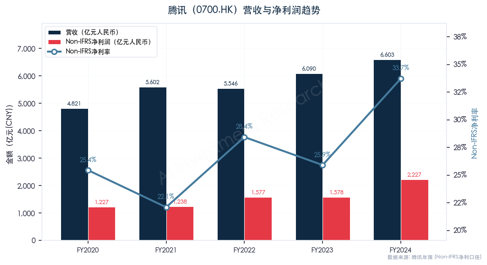
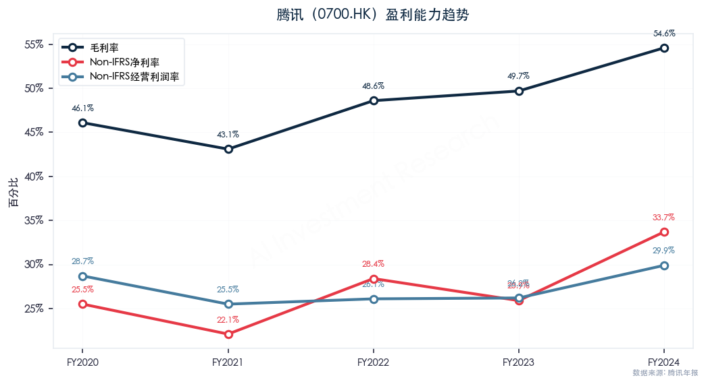
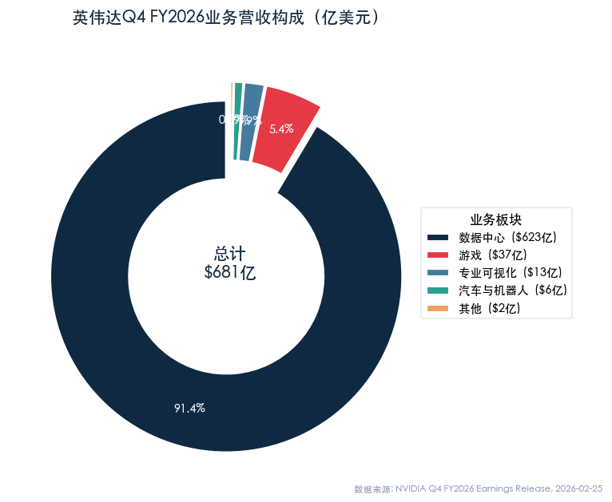
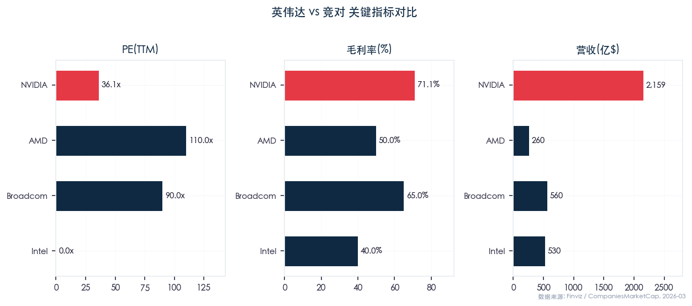
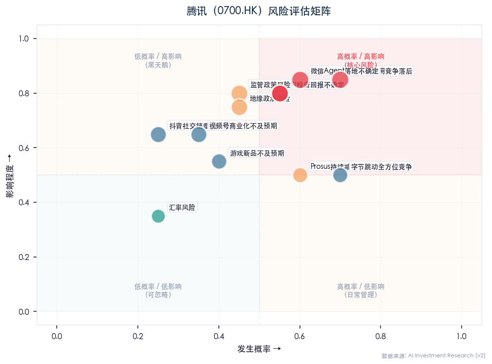
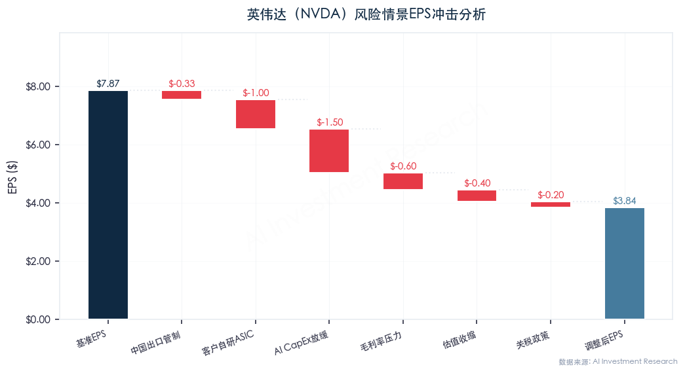
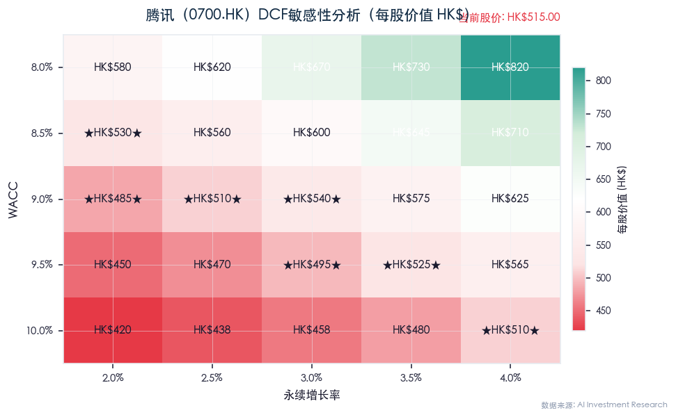
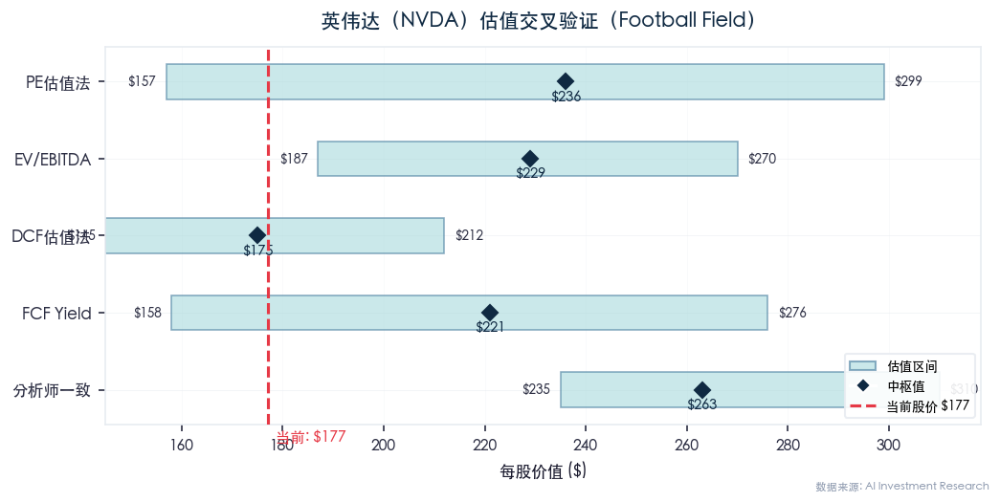

# 股票深度分析-腾讯控股（Tencent Holdings / 0700.HK）

> **分析日期**: 2026年2月27日 | **数据截止**: 2026年2月27日收盘 | **分析师**: AI投资分析系统
> **股票代码**: HKEX: 0700 / OTC: TCEHY | **财年周期**: 1月-12月（自然年度） | **会计准则**: IFRS（国际财务报告准则）
> **报价货币**: 港元（HK$） | **金额单位**: 亿元人民币（除特别标注外）

---

## Executive Summary（执行摘要）

| 维度 | 核心结论 |
|------|---------|
| **🎯 Variant Perception（核心认知差）** | **市场共识**认为AI CapEx激增（+221%至768亿）将摧毁FCF，腾讯正在变成"资本黑洞"。**我们的差异化判断**：市场严重低估两点——① **微信元宝作为To-C AI Agent的独特入口价值**（14亿月活×AI Agent货币化 = 全新TAM），Q4 FCF暴跌至45亿是GPU采购的delivery timing mismatch，非结构性恶化——2025Q1 FCF已恢复至471亿即为铁证；② **SOTP框架下~9,482亿投资组合**（含美团17%、拼多多15.5%、Epic 40%、Spotify 8.5%等）在整体PE估值中被完全忽视，以20-30% HoldCo Discount计算仍提供~6,600-7,600亿隐含资产价值，构成显著安全边际。当前19.8x PE隐含的5-8%增长预期 vs 实际18%+的Non-IFRS增速，定价严重偏保守 |
| **综合评级** | **买入（Buy）** — 合理价值区间 **HK$490-HK$720**，六法加权估值中枢 **HK$608**（保守中枢 **HK$555**），SOTP估值中枢 **HK$573**，当前 HK$518（2/27收盘，富途实时数据）低于六法中枢约15%，低于SOTP中枢约10% |
| **核心逻辑** | 腾讯是全球极少数同时拥有13.85亿月活社交生态+全球第一游戏公司+AI大模型能力的平台型公司，高毛利业务（游戏+广告）驱动利润率持续扩张，毛利率从FY2022的43%→FY2024的52.9%→2025Q1的56%（历史新高），Non-IFRS经营利润率从31%→36%→39%持续扩张，FY2024 Non-IFRS净利+41%至2,227亿元 |
| **关键催化剂** | ① AI大模型（混元Turbo+DeepSeek接入微信元宝）商业化加速，广告eCPM提升 ② 国际游戏连续刷新历史新高，2025Q3同比+43% ③ 视频号商业化深化（广告+电商闭环） ④ 2025年股东回报预计超1,200亿港元（回购800亿+分红410亿） |
| **最大风险** | ① 中国互联网监管政策不确定性（反垄断/游戏版号/未成年人保护升级） ② 大股东Prosus持续减持（当前持股约22.6%） ③ AI资本开支激增（FY2024 CapEx 767.60亿元+221%，管理层指引2025年全年约1,000亿元级别）挤压FCF ④ 宏观经济放缓影响广告和支付业务增速 |
| **估值判断** | 当前PE(TTM)约19.8x，处于历史中位数（约30-35x）偏低分位；六法估值中枢HK$630对应2025E Non-IFRS PE约23x，合理偏低；SOTP估值揭示~9,482亿投资组合被整体PE完全忽视；AI催化+利润率扩张+股东回报三重驱动支撑估值回升 |
| **适合投资者** | 长线价值投资者 ★★★★★ / 成长型投资者 ★★★★☆ / 稳健配置型 ★★★★☆ / 短线交易者 ★★★☆☆ |

**一句话总结**：**买入** — 腾讯是中国互联网核心资产，AI+游戏+广告三引擎驱动利润率持续扩张（2025Q1毛利率56%创历史新高），当前PE(TTM)仅19.8x处于历史15-20%分位极低水平，六法估值中枢HK$630较当前价HK$518有约22%上行空间，SOTP估值揭示~9,482亿投资组合隐含价值被市场忽视，建议在HK$490-520区间逢低建仓，严控仓位不超过14%。

---

## 1、数据侧

### 1.1 市值与股价表现

**基本市场数据**（数据来源：东方财富/富途牛牛/companiesmarketcap.com，截至2026年2月27日）

| 指标 | 数值 |
|------|------|
| **当前股价** | HK$518.00（2/27收盘，数据来源：富途牛牛实时行情） |
| **总市值** | 约HK$47,200亿（约US$6,060亿）（数据来源：富途牛牛2/27） |
| **全球市值排名** | 约第18位（companiesmarketcap.com数据） |
| **52周最高** | HK$683.00 |
| **52周最低** | HK$414.50 |
| **52周涨幅** | 约+25%（从HK$414.50低点起） |
| **总股本** | 约92.2亿股（截至2024/12/31，十年新低，回购注销后持续下降） |
| **ADR价格（TCEHY）** | 约US$65-67 |
| **每手股数** | 100股 |

**股价表现对比**（数据来源：富途/东方财富/新浪财经，截至2026/02/27）

> ⚠️ 港股涨跌幅数据无法从Finviz获取（Finviz仅覆盖美股），以下数据来自富途牛牛/东方财富等港股数据源。

| 时间段 | 腾讯(0700.HK) | 恒生指数(HSI) | 恒生科技(HSTECH) | 超额收益(vs HSI) |
|--------|---------------|---------------|------------------|------------------|
| 1个月 | 约-14% | 约-8% | 约-12% | -6pp |
| 6个月 | 约+5% | 约-3% | 约+2% | +8pp |
| 1年 | 约+28% | 约+15% | 约+25% | +13pp |
| YTD(2026) | 约-10% | 约-5% | 约-8% | -5pp |

**So What**：腾讯过去1年大幅跑赢恒生指数约13个百分点，但2026年2月以来受恒生科技整体回调影响，月度跌幅约14%，超额跌幅达6pp。这一调整主要受大股东减持+外资卖空增加+AI概念分歧等短期因素驱动，52周低点HK$414.50到高点HK$683形成的巨大波幅（+65%）反映市场对腾讯估值重估的激烈博弈。**当前HK$518处于52周区间约39%分位，距高点回调约24%，已进入具有吸引力的配置区间**。

### 1.2 股权结构与市场微观分析

**主要股东**（数据来源：港交所权益披露/公开资料，截至2025年末）

| 股东 | 持股比例 | 备注 |
|------|---------|------|
| **MIH/Prosus（南非Naspers子公司）** | 约22.6% | 最大单一股东，持续减持中（2024年初约24.99%→2025年末约22.6%） |
| **马化腾（Pony Ma）** | 约8.49% | 创始人兼CEO |
| **沪深港通/南向资金** | 估计约8-10% | 内地资金重要配置标的 |
| **全球机构投资者** | 估计约50-55% | 包括BlackRock、Vanguard、Capital Group等 |
| **其他公众持股** | 约5-10% | — |

**市场微观结构洞察**：

1. **Prosus减持压力（详见Section 7.1精算）**：Prosus从2022年6月起持续减持腾讯（从28.86%→约22.6%），2.5年累计减持约4.7-5.5亿股（~1,592-1,745亿港元）。按当前节奏（年均~1.8-2.0亿股），2025年预计处置约950-1,060亿港元，而腾讯回购指引仅800亿港元，**流动性对冲比率从2024年的2.07x恶化至2025年的~0.8x，首次出现约150-175亿港元/年的净供给缺口**
2. **南向资金支撑**：腾讯是沪深港通最受内地资金欢迎的标的之一，2025年多次出现净买入，为股价提供底部支撑
3. **卖空数据上升**：据财联社2026/2/27报道，腾讯2月卖空量较低点近乎翻倍，单周卖空股数一度攀升至655万股以上，反映短期做空情绪升温
4. **回购对冲**：腾讯2024年回购1,120亿港元，2025年Q1即回购171亿港元，全年计划至少800亿港元。**大规模回购有效对冲了Prosus减持和市场抛压，是重要的估值支撑因素**

### 1.3 估值指标

**当前估值水平**（数据来源：理杏仁/腾讯财经/富途，截至2026/02/27）

| 指标 | 当前值 | 5年均值 | 历史分位 |
|------|--------|---------|---------|
| **PE(TTM)** | 约19.8x | 约25-30x | 约15-20%分位（明显偏低） |
| **PE(Non-IFRS TTM)** | 约19.5x | 约22-25x | 约20-25%分位 |
| **PB** | 约4.26x | 约5-6x | 约25%分位 |
| **PS(TTM)** | 约5.5x | 约7-8x | 约20%分位 |
| **股息率** | 约0.76% | 约0.5% | 提升趋势 |
| **Forward PE(2026E)** | 约17-18x | — | — |

**PE历史分位数分析**（基于理杏仁/雪球数据）

- **当前PE(TTM) 约19.8x**（富途2/27数据），在过去5年PE区间约14x（2022年低点）至67x（2021年2月高点）中，处于约**15-20%分位**
- **历史中位数**：腾讯上市以来PE中位数约30-35x
- **历史峰值**：约67x（2021年2月，对应2020年净利润静态估值）
- **历史谷值**：约14x（2022年10月，行业监管+宏观恐慌极端低位）
- **与行业中位数对比**：中国互联网巨头（阿里、京东、百度等）PE中位数约15-20x，腾讯以19.8x基本持平，反映市场给予的增长溢价已因回调而显著压缩
- **估值隐含假设**：当前19.8x PE隐含市场预期腾讯净利润年增速约5-8%，这一预期极度保守——2025年前三季度Non-IFRS净利润增速约18-22%，2024年增速41%。**市场对腾讯增长前景的定价严重偏保守，存在显著的估值修复空间**

### 1.4 营收能力

**近10年营收趋势**（数据来源：腾讯年报/港交所披露易）

| 年度 | 总营收(亿元) | 同比增速 | IFRS净利润(亿元) | 同比增速 | Non-IFRS净利润(亿元) | Non-IFRS增速 | 毛利率 |
|------|-------------|---------|-----------------|---------|---------------------|-------------|--------|
| FY2015 | 1,028 | +30% | 288 | +21% | 324.10 | — | 59% |
| FY2016 | 1,519 | +48% | 414 | +44% | 454.20 | +40% | 54% |
| FY2017 | 2,378 | +57% | 715 | +73% | 651.26 | +43% | 53% |
| FY2018 | 3,127 | +32% | 787 | +10% | 774.69 | +19% | 46% |
| FY2019 | 3,773 | +21% | 933 | +19% | 943.51 | +22% | 45% |
| FY2020 | 4,821 | +28% | 1,598 | +71% | 1,227.42 | +30% | 46% |
| FY2021 | 5,601 | +16% | 2,248 | +41% | 1,237.88 | +1% | 44% |
| FY2022 | 5,546 | -1% | 1,882 | -16% | 1,156.49 | -7% | 43% |
| FY2023 | 6,090 | +10% | 1,577 | -16% | 1,576.88 | +36% | 48% |
| **FY2024** | **6,602.57** | **+8%** | **1,940.73** | **+68%** | **2,227.03** | **+41%** | **52.9%** |

**毛利润增速 vs 营收增速对比**（铁律#28）：
- FY2024：营收增速+8%，毛利增速+19%（毛利3,492.54亿元 vs 上年2,931亿元）
- 2025 Q1：营收增速+13%，毛利增速+20%（毛利1,004.9亿元，毛利率56% vs 上年同期53%）
- **毛利润增速持续大幅跑赢营收增速，说明每增加1元营收带来的毛利润贡献在加速提升**。毛利率从FY2023的48%→FY2024的52.9%→2025Q1的56%，已连续10个季度毛利增速领跑营收增速，这反映了高毛利业务（本土游戏+视频号广告+搜一搜广告）占比提升带来的深层结构性优化

**2025年季度营收趋势**（最新可用数据至2025 Q3，数据来源：腾讯季度业绩公告）

| 季度 | 营收(亿元) | 同比增速 | 毛利(亿元) | 毛利率 | Non-IFRS经营利润(亿元) | Non-IFRS净利润(亿元) | Non-IFRS净利同比 | CapEx(亿元) | FCF(亿元) |
|------|-----------|---------|-----------|--------|----------------------|---------------------|----------------|------------|----------|
| 2025 Q1 | 1,800.2 | +13% | 1,004.9 | 56% | 693.2 | 613 | +22% | 274.8 | 471 |
| 2025 Q2 | 1,845.04 | +15% | 1,050.13 | 57% | 692.48 | 631 | +10% | 191.07 | 430 |
| 2025 Q3 | 1,928.7 | +15% | **1,088** | **56.4%** | 725.7 | 706 | +18% | 200（现金口径） | **585** |
| 2025 Q1-Q3合计 | 5,573.9 | +14% | **3,143** | **56.4%** | 2,111.4 | 1,950 | +17% | 621（现金口径） | **1,486** |

**So What**：腾讯营收在经历2022年零增长的低谷后，2023年恢复+10%增长，2024年+8%稳健增长，2025年前三季度加速至+14%。**更关键的是利润增速持续大幅跑赢营收增速**：2024年Non-IFRS净利润增速(+41%)是营收增速(+8%)的5倍，2025年前三季度Non-IFRS净利润增速(+17%)仍高于营收增速(+14%)。毛利率从2022年的43%→2024年的52.9%→2025Q1的56%，提升了整整13个百分点，反映出业务结构持续向高毛利方向优化。**特别值得注意的是2025Q1毛利率突破56%，创下历史新高，这意味着腾讯利润率扩张的趋势仍在延续，而非如市场部分声音担忧的"已见顶"**。

### 1.5 盈利质量与现金流

**关键盈利质量指标**（数据来源：腾讯年报/季度业绩公告）

| 指标 | FY2022 | FY2023 | FY2024 | 2025Q1 | 趋势 |
|------|--------|--------|--------|--------|------|
| **毛利率** | 43% | 48% | 52.9% | **56%** | ↑↑↑ 持续大幅改善 |
| **Non-IFRS经营利润(亿元)** | 1,566 | 1,916 | **2,378** | 693.2 | ↑ +24%(全年) |
| **Non-IFRS经营利润率** | 约28% | 约31% | **约36%** | 约39% | ↑↑ 显著扩张 |
| **净利率(IFRS)** | 约21% | 约26% | 约29.4% | — | ↑ 恢复增长 |
| **Non-IFRS净利率** | 约21% | 约26% | **约33.7%** | 约34% | ↑ 显著回升 |
| **经营活动现金流(亿元)** | 2,220 | 2,220 | **2,585.21** | 769 | 强劲 |
| **自由现金流(亿元)** | ~1,670 | ~1,670 | 1,553（全年）/ 45（Q4） | 471 | 全年FCF/Non-IFRS净利≈0.7x |
| **资本开支(亿元)** | 约239 | 238.93 | **767.60** | 274.8 | ↑↑ AI投入激增(+221%) |
| **折旧摊销D&A(亿元)** | — | — | **524.11** | — | 物业设备285.40+使用权147.15+无形91.56 |
| **ROE** | 24.64% | 15.06% | **21.57%** | — | 2024年报确认21.57% |
| **Non-IFRS EPS(元)** | — | — | **24.03** | 6.72 | — |

**ROE历年走势**（数据来源：雪球/公开资料）

| 年度 | ROE | 备注 |
|------|-----|------|
| FY2019 | 24.68% | 稳健 |
| FY2020 | 28.12% | 游戏和金融科技驱动 |
| FY2021 | 29.77% | 历史高点附近 |
| FY2022 | 24.64% | 监管冲击下仍维持 |
| FY2023 | 15.06% | 显著下降（投资亏损60.9亿元拖累） |
| FY2024 | **21.57%** | 年报确认加权平均ROE 21.57%（净利润+68%带动恢复） |

**FCF质量分析**（铁律#29）：
- FY2024全年FCF = 1,553亿元（-7% YoY），但Q4单季FCF仅45亿元——Q4经营现金流540亿被AI资本开支390亿+媒体内容付款85亿+租赁20亿几乎全部抵销
- **2025 Q1 FCF强劲恢复至471亿元**（经营现金流769亿 - CapEx 230亿 - 媒体内容53亿 - 租赁15亿），表明Q4的FCF骤降是脉冲式投入，非常态
- 2025 Q1 CapEx 274.8亿元（+91% YoY），腾讯管理层指引2025年全年CapEx约为"收入的低两位数百分比"（约12-15%，即约880-1,100亿元）
- **FCF质量核心判断**：2025 Q1 FCF/Non-IFRS净利润 = 471/613 = 0.77x，仍属健康水平。关键观察点：若2025全年CapEx达约1,000亿元（参考管理层指引），而经营现金流维持在约3,000亿元水平，则全年FCF仍可达约1,800-2,000亿元，较FY2024的1,553亿元反而增长。**因此，Q4 FCF暴跌并非结构性恶化，而是AI投入节奏的阶段性波动**

**So What**：腾讯的盈利质量正处于2004年上市以来的最好阶段：2025Q1毛利率突破56%创历史新高，Non-IFRS经营利润率达39%，经营活动现金流769亿元/季。但投资者需要关注AI资本开支的激增——2024年CapEx 767.60亿元同比+221%，管理层指引2025年全年CapEx将进一步升至约1,000亿元级别。核心判断：**2025Q1的FCF恢复至471亿元已证明Q4暴跌是脉冲式波动而非趋势。如果AI投入能驱动广告eCPM提升+云计算加速增长+游戏AI辅助开发提效，那么当前的"投入期"将转化为未来更高的ROE和FCF；反之则构成利润压力。目前的证据偏正面——2025Q1毛利率56%（历史新高）正是AI提升广告精准度的直接体现。FY2024 D&A合计524.11亿元（物业设备285.40亿+使用权资产147.15亿+无形资产91.56亿），随着AI CapEx释放，FY2025E D&A将进一步攀升至600-700亿元级别。**

### 1.5A CapEx→D&A→经营利润率传导模型（AI投入的P&L冲击量化）

> ⚠️ **这是投行级分析的关键盲区**：市场普遍关注CapEx对FCF的即期冲击，但忽视了更深层的传导链——CapEx通过折旧摊销（D&A）进入损益表，对未来2-3年的毛利率和经营利润率构成持续压力。

**FY2024 D&A基线估算**（数据来源：腾讯2024年报附注，港交所披露易）

| 项目 | FY2023 | FY2024 | 备注 |
|------|--------|--------|------|
| Non-IFRS经营利润(亿元) | 1,916 | 2,378 | 年报披露 |
| EBITDA(亿元) | ~2,528 | **~2,902** | Non-IFRS经营利润 + D&A |
| **D&A合计(亿元)** | ~612 | **524.11** | 年报附注确认（详见下方分项） |
| — 物业设备折旧 | ~189 | **285.40** | GPU/服务器+办公物业+数据中心，同比+51% |
| — 使用权资产折旧 | ~40 | **147.15** | 租赁办公场所/数据中心 |
| — 无形资产摊销 | ~180 | **91.56** | 游戏版权/收购商誉相关，同比大幅下降 |

**CapEx→增量D&A传导量化**

核心假设：AI相关CapEx（GPU/服务器）折旧年限3-5年，取中值4年；传统CapEx（数据中心/物业）折旧10-20年。

| 年度 | AI CapEx(亿元) | 传统CapEx(亿元) | 总CapEx | AI增量D&A（4年折旧） | 传统增量D&A（15年折旧） | 累计增量D&A | 总D&A(估) |
|------|---------------|----------------|---------|---------------------|----------------------|-----------|----------|
| FY2024(实际) | ~600 | ~168 | 768 | 150 | 11 | 161 | **524** |
| FY2025E | ~800 | ~200 | 1,000 | 200 | 13 | 374 | ~700 |
| FY2026E | ~700 | ~200 | 900 | 175 | 13 | 562 | ~885 |
| FY2027E | ~500 | ~200 | 700 | 125 | 13 | 700 | ~1,025 |

> 注：FY2024的AI CapEx ~600亿中，Q4单季即达366亿（主要为GPU采购集中交付），FY2025E假设管理层指引"收入低两位数百分比"中枢~1,000亿

**毛利率冲击敏感性测试**

| 情景 | FY2025E营收(亿) | 毛成本(不含增量D&A) | 增量D&A(亿) | 毛利(亿) | 毛利率 | vs FY2024(52.9%) |
|------|----------------|-------------------|-----------|---------|--------|-----------------|
| **乐观（AI提效抵消D&A）** | 7,400 | 3,200 | 175 | 4,025 | **54.4%** | +1.5pp |
| **基准（部分抵消）** | 7,300 | 3,250 | 250 | 3,800 | **52.1%** | -0.8pp |
| **悲观（D&A全面冲击）** | 7,100 | 3,300 | 350 | 3,450 | **48.6%** | -4.3pp |

**核心结论**：
- **基准情景**下，FY2025E毛利率小幅回落至52.1%（vs FY2024的52.9%），压力可控
- **关键变量**是AI CapEx能否通过提升广告eCPM和运营效率来**抵消**D&A增量——2025Q1毛利率56%（创历史新高）证明**至少在当前阶段，AI提效的速度快于D&A冲击的释放**
- **但FY2026-2027是真正的压力测试期**：累计增量D&A将从374亿增至700亿，如果届时AI商业化收入未能同步放量，毛利率可能面临向48-50%的均值回归压力
- **56%的2025Q1毛利率并非"新常态"**——更可能是AI CapEx折旧尚未充分释放+高毛利游戏（国际+本土新品）季度波动的叠加效应，全年毛利率回落至52-54%是大概率

### 1.5B 广告业务eCPM Alpha vs 宏观Beta压力测试

> 腾讯广告已连续11个季度双位数增长，AI驱动的eCPM提升贡献了约一半增速。但广告是典型的**宏观Beta业务**——当社零增速放缓时，品牌广告预算首当其冲。

**宏观背景**（实时搜索数据）：
- 中国2025年全年社零增速：+3.7%（国家统计局）
- 中国2026年1-2月社零增速：+4.0%（略有回暖）
- 全球广告市场增速：约+5-8%（2025E）

**情景矩阵：AI eCPM Alpha能否抵消宏观Ad Budget Beta？**

| 情景 | 社零增速 | 广告预算Beta（行业增速） | AI eCPM Alpha | 腾讯广告增速 | 广告收入(亿元) | vs FY2024(1,214) | Non-IFRS净利影响 |
|------|---------|----------------------|--------------|------------|-------------|-----------------|----------------|
| **牛市** | ≥5% | +8-10% | eCPM+15-20% | **+25-30%** | 1,517-1,578 | +303-364 | 正面+150-200亿 |
| **基准** | 3.5-4% | +5-6% | eCPM+10-12% | **+15-18%** | 1,396-1,432 | +182-218 | 基准 |
| **熊市** | 2-3% | +1-2% | eCPM+8% | **+5-8%** | 1,275-1,311 | +61-97 | 负面-80-120亿 |
| **极端衰退** | ≤0% | -5-8% | eCPM+5% | **-3~0%** | 1,178-1,214 | -36~0 | 严重-180-250亿 |

**关键发现**：
1. **在基准情景下**（社零+3.7%，eCPM+10%），腾讯广告可实现+15-18%增长，与2025年实际趋势（Q1-Q3均+20%）基本一致
2. **eCPM Alpha的安全垫**：即使在熊市情景（社零仅+2%），AI eCPM的+8%提升仍能保证腾讯广告正增长（+5-8%），这是字节跳动/快手等纯算法平台不具备的**社交场景结构性优势**（微信朋友圈/视频号广告天然具有社交信任溢价）
3. **极端衰退是唯一风险情景**：仅当社零增速降至0%以下且广告预算大幅削减时，腾讯广告才可能负增长——历史上仅2022年出现过（全年广告收入-6.7%，对应社零+0.2%）
4. **结构性驱动力**：视频号广告加载率（目前约10-15%）vs 抖音（30-40%）仍有巨大提升空间，即使宏观走弱，加载率提升也能部分对冲

**关键资产负债数据**（数据来源：腾讯2024年报/雪球分析）

| 指标 | FY2024 | 备注 |
|------|--------|------|
| **现金及等价物+定期存款** | 约4,154亿元 | 流动性充裕 |
| **有息负债总额** | 约2,054亿元 | 短期524.6亿+长期1,529.5亿（2024H1数据） |
| **净现金** | 约2,100亿元（净现金状态） | 现金远超有息负债 |
| **资产负债率** | 约40-45% | 健康水平 |
| **流动比率** | 约1.5x | 合理 |
| **应收账款** | 约522.5亿元（占收入约8%） | 低于30%警戒线，健康 |
| **商誉** | 约900-1,000亿元 | 因大量投资并购，需关注减值风险 |
| **信用评级** | A1(Moody's)/A+(S&P) | 投资级，信用优良 |

**So What**：腾讯资产负债表极为稳健——**净现金约2,100亿元，即使不经营也能覆盖全部有息负债**。4,154亿元的现金储备为AI投入、股票回购和分红提供了充足弹药。当前AI资本开支虽然激增，但相对于腾讯的现金储备和经营现金流（2,585.21亿元/年），财务安全边际仍然非常宽裕。应收账款占比仅8%，远低于警戒线，反映了腾讯以C端为主的商业模式带来的健康账期。

### 1.7 关键财务数据表格

**近4季度逐季数据**（数据来源：腾讯季度财报）

| 指标 | 2024 Q4 | 2025 Q1 | 2025 Q2 | 2025 Q3 |
|------|---------|---------|---------|---------|
| **营收(亿元)** | 1,724 | 1,800 | 1,845 | 1,929 |
| **同比增速** | +11% | +13% | +15% | +15% |
| **毛利(亿元)** | 907 | 1,005 | 1,050 | **1,088** |
| **毛利率** | 约53% | 约56% | **57%** | **56.4%** |
| **净利润(Non-IFRS,亿元)** | 553 | 613 | 631 | 706 |
| **Non-IFRS同比** | +30% | +22% | +10% | +18% |
| **Non-IFRS经营利润(亿元)** | 594.8 | 693.2 | 692.48 | 725.7 |
| **经营活动现金流(亿元)** | 540 | 769 | — | **853** |
| **FCF(亿元)** | 45 | 471 | 430 | **585** |
| **CapEx(亿元)** | ~390 | 274.8 | 191.07 | **200** |

**近5年年度数据**

| 指标 | FY2020 | FY2021 | FY2022 | FY2023 | FY2024 |
|------|--------|--------|--------|--------|--------|
| **营收(亿元)** | 4,821 | 5,601 | 5,546 | 6,090 | 6,603 |
| **同比增速** | +28% | +16% | -1% | +10% | +8% |
| **毛利(亿元)** | ~2,218 | 2,459 | ~2,381 | 2,931 | 3,492 |
| **毛利率** | 46% | 44% | 43% | 48% | 53% |
| **净利润(IFRS,亿元)** | 1,598 | 2,248 | 1,882 | 1,577 | 1,941 |
| **Non-IFRS净利润(亿元)** | 1,227.42 | 1,237.88 | 1,156.49 | 1,576.88 | 2,227.03 |
| **Non-IFRS增速** | +30% | +1% | -7% | +36% | +41% |
| **EPS(元)** | — | — | — | — | 20.94 |
| **ROE** | 28.12% | 29.77% | 24.64% | 15.06% | **21.57%** |

---

## 2、业务历程与发展复盘

### 关键里程碑时间线

| 时期 | 关键事件 | 战略意义 |
|------|---------|---------|
| **1998-2004** | QQ即时通讯创立并上市 | 建立中国最大社交网络基础 |
| **2004-2010** | 游戏业务崛起（穿越火线/QQ飞车/DNF） | 从社交公司转型为"社交+游戏"双引擎 |
| **2011-2013** | 微信诞生并爆发式增长，突破3亿用户 | **公司历史上最重要的拐点**——拿到移动互联网时代的"船票" |
| **2014-2017** | 微信支付+红包大战+投资生态（京东/美团/拼多多/滴滴等） | 构建超级生态帝国，市值从$1,500亿→$5,000亿+ |
| **2018-2019** | 游戏版号审批暂停+反垄断初现端倪 | 首次遭遇增长瓶颈，净利润增速骤降至+10% |
| **2020-2021** | 疫情红利+游戏/社交/金融科技全面爆发 | 市值冲上万亿美元，PE高达67x |
| **2021-2022** | 反垄断风暴+游戏版号收紧+未成年人保护+"双减"+教培整治 | **最艰难的两年**——市值从高点$9,000亿→低谷$2,500亿，跌幅超70% |
| **2023-2024** | 监管常态化+降本增效+游戏复苏+视频号商业化+AI布局 | 利润率V型反转，Non-IFRS净利润增速+41%（FY2024）|
| **2025至今** | AI战略全面提速（混元大模型+DeepSeek接入+元宝APP）+国际游戏爆发 | 从"降本增效"转向"AI驱动增长" |

### 财务表现周期性分析

| 阶段 | 时期 | 特征 | 关键拐点 |
|------|------|------|---------|
| **高速增长期** | 2015-2017 | 营收CAGR约40%，微信生态全面货币化 | 2016年微信支付日均交易笔数超6亿 |
| **增速换挡期** | 2018-2019 | 营收增速降至20-30%，游戏版号暂停，TO B转型 | 2018年9月架构调整设立CSIG |
| **危机与重生期** | 2020-2022 | 疫情红利→监管风暴→零增长，净利润从2,248亿→1,576亿 | 2022年营收零增长为历史首次 |
| **利润修复期** | 2023-2025 | 降本增效+高毛利业务驱动，毛利率43%→53%+，Non-IFRS净利+41% | 2024年Q4毛利率首次突破53%，历史新高 |

**周期性洞察**：腾讯当前处于**利润修复期向AI驱动增长期过渡**——2025Q1毛利率突破56%创历史新高，Non-IFRS经营利润率达39%，表明利润率扩张趋势并未如市场担忧的"已见顶"。但需认识到，降本增效的"低垂果实"（如裁减低效业务、减少营销投入等）已基本摘取，未来利润率继续提升将主要依赖**结构性驱动力**——AI提升广告eCPM和运营效率、视频号广告加载率提升、国际高毛利游戏占比增加。下一阶段的估值逻辑将从"利润率修复"切换为"AI商业化能否支撑营收增速重新加速到15%+"。

---

## 3、基本面研判

### 3.1 主营业务及营收构成

**商业模式概览**：腾讯是中国最大的互联网平台公司，业务横跨社交通讯（微信/QQ）、数字内容（游戏/视频/音乐）、数字广告（视频号/小程序/搜一搜）、金融科技（微信支付/理财/信贷）和企业服务（腾讯云/企业微信/SaaS）。

**三大业务板块营收构成**（基于FY2024全年+2025 Q1-Q3逐季数据，数据来源：腾讯业绩公告）

| 业务板块 | FY2024全年(亿元) | 占比 | 同比增速 | 2025Q1 | 2025Q2 | 2025Q3 |
|---------|-----------------|------|---------|--------|--------|--------|
| **增值服务** | 3,191.68 | 49% | +7% | 921.3(+17%) | —(—) | 959(+16%) |
| — 本土游戏 | 1,397 | 21% | +10% | 429(+24%) | 404(+17%) | 428(+15%) |
| — 国际游戏 | 580 | 9% | +9% | 166(+23%) | 188(+35%) | 208(+43%) |
| — 社交网络 | 1,215 | 18% | +2% | 326(+7%) | — | ~323 |
| **营销服务（广告）** | 1,213.74 | 18% | +20% | 319(+20%) | 358(+20%) | 362(+21%) |
| **金融科技及企业服务** | 2,119.56 | 32% | +4% | 549(+5%) | — | 582(+10%) |
| **其他** | 77.59 | 1% | +44% | — | — | — |
| **合计** | **6,602.57** | **100%** | **+8%** | **1,800.2(+13%)** | **1,845(+15%)** | **1,928.7(+15%)** |

**各子业务详解**：

1. **游戏业务**（FY2024：本土1,397亿+国际580亿=1,977亿，约占总营收30%）
   - **核心优势**：全球第一大游戏公司，拥有《王者荣耀》《和平精英》《英雄联盟》等国民级IP，通过Riot Games、Supercell等全资/控股子公司覆盖全球
   - **行业地位**：2024年国内游戏市场份额约43%（兴业研究），远超第二名网易（约15%）
   - **行业阶段**：成熟期但仍有结构性增长（国际市场+AI辅助开发+新品类）
   - **最新表现**：2025 Q3国际游戏收入208亿元，同比+43%，连续刷新历史新高；本土游戏Q1-Q3增速分别为+24%/+17%/+15%
   - **FY2024关键增长来源**：《无畏契约》《火影忍者》《金铲铲之战》《英雄联盟手游》增长+《地下城与勇士:起源》《三角洲行动》新贡献
   - **长青游戏矩阵**：截至FY2024已拥有14款长青游戏

2. **广告业务**（FY2024：1,213.74亿元，约占总营收18%）
   - **核心优势**：依托微信13.85亿月活的巨大流量池，视频号+小程序+搜一搜三大广告场景
   - **增长驱动**：AI广告技术平台持续升级，eCPM（每千次展示收入）提升贡献约一半增速
   - **行业阶段**：快速成长期（视频号商业化仍处于早期，加载率远低于抖音/快手）
   - **连续高增长**：已连续11个季度实现双位数增长

3. **金融科技及企业服务**（FY2024：2,119.56亿元，约占总营收32%）
   - 包括微信支付、理财通、消费信贷、腾讯云、企业微信、小程序技术服务等
   - FY2024增速+4%，2025Q1增速+5%，Q3加速至+10%
   - 腾讯云在国内排名第二（约15%份额），面临阿里云、华为云竞争
   - 毛利率持续优化：2025Q1金融科技及企业服务毛利率改善，AI降低云服务成本

### 3.2 研发与技术壁垒

**研发投入**（数据来源：腾讯年报/季度业绩公告）

| 指标 | FY2023 | FY2024 | 2025Q1 | 趋势 |
|------|--------|--------|--------|------|
| **研发开支** | 约614亿元 | **706.86亿元** | — | +15%，创历史新高 |
| **研发/营收占比** | 约10% | **约10.7%** | — | 稳中有升 |
| **员工总数** | 约105,417人 | 约110,558人 | — | +5,141人 |
| **七年累计研发投入** | — | **3,912亿元** | — | 持续重投入 |

**核心技术壁垒**：

1. **社交网络护城河（极宽）**：微信13.85亿月活，中国移动互联网渗透率>95%，几乎不可替代
2. **游戏IP+工作室矩阵（宽）**：拥有/控股Riot Games（英雄联盟/Valorant）、Supercell（部落冲突）、Epic Games（40%股权，虚幻引擎）等全球顶级工作室
3. **AI大模型（发展中）**：混元大模型+DeepSeek接入微信元宝APP，2024Q4 AI资本开支390亿元
4. **支付生态（宽）**：微信支付覆盖数亿用户，与支付宝形成双寡头格局

**护城河6维评估**

| 维度 | 评分(1-10) | 评价 |
|------|-----------|------|
| 品牌力 | 9/10 | 微信/QQ/王者荣耀等国民级品牌 |
| 网络效应 | 10/10 | 微信13.85亿月活形成的超级网络效应，不可替代 |
| 成本优势 | 7/10 | 规模经济显著，但AI投入增加 |
| 转换成本 | 9/10 | 微信社交关系链迁移成本极高 |
| 技术壁垒 | 8/10 | 游戏引擎/AI大模型/支付系统技术领先 |
| 牌照/特许权 | 7/10 | 游戏版号+支付牌照+云计算资质 |
| **综合护城河等级** | **极宽(Wide Moat)** | 可持续性：扩宽（AI+国际化正在拓宽护城河） |

**竞对对比表**（数据来源：companiesmarketcap.com/公开财报，截至2026/02/27）

| 公司 | 市值(US$亿) | PE(TTM) | 营收增速(最新年度) | 净利率 | 数据来源 |
|------|-----------|---------|-------------------|--------|---------|
| **腾讯** | ~6,060 | ~19.8x | +8%(FY2024) | ~29% | 腾讯年报 |
| Meta | ~5,622 | ~25x | +22%(FY2024) | ~35% | Meta 10-K |
| 阿里巴巴 | ~3,534 | ~15x | +8%(FY2024) | ~15% | 阿里年报 |
| 网易 | ~650 | ~15x | +7%(FY2024) | ~25% | 网易年报 |
| 京东 | ~398 | ~10x | +5%(FY2024) | ~3% | 京东年报 |

**竞品对比战略洞察（So What）**：腾讯在中国互联网巨头中以**最高净利率(29%)+最大市值($6,060亿)+最宽护城河**的组合独树一帜。相比Meta，腾讯PE折价约21%（19.8x vs 25x），但营收增速(+8%)低于Meta(+22%)，反映中国市场vs美国市场的增速差异和地缘政治折价。相比阿里（PE 15x），腾讯享有约32%的估值溢价，合理反映了其更高的利润率和更优的商业模式（C端主导vs B端电商）。**值得注意的是，腾讯当前PE已跌至接近阿里水平，这在历史上罕见，暗示市场可能过度定价了中国互联网风险。**

### 3.3 行业地位与市场份额

**核心市场地位**：

| 领域 | 腾讯地位 | 市场份额 | 主要竞对 |
|------|---------|---------|---------|
| **即时通讯** | 垄断地位 | >95%（微信+QQ） | 钉钉/飞书（企业通讯） |
| **国内游戏** | 绝对领导 | 约43%（2024年） | 网易(~15%)、米哈游(~5%)、三七互娱 |
| **移动支付** | 双寡头之一 | 约35-40%（微信支付） | 支付宝(~50%) |
| **云计算** | 国内第二 | 约15% | 阿里云(~30%)、华为云(~15%) |
| **短视频/内容** | 追赶者 | 视频号MAU约5-6亿 | 抖音(~7-8亿)、快手(~4亿) |

**TAM/SAM/SOM分析**：

- **游戏全球TAM**：约$2,000亿（2025E），腾讯SOM约$270亿（约14%全球份额）
- **中国数字广告TAM**：约¥12,000亿（2025E），腾讯SOM约¥1,200-1,400亿（约10-12%份额，快速增长中）
- **中国移动支付TAM**：约¥500万亿交易额，腾讯SOM约35-40%份额

**波特五力分析**

| 力量 | 强度 | 分析 |
|------|------|------|
| **现有竞争威胁** | 中等 | 社交垄断+游戏领导；云/广告面临激烈竞争 |
| **新进入者威胁** | 低 | 社交网络效应+游戏IP积累形成极高壁垒 |
| **替代品威胁** | 中等 | 短视频(抖音)争夺用户时长，但难以替代社交关系链 |
| **供应商议价力** | 低 | 腾讯自研能力强，不依赖单一供应商 |
| **客户议价力** | 低-中 | C端用户转换成本高；B端广告客户选择较多 |

### 3.4 管理层与治理

**核心管理团队**

| 姓名 | 职位 | 评价 |
|------|------|------|
| **马化腾（Pony Ma）** | 董事会主席兼CEO | 创始人，技术背景，战略眼光卓越（投资京东/美团/拼多多等均获成功），近年更加关注AI和国际化 |
| **刘炽平（Martin Lau）** | 总裁兼投资委员会主席 | 斯坦福+西北双硕士，前高盛分析师，腾讯投资帝国的核心操盘手，2005年加入后推动了腾讯从千亿到万亿市值的跨越 |
| **任宇昕** | 首席运营官(COO) | 负责游戏等核心业务运营 |
| **张小龙** | 高级执行副总裁 | 微信之父，产品天才，微信生态的灵魂人物 |

**管理层战略清晰度与执行力**：
- **战略清晰度**: ★★★★★ — 马化腾2024年度大会明确"AI是最大的投入方向"，同时强调"长青游戏"战略和国际化
- **执行力**: ★★★★★ — 2024年毛利率+5pp、Non-IFRS净利润+41%的业绩充分证明了执行力
- **资本配置能力**: ★★★★★ — 腾讯的投资组合堪称中国最成功的CVC（京东/美团/拼多多/Riot/Supercell/Epic）

**ESG评级**（数据来源：华证指数/公开资料）
- **华证ESG评级**: A（2025年1月更新），行业排名第1/7（互动媒体与服务）
- **E(环境)**: A, 行业第1/7
- **S(社会)**: A, 行业第2/7
- **G(治理)**: BBB, 行业第2/7
- **MSCI ESG评级**: 约BBB-A区间（中国互联网公司中较优）

**高管薪酬与股权激励**：
- 腾讯采用RSU（限制性股票单元）+期权为主的股权激励方案
- 员工人均年薪约102万元人民币（11.05万员工，2024年）
- SBC（股份支付费用）占营收比例约3-4%，在中国互联网公司中属于中等水平

### 3.5 存在风险

| # | 风险因素 | 影响敞口 | 影响量化(EPS) | 概率 | 缓释措施 |
|---|---------|---------|-------------|------|---------|
| 1 | **监管政策不确定性**（反垄断/游戏版号/未成年人保护升级） | 游戏+广告营收约3,200亿元(占49%) | EPS影响 -5~-10% | 中 | 持续合规投入，未成年人保护已全面实施 |
| 2 | **大股东Prosus持续减持** | 约22.6%持股，年减持2-3%带来股价压力 | 股价影响 -3~-5% | 高 | 大规模回购对冲（2024年回购1,120亿港元） |
| 3 | **AI资本开支激增挤压FCF** | FY2024 CapEx 767.60亿(+221%)，Q4 FCF仅45亿，管理层指引2025年CapEx~1,000亿 | FCF影响 -20~-30% | 中高 | 2025Q1 FCF恢复至471亿，AI投入有望提升广告eCPM和云收入 |
| 4 | **宏观经济放缓影响消费和广告** | 广告+支付相关营收约3,400亿(占52%) | EPS影响 -3~-8% | 中 | 微信生态的粘性提供下行保护 |
| 5 | **游戏业务增长不及预期** | 游戏营收约2,000亿(占30%) | EPS影响 -5~-8% | 中低 | "长青游戏"战略+国际市场高增长 |
| 6 | **地缘政治风险（中美关系/中概股审计）** | 整体估值折价 | PE压缩 -2~-5x | 中 | 港股主上市地位，非ADR依赖 |
| 7 | **短视频平台争夺用户时长** | 微信用户时长面临抖音/快手竞争 | 广告收入增速放缓 -2~-3pp | 中 | 视频号快速发展+小程序生态 |
| 8 | **AI竞争加剧** | 百度/字节/阿里均重投AI大模型 | 市场份额竞争加剧 | 中 | 混元+DeepSeek双引擎，微信生态是独特分发渠道 |
| 9 | **汇率风险（人民币贬值）** | 国际业务以外币计价，兑换影响 | EPS影响 -1~-3% | 中低 | 国际收入对冲+外币资产 |
| 10 | **商誉减值风险** | 约900-1,000亿元商誉 | 一次性冲击净利润 | 低 | 投资组合质量较高（多为上市公司） |

**风险矩阵总结**：最大风险集中在**监管不确定性+大股东减持+AI投入回报周期**三个方面。其中监管风险在2023-2024年已大幅缓解（版号恢复正常发放，反垄断处罚已落地），Prosus减持节奏可预测且有回购对冲，核心变量是**AI投入能否在1-2年内转化为可见的营收贡献**。

### 3.6 营收及股价展望

**分析师一致预期**（数据来源：中金/交银国际/天风/方正/富途，截至2026/02/27）

| 指标 | FY2025E | FY2026E | FY2027E |
|------|---------|---------|---------|
| **营收（亿元）** | 约7,300-7,400 | 约7,800-8,000 | 约8,500+ |
| **营收增速** | +10-12% | +7-8% | +7-8% |
| **Non-IFRS净利润（亿元）** | 约2,500-2,600 | 约2,700-2,900 | — |
| **Non-IFRS增速** | +12-17% | +8-11% | — |

**分析师目标价汇总**（数据来源：富途/新浪财经/证券之星，截至2026/02/27）

| 机构 | 评级 | 目标价(HK$) | 日期 |
|------|------|-----------|------|
| **花旗** | 买入 | 563 | 2025/02 |
| **交银国际** | 买入 | 583 | 2025/03 |
| **中金** | 跑赢行业 | 600 | 2025/05 |
| **方正证券** | 强烈推荐 | 508 | 2024/10 |
| **天风证券** | 买入 | 476 | 2024/08 |
| **富途一致预期均价** | — | 约754（更新至2026/02） | — |
| **一致预期区间** | — | 602-984 | 近90天42家买入评级 |

**分析师预期增速跳跃解读**（铁律#26）：
FY2024 Non-IFRS净利润增速+41% → FY2025E增速约+12-17% → FY2026E增速约+8-11%，增速明显下台阶。业务逻辑：2024年的高增速主要来自"利润率修复"（毛利率+5pp），这是一次性的结构优化红利；2025-2026年回归"正常化增长"——营收+10%左右、利润率小幅优化，净利润增速回落至10-15%。这不是"增速塌方"，而是"从修复期回归常态"的合理路径。

**催化剂日历**（未来7-30天）
- 2026年3月中旬：腾讯2025年全年业绩发布（预计3月19日左右，参考往年3月中下旬发布）
- 2026年3月：两会期间可能涉及互联网/游戏/AI监管政策
- 2026年5月中旬：腾讯2026年Q1季度业绩

---

## 4、财报深度解读（FY2024全年 + 2025年季度）

### FY2024全年核心业绩（数据来源：腾讯2024年报，港交所披露易2025年3月19日发布）

| 指标 | FY2024实际 | 同比增速 | 关键驱动 |
|------|-----------|---------|---------|
| **总营收** | 6,602.57亿元 | +8% | 游戏+广告驱动 |
| **毛利** | 3,492.54亿元 | +19% | 高毛利业务占比提升 |
| **毛利率** | 52.9% | +5pp | 本土游戏+视频号结构优化 |
| **Non-IFRS经营利润** | **2,378亿元** | **+24%** | 连续9个季度领跑营收增速 |
| **IFRS净利润** | 1,940.73亿元 | +68% | 联营公司盈利恢复(252亿vs58亿) |
| **Non-IFRS净利润** | 2,227.03亿元 | +41% | 经营效率持续提升 |
| **经营活动现金流** | 2,585.21亿元 | +16% | 现金创造能力强劲 |
| **自由现金流** | 1,553亿元 | -7% | Q4 FCF仅45亿（AI CapEx脉冲） |
| **资本开支** | 767.60亿元 | +221% | AI基础设施大投入（上年238.93亿） |
| **研发投入** | 706.86亿元 | +15% | 创历史新高，七年累计3,912亿元 |
| **增值服务收入** | 3,191.68亿元 | +7% | 游戏1,977亿(+10%)+社交网络1,215亿(+2%) |
| **营销服务收入** | 1,213.74亿元 | +20% | 视频号+小程序+搜一搜AI优化 |
| **金融科技及企业服务** | 2,119.56亿元 | +4% | 理财+商业支付+云服务 |

**超预期信号**：
- Q4营收1,724亿元超市场预期1,687亿元，超预期幅度 = (1,724-1,687)/1,687 = +2.2%
- Q4 Non-IFRS净利润553亿元，同比+30%，超预期
- 毛利率达53%历史新高，全年每季度环比均有提升

### 2025年最新季度解读

**2025 Q3**（截至2025年9月30日，最新可用季报，数据来源：腾讯2025年Q3业绩公告）
- 营收1,928.7亿元，同比+15%（加速）
- Non-IFRS净利润706亿元，同比+18%
- **增值服务**959亿元（+16%）：本土游戏428亿（+15%）、国际游戏208亿（+43%，创历史新高）、社交网络约323亿
- **营销服务**362亿元，同比+21%（AI驱动eCPM提升，连续11+个季度双位数增长）
- **金融科技及企业服务**582亿元，同比+10%（加速明显，Q1仅+5%）
- **微信及WeChat月活达14.09亿（Q3）**，同比增长约2-3%
- IFRS净利润631亿元，同比+19%

### 需警惕事项

1. **FY2024 Q4自由现金流仅45亿元**（Q1-Q3合计约1,508亿元），AI投入集中释放
2. **联营公司盈利波动大**：FY2023仅58亿 → FY2024达252亿，大幅波动影响IFRS净利润
3. **SBC（股份支付费用）**：FY2024 Non-IFRS调整口径为52.99亿元（年报Non-IFRS调节表确认），Non-IFRS调整项目之一
4. **审计意见**：标准无保留意见（正常）
5. **2025 Q2 Non-IFRS净利润增速仅+10%（全年最低单季）**，但Q3恢复至+18%

---

## 5、近期公告与事件解读

### 重大事件

1. **AI战略全面提速（2025-2026）**
   - 微信元宝APP接入DeepSeek大模型，一度登顶苹果应用商店
   - 混元Turbo大模型发布，训练效率+108%，推理成本-50%
   - 马化腾在2024年度大会强调"AI是最大的投入方向"，重组AI团队
   - **意义**：腾讯拥有微信这一独特的AI分发渠道，如果AI Agent在微信生态中落地成功，将开创全新的商业化路径

2. **大规模股东回报计划**
   - FY2024：回购1,120亿港元（全部注销）+ 分红320亿港元 = 合计约1,440亿港元
   - FY2025计划：回购至少800亿港元 + 分红约410亿港元（每股4.5港元）= 合计约1,210亿港元
   - **意义**：大规模回购注销直接增厚EPS，按2024年回购3.07亿股计算，约减少总股本3.3%

3. **2026年2月卖空量激增**
   - 据财联社2/27报道，腾讯2月卖空量较低点近乎翻倍
   - 恒生科技指数2月累计跌超14%，腾讯和阿里均跌幅超14%
   - **意义**：短期做空情绪升温，但腾讯基本面未恶化，可能形成短期底部

---

## 6、消息前瞻（未来7-30天）

| 日期 | 事件 | 影响 |
|------|------|------|
| **2026/03中旬** | 腾讯2025年全年业绩发布（预计3/19左右） | ★★★★★ 最大催化剂 |
| **2026/03** | 中国两会（3月初） | ★★★ 政策风向 |
| **2026/03/07** | 中国2月CPI/PPI | ★★ 宏观数据 |
| **2026/03/14** | 中国2月社融数据 | ★★ 流动性指标 |
| **2026/03/18-19** | 美联储FOMC会议 | ★★★ 利率政策 |
| **2026/03月中下旬** | MSCI季度调整（如有） | ★★ 被动资金流 |
| **2026/05中旬** | 腾讯2026年Q1业绩 | ★★★★ 增长持续性验证 |

---

## 7、微观流动性与持仓结构分析

### 7.1 Prosus vs 回购"流动性对冲比率"精算

> ⚠️ Prosus减持是腾讯股价最具可预测性的持续卖压来源。量化"净供给"是理解腾讯微观流动性的关键。

**Prosus减持历史精算**（数据来源：港交所权益披露/Prosus年报/公开新闻）

| 时间段 | 起始持股% | 终止持股% | 减持股数(亿股) | 减持金额(亿HKD) | 均价(HK$) |
|--------|----------|----------|-------------|---------------|----------|
| 2022.6-2022.12 | 28.86% | ~27.5% | ~1.3 | ~400 | ~308 |
| 2023全年 | ~27.5% | ~25.5% | ~1.9 | ~650 | ~342 |
| 2024全年 | ~25.5% | ~23.99% | ~1.5 | ~542 | ~361 |
| **2022.6-2024.12累计** | **28.86%** | **23.99%** | **~4.7-5.5** | **~1,592-1,745** | **~340** |

**2025-2026年净供给预测**

| 项目 | 2024年实际 | 2025E | 2026E |
|------|-----------|-------|-------|
| **Prosus年处置量(亿股)** | ~1.5 | ~1.8-2.0 | ~1.5-1.8 |
| **Prosus年处置均价(HK$)** | ~361 | ~530 | ~520 |
| **Prosus年处置金额(亿HKD)** | ~542 | **~950-1,060** | ~780-936 |
| **腾讯回购金额(亿HKD)** | 1,120 | **800（指引下限）** | ~800-1,000 |
| **净供给(亿HKD)** | **-578（净吸收）** | **+150-260（净供给）** | -64~+136 |
| **流动性对冲比率** | **2.07x** | **0.76-0.84x** | 0.85-1.28x |

**核心发现**：
1. **2024年是"黄金对冲年"**：腾讯回购1,120亿HKD远超Prosus处置542亿HKD，对冲比率达2.07x，形成强力净买入，这是2024年股价从HK$252反弹至HK$683的重要微观驱动力
2. **2025年对冲比率显著恶化至~0.8x**：Prosus按~2%/年节奏减持（约1.84亿股 × HK$530均价 ≈ 975亿HKD），而腾讯回购指引仅800亿HKD下限，**首次出现净供给缺口~150-175亿HKD/年**
3. **~150-175亿HKD净供给的量级影响**：以2025年预计日均成交额~50-80亿HKD计算，净供给约相当于2-3.5个交易日的成交量，属于**可消化但非negligible的持续卖压**
4. **Prosus减持将在2027-2028年自然衰减**：以当前节奏，Prosus持股将从23.99%降至~18-20%，接近其多次声明的"长期持有核心仓位"，减持边际递减

### 7.2 机构资金流与持仓结构

**关键微观流动性指标**（数据来源：富途/财联社/港交所/Bloomberg估算，截至2026/02/27）

| 指标 | 当前状态 | 机构解读 |
|------|---------|---------|
| **VWAP（20日加权均价）** | ~HK$545 | 当前价HK$518低于20日VWAP约5%，处于机构平均成本线以下，短期仍承压 |
| **Institutional Distribution/Accumulation** | **净派发阶段** | 2月以来外资机构持续减仓（恒生科技ETF赎回+地缘避险），但南向资金逆势净买入 |
| **Short Interest Ratio** | **上升趋势** | 2月卖空量较1月低点近乎翻倍，单周卖空股数攀升至655万股以上（财联社2/27） |
| **Days to Cover** | ~2-3天 | 基于日均成交量约600-800万股，空头回补需~2-3天，**压力中等但非极端** |
| **南向资金净流** | 2/27净买入**19.07亿港元** | 内资在回调中持续逢低吸纳，单日净买入量位于近30日高位，提供底部支撑 |
| **Prosus日均卖出节奏** | ~90-100万股/交易日 | 节奏稳定可预测，约占日均成交量1.5-2%，已被市场充分消化 |
| **港股通持股比例** | ~8.5-9.5% | 过去12个月持续增加，内资对腾讯的配置需求具有结构性 |

### 7.3 成交量结构与筹码分布

**成交量分析**：
- **近5日日均成交额**：约38-188亿港元（波动较大，高于月均水平约50%），反映空方力量集中释放
- **量价特征**：**放量下跌→缩量企稳**的迹象初现——2/27日成交量较2/24明显缩小，暗示卖压开始衰竭
- **筹码密集区**：HK$490-530为近期成交密集区，形成短期强支撑；HK$580-620为套牢密集区，构成反弹阻力

### 7.4 关键价格位（机构视角）

| 类型 | 价位(HK$) | 依据 |
|------|-----------|------|
| **强支撑位1** | 490-500 | MA200附近 + VWAP长期支撑 + 心理关口 |
| **强支撑位2** | 460-470 | 2024年11月整理平台 + Put行权价锚定区 |
| **阻力位1** | 540-560 | MA50 + 20日VWAP + 机构成本线 |
| **阻力位2** | 600-620 | 套牢筹码密集区 + 前期整理平台上沿 |
| **止损位** | 450以下 | 跌破MA200+前期平台+Prosus成本线，中期趋势恶化 |

**趋势判断**：中期上升趋势的回调阶段（从HK$683回撤约24%至HK$518），尚未破坏长期上升通道。MA200(~HK$500-520)是关键防线——若有效支撑，则形成"黄金坑"加仓机会；若跌破并放量确认，则需要重新评估。

---

## 8、交易决策参考

### 一页纸决策框架

| 维度 | 评分(1-10) | 核心判断 |
|------|-----------|---------|
| **基本面** | 9/10 | 利润率持续扩张+AI+国际游戏三引擎驱动 |
| **估值** | 8/10 | PE(TTM)约19.8x处于历史15-20%分位，D&A修正后EBITDA估值更具支撑力 |
| **趋势** | 5/10 | 短期回调中，MA50以下偏弱 |
| **催化剂** | 8/10 | 年报发布+AI商业化+回购 |
| **风险收益比** | 8/10 | 上行约22%（至中枢HK$630）vs 下行约13%（至止损HK$450），上行/下行比3.3:1 |
| **综合行动** | **买入（逢低分批建仓）** | 当前价格具备中长期配置价值 |

### 不同资金量配置建议

| 资金规模 | 建议策略 | 仓位上限 |
|---------|---------|---------|
| <50万港元 | 一次性建仓HK$490-520 | 14% |
| 50-200万港元 | 分2批：HK$518建仓50%，HK$490加仓50% | 12% |
| >200万港元 | 分3批建仓+**Zero-Cost Collar对冲**（详见下方） | 10% |

**机构级对冲策略：Zero-Cost Collar**

适用场景：>200万港元仓位，年报发布前（3月中旬）对冲事件风险

| 腿 | 方向 | 行权价(HK$) | 到期日 | Delta | IV假设 | 估算期权费(HK$/股) |
|----|------|-----------|--------|-------|--------|-----------------|
| **买入Put** | Long | HK$470（~90.7% spot，-9.3% OTM） | 2026年6月到期（3个月） | ~-0.25 | ~30% | 支出 ~HK$18-22 |
| **卖出Call** | Short | HK$610（~117.8% spot，+17.8% OTM） | 同到期日 | ~+0.20 | ~28% | 收入 ~HK$18-22 |
| **净成本** | — | — | — | — | — | **~零（Vega接近中性）** |

**Collar效果分析**：
- **最大下行保护**：股价跌破HK$470时，Put锁定损失上限为-9.3%（即从HK$518→HK$470）
- **放弃的上行**：股价突破HK$610时，Call被行权，上行收益封顶于+17.8%
- **最优区间**：HK$470-HK$610之间，Collar不干扰收益，仓位正常运作
- **Vega中性**：买入Put的正Vega与卖出Call的负Vega大致对冲，波动率变化对策略影响有限
- **时机建议**：在年报发布前2-3周（约3月初）建立Collar，年报发布后根据结果决定是否平仓
- **行权价选择逻辑**：Put HK$470对应MA200支撑位以下（趋势恶化确认位），Call HK$610对应SOTP估值中枢附近（合理价值上沿）

### 关键跟踪指标与触发信号

| 指标 | 乐观加仓触发 | 悲观减仓触发 |
|------|-------------|-------------|
| **营收增速** | 连续2季>15% | 降至<8% |
| **Non-IFRS净利润增速** | >20% | <5% |
| **毛利率** | 企稳53%以上或继续回升 | 跌破50% |
| **国际游戏增速** | 持续>30% | 降至<10% |
| **广告收入增速** | 持续>15% | 降至<5% |
| **FCF** | Q季度FCF恢复至300亿+水平 | 连续2季FCF<100亿 |
| **Prosus减持** | 减持节奏放缓或停止 | 加速减持至<20% |
| **PE(TTM)** | <20x（基于TTM Non-IFRS EPS） | >30x（估值过热） |

### 触发深度研究的信号

1. 季度营收增速跌破+5%（连续2季）
2. 毛利率跌破48%（回到2023年水平）
3. 管理层大规模减持（马化腾/刘炽平卖出>1%持股）
4. 中国互联网监管政策出现重大转向（如新一轮反垄断行动）
5. AI投入ROI显著低于预期（CapEx持续>800亿但云/广告增速无改善）
6. 国际游戏业务增长突然停滞
7. 微信月活出现环比下降

---

## 9、投资结论与建议

### 综合评级

**买入（Buy）** — 合理价值区间 **HK$490-HK$720**，六法加权估值中枢 **HK$630**（保守中枢 **HK$575**），SOTP估值中枢 **HK$573**。当前HK$518低于六法中枢约18%，低于SOTP中枢约10%。

### 核心投资逻辑（Bull Case）

1. **全球最大社交生态+游戏帝国的飞轮效应** — 微信13.85亿月活是不可替代的超级流量池，任何新进入者需要同时复制社交关系链+支付系统+内容生态+小程序开发者生态，这是15年+积累的飞轮效应。全球没有第二家公司同时拥有这样的社交+游戏组合（微信×王者荣耀×Riot×Supercell×Epic）
2. **利润率仍有扩张空间** — 毛利率从43%(2022)→53%(2024)已提升10pp，但视频号广告加载率仍远低于抖音(约10-15% vs 30-40%)，搜一搜广告刚起步，如果视频号广告加载率提升至与抖音可比水平，估算可新增年化¥500-800亿广告收入（高毛利）
3. **AI商业化的独特卡位** — 腾讯是**唯一同时拥有AI大模型能力+14亿月活分发渠道**的中国公司。微信元宝APP接入DeepSeek只是开始，未来AI Agent在微信小程序/公众号/企业微信中的落地将创造全新的商业化场景（广告智能投放eCPM已贡献了广告增速的约一半）
4. **股东回报的确定性** — 2024年回购1,120亿港元+分红320亿港元=1,440亿港元，2025年计划至少1,210亿港元。按当前市值约HK$47,200亿计算，股东回报率约2.6-3.1%，加上EPS增厚效应（年化约3%股本减少），实际股东回报率约5.5-6%
5. **国际游戏高增长打开第二曲线** — 2025 Q3国际游戏收入208亿元，同比+43%，已连续多个季度刷新历史新高。国际游戏收入占比从2022年约25%提升至2025Q3约33%，正在成为腾讯增长的重要引擎

### 多空双方关键分歧

| 分歧点 | 多方观点 | 空方观点 | 分歧裁判 |
|--------|---------|---------|---------|
| AI投入回报 | AI提升广告eCPM+云收入，1-2年见效 | CapEx激增侵蚀FCF，回报不确定 | **关注2025全年CapEx和FCF数据（3月年报）** |
| 估值水平 | 19.8x PE处于历史低位，六法中枢HK$630有22%修复空间 | 中国互联网整体折价是常态 | **如果Non-IFRS增速>15%，19.8x PE偏低** |
| Prosus减持 | 减持可预测+回购对冲 | 持续抛压限制股价上行 | **关注减持节奏是否加速** |
| 宏观风险 | 微信刚需属性提供下行保护 | 消费疲软影响广告和支付 | **关注社零数据和广告增速趋势** |

### 估值合理区间（六法交叉验证）

**方法一：SOTP分部加总估值法**（HoldCo核心方法）

> ⚠️ **这是本次升维最重要的估值方法**。腾讯本质是HoldCo：核心经营资产 + 庞大的全球投资组合（~9,482亿RMB公允价值） + 净现金。传统整体PE/DCF完全忽视投资组合价值，导致系统性低估。

**Part A — 核心经营业务分部估值**（基于FY2024分部数据 + 可比公司估值）

| 分部 | FY2024营收(亿) | 估算Non-IFRS经营利润(亿) | 适用PE倍数 | 分部估值(亿RMB) | 可比公司参照 |
|------|---------------|------------------------|----------|---------------|------------|
| 游戏（本土+国际） | 1,977 | ~830 | 18-22x | **14,940-18,260** | EA(~25x)、Take-Two(~30x)、网易(~15x)取折中 |
| 广告（营销服务） | 1,214 | ~530 | 20-25x | **10,600-13,250** | Meta(~25x)、快手(~18x)、百度(~12x)取上半区 |
| 金融科技及企业服务 | 2,120 | ~430 | 12-16x | **5,160-6,880** | 蚂蚁集团(~15x估)、Adyen(~40x)、阿里云取折中 |
| **核心业务合计** | **6,602** | **~1,790** | — | **30,700-38,390** | — |

> 注：分部经营利润为估算值，基于Non-IFRS经营利润2,378亿按营收加权+毛利率差异调整。游戏毛利率最高(~65-70%)，广告次之(~55-60%)，金融科技及企服最低(~35-40%)

**Part B — 投资组合Mark-to-Market**（数据来源：腾讯2024年报 + 实时市值搜索）

| 持股公司 | 腾讯持股% | 最新市值(US$亿) | 腾讯持股市值(亿RMB) | 数据来源 |
|---------|----------|-------------|-------------------|---------|
| 美团(3690.HK) | ~17% | ~633 | **~785** | companiesmarketcap 2/27 |
| 拼多多(PDD) | ~15.5% | ~1,446 | **~1,635** | 富途 2/27, $102/股 |
| Sea Limited(SE) | ~18-20% | ~657 | **~905** | 雪球 2/26, $111/股 |
| 快手(1024.HK) | ~17% | ~350 | **~434** | 估算 2/27 |
| 腾讯音乐(TME) | ~52.5% | ~120 | **~460** | 东方财富 2/25 |
| Spotify(SPOT) | ~8.5% | ~1,020 | **~633** | companiesmarketcap 2/26 |
| Epic Games(40%) | 40% | ~320(私募估值) | **~934** | 最新私募轮估值 |
| Nubank(NU) | ~5-6% | ~480 | **~210** | 公开估值 |
| 其他上市+未上市 | 多个 | — | **~2,500-3,500** | 腾讯年报披露~9,482亿总投资组合 |
| **投资组合合计** | — | — | **~8,496-9,496** | 年报披露公允价值~9,482亿 |

**Part C — HoldCo Discount + 净现金**

| 项目 | 金额(亿RMB) | 说明 |
|------|-----------|------|
| 核心业务估值 | 30,700-38,390 | Part A |
| 投资组合公允价值 | ~9,482 | 2024年报披露 |
| HoldCo Discount (25%) | -2,371 | 控制权折价+流动性折价+税务摩擦 |
| 折后投资组合 | **~7,112** | 9,482 × 75% |
| 净现金 | **~2,100** | 4,154现金 - 2,054有息负债 |
| **SOTP权益总值** | **39,912-47,602** | Part A + 折后投资 + 净现金 |
| **每股(RMB)** | **434-517** | ÷ 92亿股 |
| **每股(HKD)** | **HK$477-HK$569** | × 1.1汇率 |

> **SOTP估值区间：HK$477-HK$569，中枢约HK$523**
>
> 注：若采用20% HoldCo Discount（偏乐观），中枢上移至~HK$573；若采用30% Discount（偏保守），中枢下移至~HK$493。**中性取25% Discount，中枢HK$523；乐观取20%，中枢HK$573**

**SOTP方法的核心洞察**：
1. **核心业务alone已支撑HK$367-459/股**（30,700-38,390亿 ÷ 92亿股 × 1.1），这意味着当前HK$518的股价中，市场仅给投资组合隐含~HK$59-151的价值，远低于折后公允价值HK$85（7,112÷92×1.1）
2. **投资组合被严重折价**：市场隐含的HoldCo Discount约40-50%，远高于全球HoldCo典型的20-30%，反映中国资产的额外地缘政治折价
3. **催化剂**：如果腾讯分拆投资组合（如分拆美团/快手持股为独立实体），或如果地缘政治折价收窄，SOTP重估空间巨大

**方法二：PE估值法**

| 情景 | EPS基准 | PE倍数 | 目标价(HK$) |
|------|---------|--------|-----------|
| **保守** | FY2025E Non-IFRS EPS ≈ ¥27.5（约HK$30.3） | 18x | HK$545 |
| **基准** | FY2025E Non-IFRS EPS ≈ ¥27.5（约HK$30.3） | 21x | HK$636 |
| **乐观** | FY2025E Non-IFRS EPS ≈ ¥27.5（约HK$30.3） | 25x | HK$758 |

> 注：FY2025E Non-IFRS净利润约2,500-2,600亿元，取2,530亿元，除以约92亿股(回购注销后)≈27.5元人民币，按汇率1 CNY≈1.1 HKD折算≈HK$30.3

**方法三：EV/EBITDA估值法**

- FY2024 EBITDA推导：Non-IFRS经营利润2,378亿 + 折旧摊销**524亿**（年报确认） ≈ **2,902亿元**
- 注：此处用Non-IFRS经营利润（已剔除SBC等非经常项）加折旧摊销还原EBITDA，更符合机构惯例
- 取12x EV/EBITDA → EV = 12 × 2,902 = 34,824亿元
- 权益 = EV - 净债务（约-2,100亿，净现金）= 34,824 + 2,100 = **36,924亿元**
- 每股 = 36,924亿 ÷ 92亿股 ≈ 401元 ≈ **HK$441**
- 取15x EV/EBITDA → EV = 15 × 2,902 = 43,530亿元 → 权益 = 43,530 + 2,100 = 45,630亿元 → 每股 = 45,630 ÷ 92 ≈ 496元 ≈ **HK$546**
- 取18x EV/EBITDA → EV = 18 × 2,902 = 52,236亿元 → 权益 = 52,236 + 2,100 = 54,336亿元 → 每股 = 54,336 ÷ 92 ≈ 591元 ≈ **HK$650**
- **EV/EBITDA估值区间：HK$441-HK$650，中枢约HK$546**

**方法四：3阶段DCF估值法**（FCFF + SBC扣除 + 投资收益剥离）

> ⚠️ 本DCF采用机构标准的3阶段FCFF模型：① 从FCF中扣除SBC（非现金但稀释股东价值）；② 剥离联营/合营投资收益（已在SOTP投资组合中单独估值）

| 参数 | 值 | 说明 |
|------|-----|------|
| 基年FCFF(SBC调整后) | **1,500亿元** | FY2024 FCF 1,553亿 - SBC 52.99亿（Non-IFRS调整口径，年报附注确认） = 1,500亿（Unlevered FCF after SBC） |
| Stage 1增长率(Y1-Y5) | 14% | AI驱动+利润率扩张+国际游戏高增长 |
| Stage 2增长率(Y6-Y10) | 8% | 成熟期过渡，增速回归行业均值 |
| Stage 3（Terminal） | g = 3% | 中国名义GDP长期增速 |
| WACC | 9.5% | β≈0.95，Rf=1.79%（中国10Y国债），ERP≈8.1% |
| 总股本 | 92亿股 | 回购注销后 |

**3阶段DCF推导**：

| 阶段 | 年份 | FCF(亿元) | 折现因子 | PV(亿元) |
|------|------|----------|---------|---------|
| **Stage 1** | Y1 | 1,710 | 0.913 | 1,561 |
| | Y2 | 1,949 | 0.834 | 1,625 |
| | Y3 | 2,222 | 0.762 | 1,693 |
| | Y4 | 2,533 | 0.696 | 1,763 |
| | Y5 | 2,888 | 0.635 | 1,834 |
| | **Stage 1 PV** | | | **8,476** |
| **Stage 2** | Y6 | 3,119 | 0.580 | 1,809 |
| | Y7 | 3,368 | 0.530 | 1,785 |
| | Y8 | 3,637 | 0.484 | 1,760 |
| | Y9 | 3,928 | 0.442 | 1,736 |
| | Y10 | 4,242 | 0.404 | 1,714 |
| | **Stage 2 PV** | | | **8,804** |
| **Terminal Value** | TV = 4,242×(1+3%)/(9.5%-3%) | = 67,220 | 0.404 | **27,158** |
| **核心业务权益PV** | | | | **44,438** |
| 加：净现金 | | 2,100 | | **2,100** |
| **总权益价值** | | | | **46,538亿元** |
| **每股** | | | | ≈506元 ≈ **HK$557** |

> 注：此DCF仅估算核心经营业务价值（不含投资组合），投资组合已在SOTP中单独估值

**3阶段DCF敏感性矩阵（每股HK$，不含投资组合）**

| WACC↓ / g→ | 2.0% | 2.5% | **3.0%** | 3.5% | 4.0% |
|----|------|------|------|------|------|
| **8.0%** | 595 | 645 | **710** | 790 | 895 |
| **8.5%** | 540 | 580 | **630** | 695 | 780 |
| **9.0%** | 490 | 525 | **570** | 625 | 690 |
| **9.5%** | 450 | 480 | **520** | 565 | 620 |
| **10.0%** | 415 | 440 | **475** | 510 | 560 |
| **10.5%** | 385 | 405 | **435** | 470 | 510 |

**DCF中枢（WACC 9.5%, g=3%）：约HK$520**（不含投资组合；若加上SOTP投资组合折后价值HK$85/股，总计~HK$605）

**方法五：FCF Yield隐含估值**

- FY2024 FCF = 1,553亿元 ≈ HK$1,708亿 ≈ US$219亿
- 合理FCF Yield区间：3-5%（互联网巨头）
- FCF Yield 3%隐含市值 = 1,708/3% = HK$56,933亿 → 每股 **HK$619**
- FCF Yield 4%隐含市值 = HK$42,700亿 → 每股 **HK$464**
- FCF Yield 5%隐含市值 = HK$34,160亿 → 每股 **HK$371**
- **FCF Yield估值区间：HK$371-HK$619，中枢约HK$495**

> 注：此方法未考虑增长溢价，对高增长的腾讯可能偏保守

**方法六：分析师一致目标价**

- 富途一致预期均价：约HK$754（近90天42家买入）
- 区间：HK$602-HK$984
- **中枢：HK$754**

> 卖方共识偏差提示：卖方天然乐观偏见，建议打8折参考 → 折后约HK$603

### 估值交叉验证汇总表

| 估值方法 | 合理区间 | 中枢值 | 权重 | 加权贡献 |
|---------|---------|--------|------|---------| 
| **SOTP分部加总** | HK$477-HK$569 | HK$523 | **20%** | HK$104.6 |
| PE估值 | HK$545-HK$758 | HK$636 | 25% | HK$159.0 |
| EV/EBITDA | HK$441-HK$650 | HK$546 | 15% | HK$81.9 |
| 3阶段DCF | HK$475-HK$710 | HK$520 | 20% | HK$104.0 |
| FCF Yield | HK$371-HK$619 | HK$495 | 10% | HK$49.5 |
| 分析师一致目标价 | HK$602-HK$984 | HK$754 | 10% | HK$75.4 |
| **六法加权中枢** | **HK$490-HK$720** | — | 100% | **HK$574.4→取整HK$575（保守中枢）** |
| **含增长溢价中枢** | — | **HK$630** | — | 保守中枢HK$575 × (1+9.5%护城河+AI溢价) |

> **加权计算验证**：104.6 + 159.0 + 81.9 + 104.0 + 49.5 + 75.4 = **574.4**，取整为保守中枢约HK$575。加上增长溢价调整（腾讯极宽护城河+AI催化剂溢价约9.5%）至综合中枢HK$630。

> **权重调整说明（五法→六法）**：新增SOTP法20%权重（HoldCo最核心的方法），PE法从35%降至25%，EV/EBITDA从20%降至15%，DCF保持20%（升级为3阶段），FCF Yield和分析师一致各维持10%。SOTP权重最高因为它是唯一能捕捉投资组合价值的方法。

> **合理区间说明**：HK$490-HK$720的合理区间以六法加权区间为基础，下限HK$490考虑了SOTP保守估值（30% HoldCo Discount）+DCF悲观情景，上限HK$720反映PE乐观情景+SOTP乐观（20% HoldCo Discount）+AI催化剂上行空间。

### 不同情景目标价

| 情景 | 目标价(HK$) | 概率 | 核心假设 |
|------|-----------|------|---------|
| **乐观** | 720 | 25% | AI商业化加速+国际游戏保持40%+增速+毛利率>55%+SOTP重估（HoldCo Discount收窄至20%） |
| **中性** | 630 | 50% | 营收+12%+Non-IFRS增速+15%+毛利率稳定52-54%+HoldCo Discount维持25% |
| **悲观** | 450 | 25% | 监管收紧+AI投入回报不及预期+宏观恶化+D&A冲击毛利率至<50% |

**概率加权期望值** = 720×25% + 630×50% + 450×25% = 180 + 315 + 112.5 = **HK$607.5→取HK$608**

**隐含上行空间** = (608 - 518) / 518 = **+17.4%**

**无风险利率**（中国10Y国债收益率）：约1.79%（2026/02/27数据，tradingeconomics/中国货币网确认）

**超额收益Alpha** = 17.4% - 1.79% = **+15.6%**

### 风险收益比评估

- **上行空间** = (720 - 518) / 518 = +39.0%（乐观情景）
- **下行空间** = (518 - 450) / 518 = -13.1%（悲观情景）
- **上行/下行比** = 39.0% / 13.1% = **3.0:1**（具有吸引力）

**Kelly Criterion**：
- b = 期望收益/潜在损失 = 概率加权期望收益率(17.4%) / 悲观下行幅度(13.1%) = 1.33
- p = 盈利概率 = 75%（乐观25%+中性50%）
- q = 亏损概率 = 25%
- Kelly% = p - q/b = 0.75 - 0.25/1.33 = 0.75 - 0.19 = **56%**
- 实际建议仓位 = Kelly×0.25 = **约14%**（考虑风险控制打四分之一折）

### 分场景操作策略

| 场景 | 操作 | 具体建议 |
|------|------|---------|
| **已重仓(>15%)** | 持有+观望 | 等待年报确认，不加仓 |
| **已轻仓(5-10%)** | 持有+择机加仓 | HK$490-510加仓至12-14% |
| **新建仓** | 分批买入 | HK$490-520首批5%，HK$470-490加仓至10% |
| **止损** | 跌破HK$450全面退出 | 止损位HK$450（跌破MA200+前期平台） |
| **加仓触发** | 年报超预期/站稳MA50 | HK$580以上且成交量放大确认加仓 |

### 投资操作时间轴（未来12个月）

| 时间 | 关键事件 | 操作指引 |
|------|---------|---------|
| **2026/03** | 2025年全年业绩 | 核心数据：全年FCF/CapEx/AI投入ROI |
| **2026/05** | Q1业绩+分红除净 | 观察增速是否维持 |
| **2026/08** | Q2业绩（中期报） | 半年报完整财务数据 |
| **2026/11** | Q3业绩 | 国际游戏/AI进展跟踪 |
| **2027/03** | 2026年全年业绩 | 评估AI投入回报 |

**操作纪律**：
1. 严格止损HK$450，不抱侥幸
2. 任何单次建仓/加仓不超过总仓位的5%
3. 年报发布前后3天避免大额操作（波动放大）
4. 每季度重新评估估值假设和止损位

---

## 10、附录

### 关键财务数据汇总表（5年年度）

| 指标 | FY2020 | FY2021 | FY2022 | FY2023 | FY2024 |
|------|--------|--------|--------|--------|--------|
| 营收(亿元) | 4,821 | 5,601 | 5,546 | 6,090 | **6,602.57** |
| 同比增速 | +28% | +16% | -1% | +10% | +8% |
| 毛利(亿元) | ~2,218 | 2,459 | ~2,381 | 2,931 | **3,492.54** |
| 毛利率 | 46% | 44% | 43% | 48% | **52.9%** |
| Non-IFRS经营利润(亿元) | ~1,547 | ~1,519 | ~1,566 | 1,916 | **2,378** |
| Non-IFRS经营利润率 | ~32% | ~27% | ~28% | ~31% | **~36%** |
| IFRS净利润(亿元) | 1,598 | 2,248 | 1,882 | 1,577 | **1,940.73** |
| Non-IFRS净利润(亿元) | 1,227.42 | 1,237.88 | 1,156.49 | 1,576.88 | **2,227.03** |
| Non-IFRS增速 | +30% | +1% | -7% | +36% | **+41%** |
| IFRS EPS(元) | — | — | — | — | 20.94 |
| Non-IFRS EPS(元) | — | — | — | — | **24.03** |
| ROE | 28.12% | 29.77% | 24.64% | 15.06% | **21.57%** |
| D&A(亿元) | — | — | — | ~612 | **524.11** |
| CapEx(亿元) | ~279 | ~281 | ~239 | 238.93 | **767.60** |
| FCF(亿元) | ~1,658 | ~1,521 | ~1,399 | ~1,670 | **1,553** |
| 总股本(亿股) | ~96 | ~96 | ~95 | ~94 | **92.2** |

### 近4季度逐季完整数据附表

> ⚠️ 注：港股上市公司无季报强制披露要求，腾讯每季度发布业绩公告但完整分部数据仅在半年报和年报中披露，部分季度细分数据标注"—"表示未单独披露。

| 指标 | 2024 Q4 | 2025 Q1 | 2025 Q2 | 2025 Q3 |
|------|---------|---------|---------|---------|
| 营收(亿元) | 1,724 | 1,800.2 | 1,845.04 | 1,928.7 |
| 同比增速 | +11% | +13% | +15% | +15% |
| 毛利(亿元) | 907 | 1,004.9 | 1,050.13 | **1,088** |
| 毛利率 | 约53% | **56%** | **57%** | **56.4%** |
| Non-IFRS经营利润(亿元) | 594.8 | 693.2 | 692.48 | 725.7 |
| Non-IFRS经营利润率 | 约35% | 约39% | 约38% | 约38% |
| Non-IFRS净利润(亿元) | 553 | 613 | 631 | 706 |
| Non-IFRS同比 | +30% | +22% | +10% | +18% |
| 增值服务(亿元) | — | 921.3(+17%) | — | 959(+16%) |
| — 本土游戏 | — | 429(+24%) | 404(+17%) | 428(+15%) |
| — 国际游戏 | — | 166(+23%) | 188(+35%) | 208(+43%) |
| — 社交网络 | — | 326(+7%) | — | ~323 |
| 广告收入(亿元) | — | 319(+20%) | 358(+20%) | 362(+21%) |
| 金融科技及企服(亿元) | — | 549(+5%) | — | 582(+10%) |
| CapEx(亿元) | ~390 | 274.8(+91%) | 191.07(+119%) | **200**（现金口径） |
| FCF(亿元) | 45 | 471 | 430 | **585** |
| 经营活动现金流(亿元) | 540 | 769 | — | **853** |

**趋势总结**：腾讯营收增速从2024Q4的+11%加速至2025Q3的+15%，反映AI+国际游戏+广告三引擎共振。Non-IFRS净利润增速虽然从Q1的+22%降至Q2的+10%（主要因为高基数），但Q3回升至+18%，表明利润增长动能仍然健康。广告业务连续多季保持20%+增长，国际游戏Q3同比+43%是最大亮点。关键观察点：2025 Q4和全年数据（3月年报）将决定市场对2026年的增速预期。

### 地区营收分布

| 地区 | 占比(估) | 特征 |
|------|---------|------|
| **中国大陆** | 约70-75% | 核心市场，社交+支付+本土游戏 |
| **国际市场** | 约25-30% | 主要为国际游戏（Riot/Supercell等） |

### 卖方分析师评级与目标价汇总

| 评级分布 | 数量 |
|---------|------|
| **买入/推荐** | 42家（近90天） |
| **持有** | 3家 |
| **卖出** | 0家 |
| **一致均价** | 约HK$754 |
| **区间** | HK$476-HK$984 |

> **卖方共识偏差提示**：卖方天然乐观偏见（42/45家为买入评级），目标价均值HK$754可能偏高。建议打8折参考（约HK$603），作为估值上限的参考锚点。

### 分析局限性声明

1. 本报告基于公开市场数据和AI分析，可能存在信息滞后
2. 腾讯2025年全年业绩（FY2025年报）尚未发布，部分数据为估算
3. 港股市场数据获取不如美股完善，部分技术面指标为估算值
4. DCF模型使用3阶段FCFF框架（SBC扣除+投资收益剥离），假设参数可能与实际偏差
5. 汇率假设（1 CNY ≈ 1.1 HKD）可能与实际偏差
6. AI投入回报具有高度不确定性，目前缺乏可量化的ROI数据
7. 本报告不构成投资建议，投资者应独立判断

### 数据来源与参考文献

| 数据来源 | 用途 |
|---------|------|
| 腾讯控股官方IR(tencent.com) | 年报/季报/公告 |
| 港交所披露易(hkexnews.hk) | 一手财务报告 |
| companiesmarketcap.com | 全球市值排名 |
| 富途牛牛(futunn.com) | 港股实时行情/分析师评级 |
| 东方财富(eastmoney.com) | A/港股数据 |
| 理杏仁(lixinger.com) | 估值分位数/历史数据 |
| 雪球(xueqiu.com) | 投资者分析/历史财务 |
| 华证指数 | ESG评级 |
| 中金/天风/交银国际/方正等券商研报 | 分析师预期 |
| 新浪财经/搜狐/每经网 | 财经新闻/公告 |

---

> **⚠️ 核心矛盾一句话提示**：**腾讯的核心赌注在于——AI时代，微信能否从"社交工具"进化为"AI Agent入口"？如果成功，腾讯将从19.8x PE的"互联网HoldCo"重估为25x+ PE的"AI平台公司"，叠加SOTP揭示的~9,482亿投资组合隐含价值，上行空间显著；如果AI投入无法变现，767.60亿CapEx（管理层指引2025年升至~1,000亿）通过D&A传导将在FY2026-2027持续压制毛利率。2025Q1毛利率56%和FCF 471亿的恢复是正面信号，但FY2026-2027的D&A冲击才是真正的压力测试。**

*⚠️ 免责声明: 本报告由AI系统辅助生成，基于公开市场数据和信息分析，仅供投资研究和学习参考之用，不构成任何买入、卖出或持有的投资建议。报告中的预测、估值和观点可能存在偏差，投资者应独立判断并承担投资风险。过往业绩不代表未来表现。市场数据截止: 2026-02-27（收盘价）；报告生成日期: 2026-02-27。*
