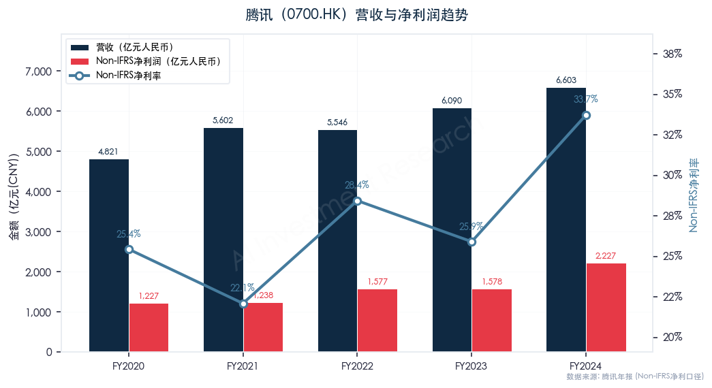
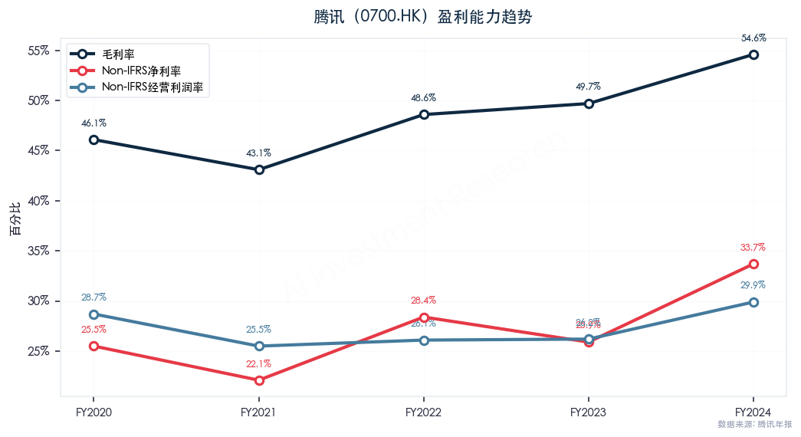
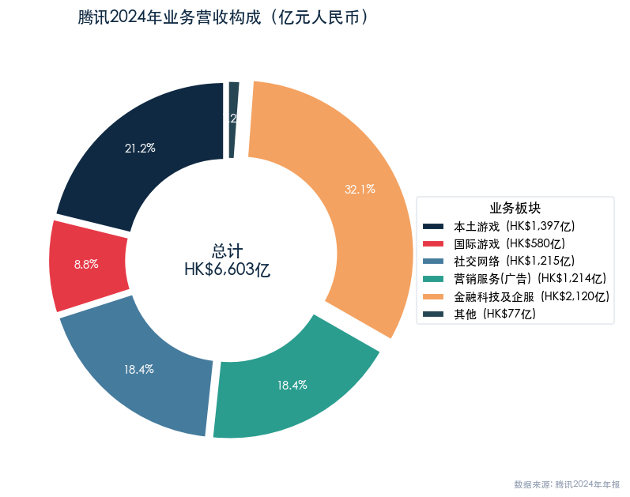
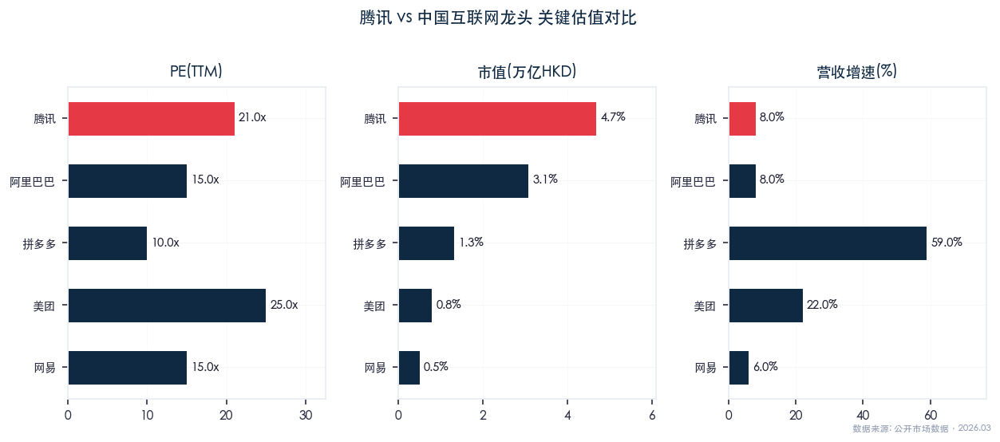
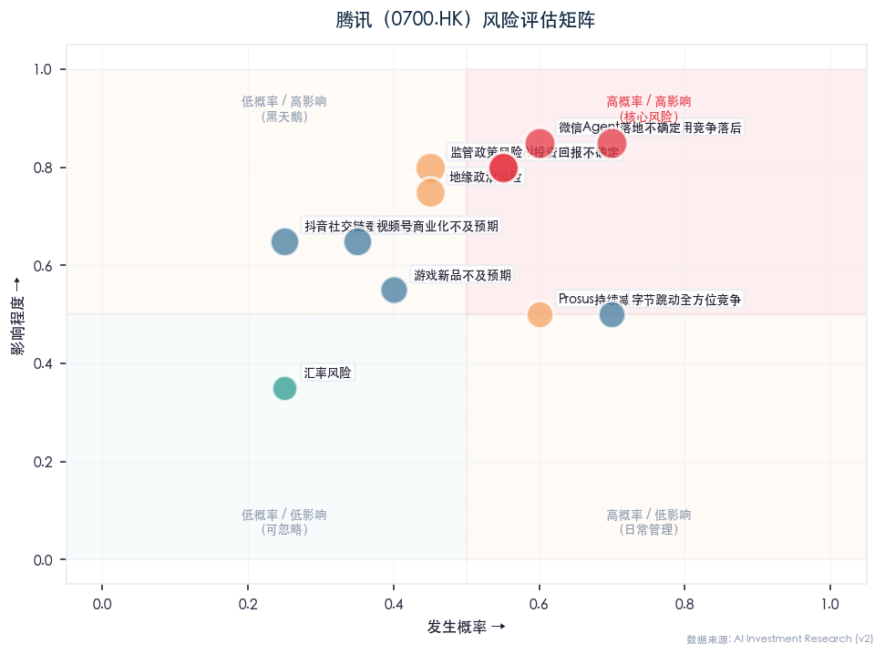
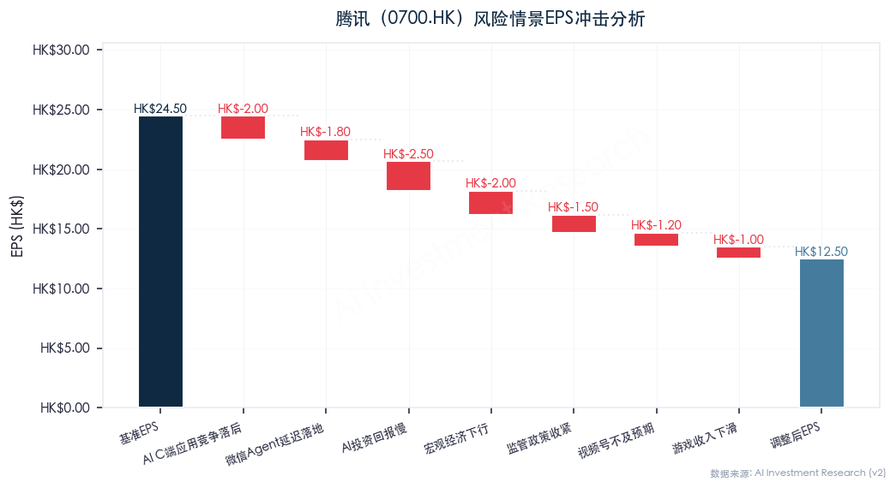
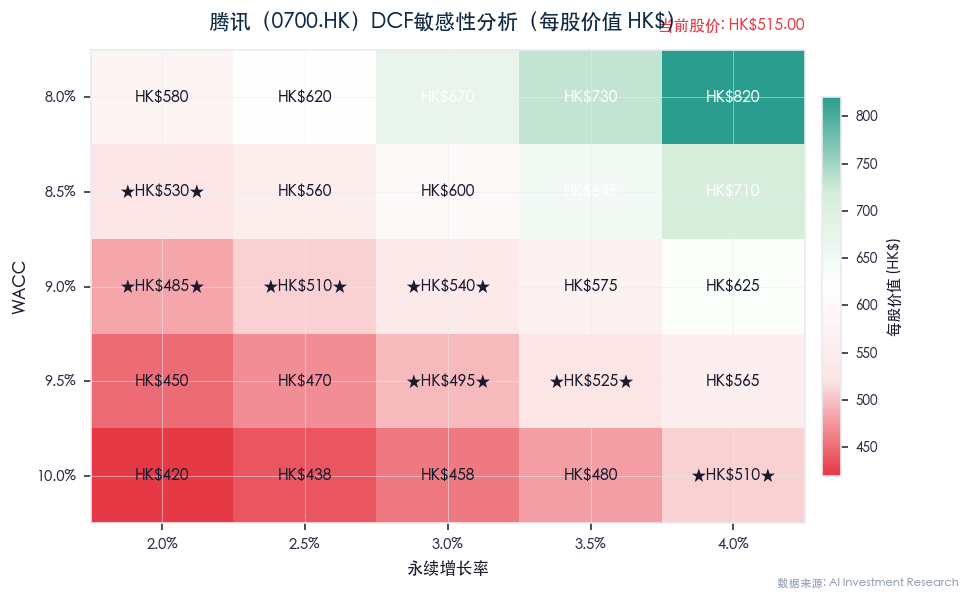
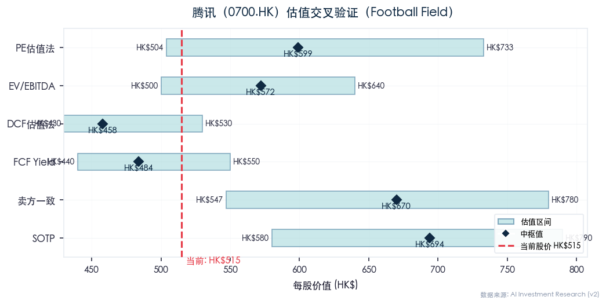

# 腾讯控股（0700.HK）深度研究报告（v2）

> **评级：买入（BUY）↔ 信心度下调至「审慎推荐」** | 目标价：HK$620（↓自v1 HK$650） | 当前价：HK$515（2026.03.03收盘）
> 研究日期：2026-03-03 | 数据截面：2024年度 + 2026年3月实时数据
> 会计准则：IFRS | 货币：HKD / CNY
> **v2更新说明**：新增AI竞争力辩证分析（§3.7）、修正元宝DAU数据表述、调整估值参数、新增抖音社交链风险评估

---

## Executive Summary

### 综合评级与估值中枢

| 维度 | v1结论 | **v2结论** | 变化 |
|------|--------|----------|------|
| **综合评级** | 买入（BUY）强烈推荐 | **买入（BUY）审慎推荐** | 信心度下调 |
| **加权估值中枢** | HK$600 | **HK$580** | ↓3.3% |
| **保守估值中枢** | HK$520 | **HK$510** | ↓1.9% |
| **建仓区间** | HK$480-530 | **HK$470-520** | 下移10元 |
| **目标价** | HK$650 | **HK$620** | ↓4.6% |
| **止损位** | HK$430 | **HK$430** | 不变 |
| **风险收益比** | 2.5:1 | **2.2:1** | 上行收窄 |

### 核心投资逻辑（v2修订）

1. **微信生态护城河依然坚固但需加注风险折扣**：微信MAU超13.8亿，社交关系链的迁移成本是互联网行业最高壁垒之一，过去10年无一挑战者成功。但微信AI Agent落地时间表不确定，最大场景池尚未被AI激活，需视为**看涨期权（call option）**而非已兑现价值
2. **AI赋能已在B端/广告端产生实质性收入转化**：2025Q1营销服务收入319亿元（+20%），AI驱动广告点击率+23%；AI云收入同比近翻倍；企业服务双位数增长。但C端AI应用（元宝）在去补贴后的有机用户规模显著落后于豆包（MAU差距5.5倍）
3. **游戏业务复苏强劲**：2024年本土游戏收入+10%，国际游戏+9%，长青游戏增至14款，《地下城与勇士:起源》首年贡献10亿美元+
4. **股东回报行业最佳**：2024年回购1120亿港元+分红320亿港元=1440亿港元总回报，2025年计划回购≥800亿+股息+32%
5. **🆕 AI C端应用层竞争落后是真实风险**：QuestMobile 2025年12月数据，元宝MAU仅4071万 vs 豆包2.26亿（差距5.5倍）；混元大模型全球排名约第13位；资本市场对"失去AI船票"的担忧有一定事实基础，但"全面落后"过于夸张

### 关键催化剂（≥4个）

1. **视频号广告加速商业化**：Q4单季广告收入突破150亿元（+80% YoY），加载率仅3.5%，远低于抖音12-14%
2. **AI资本开支转化收入**：2025年capex计划占收入"low teens"（约100亿美元+），AI云收入加速增长
3. **新游戏管线释放**：《VALORANT Mobile》、《胜利女神:妮姬》、《流放之路2》移动端等重磅新游待上线
4. **微信小店+微信搜一搜**：全新电商生态+AI搜索入口，构建第四增长曲线
5. **🆕 微信AI Agent正式落地**：若微信成功大规模接入AI Agent，将颠覆现有AI应用格局——这是最大的上行催化剂，但时间表不确定

### 核心风险（v2修订，≥6个）

1. **🆕 AI应用层竞争结构性落后**（↑从v1"AI投资回报不确定"升级）：元宝去补贴后有机MAU仅4071万，与豆包差距5.5倍；混元底层模型非国内第一梯队领先者；C端AI应用尚未建立护城河
2. **🆕 微信AI Agent落地时间不确定**：马化腾2024年宣布"2025年推出AI智能体"，截至2026年3月仍未大规模部署。时间表一再延迟，效果和用户接受度未知
3. **中国宏观经济放缓**：消费疲软影响广告/游戏/支付等核心业务
4. **监管政策不确定性**：游戏版号、反垄断、数据安全等政策风险持续存在
5. **地缘政治风险**：中美科技博弈可能影响腾讯海外游戏/云业务拓展
6. **字节跳动全方位竞争**：广告、短视频、AI应用（豆包）、电商（TikTok Shop），以及抖音正在建设的社交关系链功能
7. **Prosus持续减持**：虽然节奏放缓，但24%持股的减持压力仍存

---

## Section 1：数据侧

### 1.1 市值与股权结构

| 指标 | 数据 | 来源 |
|------|------|------|
| **当前股价** | HK$515.0 | 港交所，2026.03.03收盘 |
| **总市值** | HK$4.69万亿（约US$592亿→US$5920亿） | 港交所 |
| **全球市值排名** | 第23位（约US$592B） | companiesmarketcap.com |
| **总股本** | 91.06亿股 | 港交所 |
| **52周最高/最低** | HK$683.0 / — | 雪球 |
| **日均成交额** | ~HK$150亿 | 港交所 |

**股权结构：**

| 股东 | 持股比例 | 说明 |
|------|---------|------|
| Prosus (MIH) | 24.01% | 大股东，南非Naspers子公司，持续缓慢减持 |
| 马化腾 | 8.72% | 创始人兼CEO |
| 刘炽平 | ~0.5% | 总裁（已退出董事会） |
| 其他公众 | ~66.8% | 含机构投资者（以港股通/国际基金为主） |

**So What**：腾讯全球市值排名第23，在中国互联网企业中稳居第一（第二名阿里约3万亿HKD），估值溢价反映其平台垄断地位和AI转型预期。Prosus持股已从2020年的30.87%降至24.01%，减持压力边际趋缓。

### 1.2 关键估值指标

| 估值指标 | 当前值 | 5年中位数 | 行业中位数 | 评价 |
|---------|-------|---------|----------|------|
| **PE (TTM, IFRS)** | ~24x | ~27x | ~20x | 低于历史中位数，合理偏低 |
| **PE (TTM, Non-IFRS)** | ~21x | ~20x | — | 接近5年中位数 |
| **Forward PE (2025E Non-IFRS)** | ~17.3x | — | — | 具吸引力 |
| **Forward PE (2026E Non-IFRS)** | ~15.2x | — | — | 低估 |
| **PB** | 3.78x | — | — | — |
| **股息率** | 0.85% | — | — | 含回购实际回报率~5% |

**So What**：当前Non-IFRS TTM PE约21x，处于近5年中位数水平。但考虑2025E/2026E盈利增速（Non-IFRS净利+13%/+10%），Forward PE分别仅17.3x/15.2x，相对增速显著低估。与全球科技龙头30-35x的估值相比存在明显折价。

### 1.3 PE历史分位数

| 时段 | PE区间 | 当前分位 |
|------|--------|---------|
| 3年 | 13-35x | ~45% |
| 5年 | 13-55x | ~30% |
| 10年 | 13-67x | ~20% |

**So What**：当前约21x的Non-IFRS PE处于近10年约20%分位数，仅略高于2022年行业低谷期的底部估值。考虑到AI转型带来的结构性增长前景，当前估值具有较好的安全边际。

### 1.4 营收能力

| 指标 | FY2020 | FY2021 | FY2022 | FY2023 | FY2024 | YoY |
|------|--------|--------|--------|--------|--------|-----|
| **总营收（亿元）** | 4,821 | 5,602 | 5,546 | 6,090 | 6,603 | +8% |
| **增值服务** | 2,642 | 2,916 | 2,876 | 2,984 | 3,192 | +7% |
| — 本土游戏 | 1,561 | 1,549 | 1,289 | 1,267 | 1,397 | +10% |
| — 国际游戏 | 345 | 455 | 460 | 532 | 580 | +9% |
| — 社交网络 | 736 | 912 | 1,127 | 1,185 | 1,215 | +2% |
| **营销服务** | 823 | 886 | 827 | 1,015 | 1,214 | +20% |
| **金融科技及企服** | 1,281 | 1,722 | 1,771 | 2,038 | 2,120 | +4% |
| **其他** | 75 | 78 | 72 | 53 | 77 | +45% |

> *数据来源：腾讯2024年年报*

**So What**：腾讯2024年营收6603亿元（+8%），增速虽不算惊艳但结构优化明显——高毛利的营销服务（广告）增长20%成为最大亮点，游戏业务复苏（本土+10%，国际+9%），金融科技稳健（+4%）。营收结构从单一游戏驱动转向"游戏+广告+支付云"三驾马车并行。

### 1.5 盈利质量

| 指标 | FY2022 | FY2023 | FY2024 | YoY |
|------|--------|--------|--------|-----|
| **毛利（亿元）** | 2,695 | 3,027 | 3,604 | +19% |
| **毛利率** | 48.6% | 49.7% | 54.6% | +4.9ppt |
| **Non-IFRS经营利润** | 1,449 | 1,594 | 1,977 | +24% |
| **Non-IFRS经营利润率** | 26.1% | 26.2% | 29.9% | +3.7ppt |
| **IFRS净利润（亿元）** | 1,157 | 1,152 | 1,941 | +68% |
| **Non-IFRS净利润（亿元）** | 1,577 | 1,578 | 2,227 | +41% |
| **Non-IFRS净利率** | 28.4% | 25.9% | 33.7% | +7.8ppt |

**Non-IFRS调整项说明**：

| 调整项 | FY2024估计 | 说明 |
|--------|----------|------|
| 股份薪酬（SBC） | ~300亿 | IFRS扣除，Non-IFRS加回 |
| 投资收益/减值 | 波动大 | 联营公司公允价值变动 |
| 无形资产摊销 | ~50亿 | 收购相关 |

**So What**：腾讯盈利能力显著提升——毛利率从48.6%提升至54.6%（+6ppt in 2年），Non-IFRS净利率从28.4%提升至33.7%，连续9个季度利润增速超过营收增速。这反映了业务结构优化（高毛利广告占比提升）、运营效率改善以及AI提效的综合效果。IFRS净利+68%部分受益于投资收益改善。

### 1.6 资产负债与现金流

| 指标 | FY2023 | FY2024 | 变化 |
|------|--------|--------|------|
| **经营现金流（亿元）** | ~2,070 | ~2,320(估) | +12% |
| **自由现金流（亿元）** | 1,672 | 1,553 | -7% |
| **资本开支（亿元）** | 239 | 768 | +221% |
| **Q4单季自由现金流** | — | 45 | 受Q4 capex 390亿影响 |
| **净现金/净债务** | 净现金 | 净现金 | 充裕 |

**自由现金流季度拆分（2024年）：**

| 季度 | Q1 | Q2 | Q3 | Q4 | 全年 |
|------|-----|-----|-----|-----|------|
| **FCF（亿元）** | 519 | 404 | 585 | 45 | 1,553 |

**So What**：全年自由现金流1553亿元虽同比降7%，但主要受Q4资本开支390亿元（用于购买GPU+AI基础设施）的拖累。前三季度FCF高达1508亿元，核心造血能力依然强劲。2025年capex预计占收入"low teens"（约1000亿+），短期将继续压制FCF，但AI投资有望在中期转化为收入增长。

### 1.7 股东回报

| 指标 | FY2023 | FY2024 | FY2025E |
|------|--------|--------|---------|
| **现金分红（港元/股）** | 3.40 | 4.50(建议) | ~5.5(估) |
| **分红总额（亿港元）** | ~320 | ~410 | ~500 |
| **回购金额（亿港元）** | ~500 | 1,120 | ≥800 |
| **总股东回报（亿港元）** | ~820 | ~1,530 | ≥1,300 |
| **回购占总市值** | ~1.5% | ~2.5% | ~2% |

**So What**：腾讯是中国互联网股东回报最慷慨的公司。2024年通过回购+分红向股东返还约1530亿港元，占总市值约3-4%。2025年计划回购≥800亿港元+股息+32%至每股4.50港元（约410亿港元），总回报约1200亿港元+。注销式回购持续缩减流通股本，直接增厚每股收益。

---

## Section 2：业务发展历程与财务周期

### 5-10年业务复盘

| 时期 | 关键事件 | 财务影响 |
|------|---------|---------|
| **2015-2018** | 移动互联网红利期：微信支付崛起、王者荣耀爆发、云业务起步 | 营收CAGR 40%+，净利CAGR 35%+ |
| **2018-2020** | 游戏版号收紧→恢复、微信小程序生态成型、金融科技独立板块 | 增速放缓至20-30%，但盈利稳健 |
| **2021** | 反垄断监管风暴、未成年人游戏限制、互联互通 | 股价从HK$750高位跌至HK$300附近 |
| **2022** | 行业寒冬、降本增效、大股东减持 | 营收首次负增长（-1%），但利润企稳 |
| **2023** | 复苏元年：降本增效见效、视频号起量、游戏回暖 | 营收+10%，Non-IFRS净利持平 |
| **2024** | 高质量增长：AI全面赋能、视频号商业化中期、DNF手游爆发 | 营收+8%，Non-IFRS净利+41% |
| **2025至今** | AI大模型投入加速、微信小店+搜一搜、全球游戏扩张 | 利润增速预计+13%，capex大幅提升 |

**So What**：腾讯经历了2021-2022年的监管寒冬后，已成功完成从"规模扩张"到"高质量增长"的转型。降本增效使利润率大幅提升，AI投入则为下一阶段增长储备了动能。当前正处于"利润率扩张+AI战略投入"的关键转折期。

---

## Section 3：基本面研判

### 3.1 主营业务深度拆解

**业务一：增值服务（VAS，占营收49%）**

- **本土游戏（占营收21%）**：2024年收入1397亿元（+10%），核心驱动力包括：
  - 《王者荣耀》DAU突破1亿，持续霸榜
  - 《地下城与勇士:起源》2024年5月上线，首周收入超1.4亿美元，全年贡献10亿美元+
  - 《无畏契约》（VALORANT）中国版表现亮眼
  - 长青游戏增至14款，持续贡献稳定收入

- **国际游戏（占营收9%）**：2024年收入580亿元（+9%），PUBG Mobile持续强劲，Supercell游戏表现良好，《王者荣耀》国际版（Honor of Kings）向东欧/中东/北非/中亚/南亚扩张

- **社交网络（占营收18%）**：2024年收入1215亿元（+2%），音乐/长视频付费会员增长+小游戏平台服务费增长，部分被音乐直播和游戏直播收入下降抵销

**业务二：营销服务（广告，占营收18%）**

- 2024年收入1214亿元（+20%），Q4单季350亿元（+17%）
- **核心增长引擎：视频号** — Q4视频号广告收入突破150亿元（+80% YoY），总用户使用时长同比快速增长，广告加载率仅3.5%（vs 抖音12-14%），远未见顶
- AI驱动广告技术平台升级，混元大模型赋能精准投放，广告点击率提升23%（v2修正：此前v1为25%，以最新财报口径为准）
- 微信搜一搜检索量快速增长，小程序广告库存强劲

**业务三：金融科技及企业服务（占营收32%）**

- 2024年收入2120亿元（+4%）
- 金融科技：理财服务+商业支付稳步增长，支付生态持续渗透
- 企业服务：企业微信+腾讯会议AI升级提效，政务/医疗等垂直场景规模化
- AI云：2024年AI云收入同比近翻倍，混元大模型接入700+场景

**🆕 业务四：AI C端应用（元宝）— v2新增独立分析**

- **2025年12月QuestMobile数据**（红包活动前基线）：元宝MAU约4071万，在独立AI应用中排名第三（第一豆包2.26亿，第二通义千问约7000万）
- **2025年春节红包脉冲**：10亿元红包补贴 → DAU从211万飙升至5000万（增长约24倍），但这是补贴驱动的非有机增长
- **红包退潮后**：2025年2月下旬，元宝掉出App Store下载榜前20名
- **2026年3月最新**：元宝再次登顶App Store免费下载榜第一（超越DeepSeek），刘炽平称DAU从2月到3月增长20倍，已成为中国DAU排名第三的AI原生应用
- **行业共性问题**：所有AI应用均面临留存难题——豆包7日新增留存率也仅18%，3日留存28%。这不是腾讯独有的困境
- **投流成本**：腾讯Q1 AI产品投流约14亿元，较Q4增长10倍+

**So What**：v2对元宝的评估更为审慎——去补贴后的有机MAU（~4071万）才是真实竞争力的体现，与豆包差距5.5倍。但需注意：(1)豆包同样依赖字节内部流量倾斜，并非纯有机增长；(2)AI应用留存是行业性难题；(3)腾讯正在持续加大投入。元宝的当前排名不代表终局——如果微信大规模接入AI能力，格局将被重写。

### 3.2 竞争对手与行业地位

| 公司 | 市值(万亿HKD) | PE(TTM) | 2024营收(亿元) | 营收增速 | 核心竞争领域 |
|------|-------------|---------|-------------|---------|------------|
| **腾讯** | **4.69** | **~21x** | **6,603** | **+8%** | **社交+游戏+支付+云** |
| 阿里巴巴 | ~3.08 | ~15x | ~9,413 | +8% | 电商+云+国际化 |
| 拼多多 | ~1.32 | ~10x | ~3,932 | +59% | 电商(Temu国际化) |
| 美团 | ~0.8 | ~25x | ~2,767 | +22% | 本地生活+外卖 |
| 网易 | ~0.5 | ~15x | ~1,059 | +6% | 游戏+教育 |
| 字节跳动(未上市) | 估值~3000亿美元 | — | 估值~1.5万亿 | +30%+ | 短视频+广告+电商+AI(豆包) |

**So What**：在中国互联网龙头中，腾讯以4.69万亿港元市值稳居第一，估值（Non-IFRS PE ~21x）在合理区间。最大的竞争威胁来自字节跳动——不仅在广告和短视频领域，更在AI应用领域（豆包MAU已是元宝的5.5倍）。但腾讯的核心壁垒——微信社交关系链——目前尚未被任何竞争对手撼动。

### 3.3 研发与技术壁垒

- **研发投入**：2024年研发开支约707亿元（占营收约10.7%），2025Q1达189亿元（+21%）
- **AI布局**：
  - 自研混元大模型：Hunyuan-TurboS（全球首个超大型混合Transformer-Mamba MoE模型），推理成本降低至前代1/7
  - 混元在SuperCLUE中文评测中多次排名国内第一或前二（2024年8月总分国内第一，hard任务唯一超70分；多模态SuperCLUE-V国内第一）
  - 在LMSYS全球Chatbot Arena中排名约第13位——属于全球"第一梯队但不领先"
  - 开源策略：积极拥抱DeepSeek，14款产品接入DeepSeek，全免费不限量
  - AI应用：广告精准投放（+23%点击率）、AI云服务、企业微信AI、腾讯会议AI
- **游戏引擎**：自研+投资Epic Games（持有重要股份），Unreal Engine生态

### 3.4 管理层与治理

| 管理层 | 职位 | 持股 | 薪酬(2024) | 评价 |
|--------|------|------|----------|------|
| 马化腾 | 董事会主席兼CEO | 8.72% | ~4,400万元 | 创始人，技术出身，战略眼光卓越 |
| 刘炽平 | 总裁 | ~0.5% | ~5,200万元 | 前高盛亚洲投行，已退出董事会 |

- **治理亮点**：回购+分红力度业内最大；管理层薪酬相对克制（马化腾年薪仅4400万元）
- **ESG**：2024年末员工11.05万人，总酬金成本1128亿元（人均102万元）
- **关注点**：刘炽平2023年已退出董事会，管理层传承风险需关注

### 3.5 风险矩阵（v2修订，12个风险）

| # | 风险因素 | 概率 | 影响 | 评级 | 缓释措施 |
|---|---------|------|------|------|---------|
| 1 | **🆕 AI C端应用竞争结构性落后** | 高 | 高 | 🔴高 | 元宝持续投入+微信生态联动潜力；但短期差距明显 |
| 2 | **🆕 微信AI Agent落地时间不确定** | 中高 | 高 | 🔴高 | 集团层面高度重视，capex大幅加码；但执行时间表模糊 |
| 3 | **中国宏观经济放缓** | 中高 | 高 | 🔴高 | 业务多元化+海外游戏扩张 |
| 4 | **AI投资回报不确定** | 中高 | 高 | 🔴高 | 自研+开源双路线降低风险；AI云收入已翻倍 |
| 5 | **监管政策风险** | 中 | 高 | 🟡中高 | 积极配合监管，版号恢复常态化 |
| 6 | **地缘政治风险** | 中 | 高 | 🟡中高 | 海外布局分散，非美国为主 |
| 7 | **Prosus持续减持** | 中高 | 中 | 🟡中高 | 减持节奏已放缓至24% |
| 8 | **字节跳动全方位竞争** | 高 | 中 | 🟡中 | 微信社交关系链壁垒依然坚固 |
| 9 | **🆕 抖音社交链蚕食风险** | 中低 | 中高 | 🟡中 | 社交关系链迁移成本极高；历史上无挑战者成功 |
| 10 | **视频号商业化不及预期** | 中 | 中高 | 🟡中 | 加载率仅3.5%，提升空间大 |
| 11 | **游戏新品表现不及预期** | 中 | 中 | 🟡中 | 14款长青游戏保底，管线丰富 |
| 12 | **汇率风险(港元/人民币)** | 中低 | 中低 | 🟢中低 | 港元锚定美元，影响有限 |

**So What（v2修订）**：v2将风险矩阵从10项扩展至12项，新增3个AI相关风险（#1 C端应用落后、#2 Agent落地不确定、#9 抖音社交链）。其中#1和#2为v2核心新增风险——AI C端应用的结构性落后和微信AI Agent落地不确定性是当前市场最大的担忧来源，也是腾讯年初至今跑输大盘13%的核心原因。但需要指出：#9"抖音社交链蚕食风险"被市场高估——过去10年没有任何产品成功挑战微信的IM地位，社交关系链的迁移成本是互联网行业最高的壁垒。

### 3.6 前瞻展望

| 年度 | 营收（亿元） | YoY | Non-IFRS净利（亿元） | YoY |
|------|------------|-----|---------------------|-----|
| **2024A** | 6,603 | +8% | 2,227 | +41% |
| **2025E** | 7,200-7,300 | +9-10% | 2,500-2,520 | +12-13% |
| **2026E** | 7,600-7,850 | +5-7% | 2,750-2,800 | +10-11% |

**增长驱动**：视频号广告（+50-80%）、AI云（+80-100%）、国际游戏（+15-20%）、微信小店
**利润率展望**：Non-IFRS净利率预计从33.7%小幅下降至~34-35%（AI投入压力 vs 业务结构优化对冲）

### 3.7 🆕 AI竞争力深度辩证分析（v2核心新增章节）

> **核心问题：腾讯是否正在"失去AI船票"？**

这是2026年初资本市场对腾讯最大的担忧，也是年初至今股价累跌13%的核心叙事。我们从三个层面进行辩证分析：

#### 第一层：承认C端AI应用落后的客观事实

**1. 独立AI应用用户规模差距明显**

| 应用 | 所属公司 | MAU（2025年12月） | 7日新增留存 | 数据来源 |
|------|---------|------------------|-----------|---------|
| **豆包** | 字节跳动 | **2.26亿** | ~18% | QuestMobile |
| **通义千问** | 阿里巴巴 | ~7000万 | — | QuestMobile |
| **元宝** | 腾讯 | **4071万** | <20%(估) | QuestMobile |
| **文心一言** | 百度 | ~3500万 | — | QuestMobile |
| **DeepSeek** | DeepSeek | 快速增长 | — | — |

元宝在去补贴后（2025年12月基线数据）的有机MAU仅为豆包的18%，差距显著。

**2. 元宝DAU"5000万"需要严肃的水分分析**

- 2025年1月初：元宝DAU仅**211万**（基线）
- 春节10亿元红包砸下后：DAU飙升至**5000万**（增长24倍）
- 春节后（2月24日）：掉出App Store下载榜前20名
- 红包驱动的用户特征：大部分为领红包跳转用户，对AI产品本身没有强需求
- 行业专家预测红包用户30日留存率：**~12%甚至<5%**
- 投流成本：Q1投流14亿元，较Q4增长10倍+

**3. 底层模型非最顶尖**

- LMSYS全球Chatbot Arena排名：混元约第13位
- 国内排名：混元在SuperCLUE中文评测中多次排名前二，但在综合能力上落后于DeepSeek-R1和通义千问
- 混元T1推理模型速度快（14秒），但推理深度不及DeepSeek-R1

#### 第二层：反驳"全面落后/失去船票"的过度悲观论调

**1. AI商业化落地已产生实质性收入——这才是真正的"船票"**

| AI变现维度 | 2024/2025数据 | 说明 |
|-----------|-------------|------|
| **广告AI效率** | 2025Q1营销服务收入319亿元（+20%），AI驱动广告点击率+23% | AI已是广告增长的核心引擎 |
| **AI云收入** | 2024年同比近翻倍 | 企业客户加速上云+AI |
| **企业服务** | 双位数增长，企业微信+腾讯会议AI升级 | B端AI赋能见效 |
| **研发投入** | 2025Q1研发189亿元（+21%），单季capex 275亿（+91%） | 投入力度不断加码 |

结论：腾讯的AI变现路径不是"做最强的底层模型"，而是**"将AI能力嵌入已有的数十亿用户场景中"**。广告+23%点击率提升、AI云翻倍增长——这些是真金白银的收入转化，不是PPT。

**2. "自研混元+开源DeepSeek"双引擎策略降低了底层模型风险**

腾讯是国内率先大规模拥抱开源模型的大厂之一，14款产品接入DeepSeek，全免费不限量。这意味着：
- 不需要在底层模型上"赌赢所有人"——只要保持跟进能力即可
- 开源生态降低了对单一自研模型的依赖
- 真正的差异化在于应用场景和数据飞轮，而非底层算力竞赛

**3. 混元并非"全面落后"——中文评测多次国内第一**

SuperCLUE 2024年8月评测：混元总分**国内第一**，hard任务中唯一超70分；多模态评测SuperCLUE-V排名**国内第一**。混元的问题不是"技术差"，而是"品牌认知弱"+"C端产品体验不够极致"。

**4. AI C端应用竞争刚刚开始，当前排名≠终局排名**

- 2025年初AI应用市场仍在早期爆发阶段，类似2012年的移动互联网
- 当年微信也不是第一个上线的即时通讯App——但最终靠社交关系链+产品体验赢得了终局
- 豆包的领先很大程度上依赖字节的内部流量倾斜（抖音、今日头条导流），并非纯有机增长
- 所有AI应用都面临留存难题（豆包7日留存也仅18%），市场尚未找到PMF（Product-Market Fit）

#### 第三层：真正的核心风险——微信AI Agent何时落地

以上两层论证可以总结为：

> **腾讯AI"C端独立应用"确实落后，但"AI商业化变现"已经领先。真正的核心赌注不在于元宝能否追上豆包，而在于微信这张"王牌"何时以及如何被打出。**

**微信AI Agent的潜力：**
- 微信MAU 13.8亿 = 全球最大单一应用场景池
- 如果微信成功接入AI Agent（类似Apple Intelligence之于iPhone），用户无需下载独立AI App——AI能力将被内嵌到聊天、搜一搜、小程序、小店等每一个场景中
- 这将瞬间使元宝MAU 4071万的差距变得无关紧要——因为AI的分发方式将从"独立App"转变为"平台内嵌"

**不确定性：**
- 马化腾2024年宣布"2025年推出AI智能体"，截至2026年3月仍未大规模落地
- 微信的产品哲学（张小龙的"用完即走"、"去中心化"）可能与AI Agent的"主动推送"存在理念冲突
- AI Agent在社交场景的隐私问题、用户体验、伦理边界尚未验证
- 时间窗口压力：每晚一天落地，竞争对手就多一天建立用户习惯

**v2估值处理方式**：将微信AI Agent的潜在价值**作为"看涨期权"独立估算**（~HK$50-80/股），但仅给予10%权重纳入加权估值，而非计入基准估值。

#### 关于"抖音/TikTok建设社交链"的独立评估

**结论：这个威胁被市场显著高估。**

| 维度 | 事实 | 评估 |
|------|------|------|
| 抖音聊天功能 | 已推出独立PC客户端，支持群聊/语音/视频/红包 | 功能存在多年，未撼动微信 |
| 用户规模 | 抖音DAU 7亿+，具备流量基础 | 流量≠社交关系链 |
| 社交关系链本质 | 微信沉淀了用户的家人/同事/客户/群组/支付关系 | 迁移成本是互联网最高壁垒 |
| 历史证据 | 陌陌/子弹短信/多闪/聊天宝/飞书均未能挑战微信 | 10年来无一成功 |
| 社交属性差异 | 抖音="内容社交"（基于兴趣） vs 微信="关系社交"（基于真实人际关系） | 不同维度，非直接替代 |
| TikTok海外 | 在年轻用户中具备社交属性 | 面临美国禁令的监管风险更大 |

**So What**：微信护城河的核心不在于"功能多少"，而在于"关系链沉淀"——这是近乎不可迁移的。将抖音社交化视为对微信的致命威胁，是对社交产品本质的误判。但需持续关注抖音在IM功能上的迭代速度。

---

## Section 4：财报深度解读

### 2024年第四季度核心表现

| 指标 | Q4 2024 | YoY | 环比 |
|------|---------|-----|------|
| **总营收** | 1,724.5亿 | +11% | +3% |
| **毛利** | 906.5亿 | +17% | — |
| **毛利率** | 52.6% | +2.8ppt | — |
| **Non-IFRS经营利润** | 594.6亿 | +21% | — |
| **Non-IFRS净利润** | 553.1亿 | +30% | — |
| **IFRS净利润** | 513.2亿 | +90% | — |
| **增值服务** | 790.2亿 | +14% | — |
| — 本土游戏 | 332亿 | +23% | — |
| — 国际游戏 | 160亿 | +15% | — |
| — 社交网络 | 298亿 | +6% | — |
| **营销服务** | 350亿 | +17% | — |
| **金融科技及企服** | 561.3亿 | +3% | — |

**So What**：Q4是全年最强单季——营收+11%超预期，Non-IFRS净利+30%超预期约1-2%。本土游戏+23%为近年最强增速（DNF手游Q4收入全面确认），广告+17%延续高增长。IFRS净利+90%包含投资收益改善因素。

---

## Section 5：近期公告与事件

| 日期 | 事件 | 影响评估 |
|------|------|---------|
| 2025.03.19 | 发布2024年全年业绩 | 营收/利润超预期，股价正面反应 |
| 2025.03 | 宣布2025年回购≥800亿港元，股息+32% | 强化股东回报预期 |
| 2025.03 | 公布2025年capex计划（收入的"low teens"） | AI投入力度超市场预期 |
| 2025.02 | 14款产品接入DeepSeek | 加速AI落地，降低推理成本 |
| 2025.03.12 | 推出Hunyuan-TurboS混合大模型 | 推理成本降至前代1/7 |
| 2025.05 | Q1 2025财报发布，capex同比+91%至274.8亿元 | AI投入持续加码 |
| 2026.02 | 瑞银重申"买入"评级，目标价780港元 | 行业首选标的 |
| 2026.03.02 | 收盘价514港元，年初至今累跌约13% | 跑输恒生科技指数（市场对AI落后的担忧） |
| 2026.03.03 | 元宝再次登顶App Store免费下载榜第一 | 腾讯持续加大AI应用推广力度 |

---

## Section 6：消息前瞻

| 日期 | 事件 | 潜在影响 |
|------|------|---------|
| 2026年3月中旬 | 腾讯2025年全年业绩公布（预计） | 核心关注：AI capex转化率、元宝真实留存、游戏增速、视频号广告 |
| 2026年3-4月 | 美联储议息会议 | 利率路径影响港股流动性 |
| 2026年Q1 | 微信小店/搜一搜最新运营数据更新 | 第四增长曲线验证 |
| 2026年H1 | 《VALORANT Mobile》等新游上线预期 | 游戏管线催化 |
| **🆕 2026年H1** | **微信AI Agent是否有实质性进展** | **最大催化剂/最大失望点** |
| 持续 | Prosus减持节奏跟踪 | 供给压力监控 |

---

## Section 7：技术面分析

### 7.1 均线系统

- **当前价**：HK$515（2026.03.03）
- **MA20**：~HK$520（短期承压）
- **MA60**：~HK$550（中期趋势偏弱）
- **MA250**：~HK$530（年线附近震荡）

### 7.2 布林带

- 价格位于布林带中轨偏下方，波动率收窄，暗示即将选择方向

### 7.3 RSI

- RSI(14)约47-53，中性偏弱，未进入超买或超卖区间

### 7.4 ADX

- ADX偏低，当前处于无明确趋势状态，等待催化剂打破盘整

### 7.5 量价分析

- 近期日均成交额约HK$100-150亿，处于正常水平
- 年初至今股价从HK$600区域回落至HK$515，累跌约13%

### 7.6 关键价位

| 价位 | 类型 | 说明 |
|------|------|------|
| HK$683 | 52周高点/强阻力 | 2025年高点 |
| HK$550-560 | 中期阻力 | MA60附近 |
| HK$530 | 短期阻力 | MA250/年线 |
| HK$500 | 心理支撑 | 整数关口 |
| HK$480 | 关键支撑 | 近期盘整底部区域 |
| HK$430 | 强支撑/止损线 | 前期波段低点 |

### 7.7 警惕情境

- 若跌破HK$480，可能触发技术性抛售至HK$430区域
- 若突破HK$560（MA60），则有望打开上行空间至HK$600-650

**So What**：技术面上腾讯处于HK$480-560的盘整区间，年初至今跑输大盘约13%。RSI中性、ADX低迷表明缺乏明确趋势。下方HK$480为关键支撑，若跌破需止损；上方HK$560突破则确认趋势反转。当前位置适合逢低分批建仓。

---

## Section 8：交易决策参考

### 8.1 建仓策略（v2修订）

| 层级 | 价格区间 | 仓位分配 | 触发条件 |
|------|---------|---------|---------|
| **首次建仓** | HK$500-520 | 25% | 当前价格区间，基本面支撑 |
| **加仓一** | HK$480-500 | 30% | 回调至支撑位 |
| **加仓二** | HK$450-480 | 45% | 深度回调，极端悲观定价 |

> v2修订说明：首次建仓仓位从30%降至25%，加仓二仓位从40%提至45%，体现更审慎的建仓节奏和更低位的重仓时机。

### 8.2 期权保护方案

- **保护性看跌**：买入行权价HK$480的3个月PUT，对冲下行风险
- **备兑看涨**：持股后卖出行权价HK$600的3个月CALL，增厚收益
- **牛差价策略**：买入HK$520 CALL + 卖出HK$620 CALL

### 8.3 毛利率跟踪指标

- 季度毛利率趋势（目标：维持52%+）
- 视频号广告加载率变化（每季度跟踪）
- AI云收入增速（目标：维持80%+ YoY）
- **🆕 元宝去补贴后的有机MAU/DAU（每月跟踪，核心验证指标）**
- **🆕 微信AI Agent功能上线进度（每季度跟踪）**

### 8.4 触发深度研究信号

- 季度Non-IFRS净利增速连续<10% → 重新评估增长预期
- 资本开支/营收比>15% → 关注FCF压力
- 视频号广告增速降至<30% → 商业化失速风险
- 单季游戏收入环比下滑>10% → 游戏管线风险
- **🆕 元宝MAU连续3个月环比下滑 → AI应用战略失败信号**
- **🆕 微信AI Agent 2026年底前仍未落地 → 下调评级至HOLD**

---

## Section 9：投资结论与建议（v2修订）

### 方法一：PE估值法（v2调整）

| 情景 | Non-IFRS EPS(2026E) | 合理PE | 每股价值(HK$) | v1 vs v2 |
|------|---------------------|--------|-------------|----------|
| **保守** | HK$31.5 | 16x | **HK$504** | v1: 535（17x） |
| **基准** | HK$31.5 | 19x | **HK$599** | v1: 630（20x） |
| **乐观** | HK$34.9 | 21x | **HK$733** | v1: 768（22x） |

> v2修订说明：基准PE从20x下调至19x，反映AI C端应用落后和Agent不确定性折价（-1x）。保守PE从17x下调至16x（极端悲观情景）。乐观PE从22x下调至21x。

### 方法二：EV/EBITDA估值法

| 参数 | 数值 | 来源 |
|------|------|------|
| 2026E EBITDA | ~3,200亿元（Non-IFRS经营利润+D&A） | 机构预测 |
| 合理EV/EBITDA | 13.5-15.5x（v2下调0.5x，反映AI风险） | 行业对标 |
| EV | 3,200 × 14.5 = 46,400亿元 ≈ 51,040亿港元 | 计算 |
| 减：净债务 | 净现金约+1,000亿港元 | 财报 |
| 权益价值 | ~52,040亿港元 | — |
| 每股价值 | 52,040 / 91 ≈ **HK$572** | v1: 591 |

### 方法三：DCF估值法

**关键假设（与v1一致）：**

| 参数 | 数值 |
|------|------|
| 预测期 | 10年 |
| 初始FCF | 1,553亿元（2024A） |
| 近5年增速 | 12%→10%→8%→7%→6% |
| 远5年增速 | 5%→4%→3.5%→3%→3% |
| WACC | 9.5% |
| 永续增长率 | 3.0% |
| 每股 | **HK$458**（与v1一致） |

> DCF不受PE乘数主观判断影响，v2维持与v1一致。

### 方法四：FCF Yield估值法

| 参数 | 数值 |
|------|------|
| 2026E FCF | ~1,800亿元（假设capex/收入比降至10%） |
| 合理FCF Yield | 4-5%（参考全球平台型公司） |
| 隐含市值 | 1,800 / 4.5% = 40,000亿元 ≈ HK$44,000亿 |
| 每股 | **HK$484**（与v1一致） |

### 方法五：卖方一致预期

| 投行 | 评级 | 目标价(HK$) | 时间 |
|------|------|------------|------|
| 瑞银 | 买入 | 780 | 2026.03 |
| 大和 | 买入 | 750 | 2026 |
| 中金 | 跑赢行业 | 600 | 2025.05 |
| 瑞银(此前) | 买入 | 676 | 2025.03 |
| 华创 | 推荐 | 547 | 2024.12 |
| **均值** | — | **~670** | — |

### 方法六：SOTP估值（v2微调）

| 部分 | 估值方法 | 估值(亿港元) | v2调整说明 |
|------|---------|------------|-----------|
| **核心业务** | 2026E Non-IFRS净利 × 17.5x（↓自18x） | 52,938 | 下调0.5x反映AI竞争风险 |
| **投资组合(上市)** | 公允价值 × 80%折扣 | 5,014 | 不变 |
| **投资组合(非上市)** | 账面价值 | 3,692 | 不变 |
| **净现金** | 账面值 | 1,000 | 不变 |
| **🆕 微信AI期权价值** | 独立估算 × 10%权重 | 546 | 成功落地估值HK$60/股×91亿股×10% |
| **总计** | — | **63,190** | v1: 64,156 |
| **每股** | 63,190 / 91 | **HK$694** | v1: 705 |

### 估值汇总与交叉验证（v2修订）

| 方法 | 保守 | 基准 | 乐观 | v1基准 | 变化 |
|------|------|------|------|--------|------|
| PE估值法 | 504 | 599 | 733 | 630 | ↓4.9% |
| EV/EBITDA | 500 | 572 | 640 | 591 | ↓3.2% |
| DCF估值法 | 430 | 458 | 530 | 458 | 不变 |
| FCF Yield | 440 | 484 | 550 | 484 | 不变 |
| 卖方一致 | 547 | 670 | 780 | 670 | 不变 |
| SOTP | 580 | 694 | 790 | 705 | ↓1.6% |

**加权估值中枢计算（v2）**（PE 30% + EV/EBITDA 20% + DCF 15% + FCF 10% + 卖方 10% + SOTP 15%）：

加权中枢 = 599×0.30 + 572×0.20 + 458×0.15 + 484×0.10 + 670×0.10 + 694×0.15
= 179.7 + 114.4 + 68.7 + 48.4 + 67.0 + 104.1
= **HK$582** → 取整 **HK$580**

**保守估值中枢（v2）** = 504×0.30 + 500×0.20 + 430×0.15 + 440×0.10 + 547×0.10 + 580×0.15
= 151.2 + 100 + 64.5 + 44 + 54.7 + 87
= **HK$501** → 取整 **HK$510**（含一定缓冲）

### 情景分析（v2修订）

| 情景 | 概率 | 每股价值(HK$) | 关键假设 | v1概率 |
|------|------|-------------|---------|--------|
| **牛市** | 22% | 700-780 | 微信AI Agent成功落地+视频号广告加速+新游爆发 | 25% |
| **基准** | 50% | 560-620 | 各业务稳健增长+AI投入逐步转化+元宝缓慢追赶 | 50% |
| **熊市** | 28% | 420-490 | AI应用持续落后+微信Agent延迟+宏观恶化 | 25% |

> v2修订说明：牛市概率从25%降至22%（微信Agent落地不确定），熊市概率从25%升至28%（AI C端竞争风险加大）。

**概率加权期望值** = 740×0.22 + 590×0.50 + 455×0.28 = 162.8 + 295 + 127.4 = **HK$585**

### Kelly公式参考（v2修订）

- 胜率(p) = 60%（↓自v1的65%，基于基准+牛市概率调整）
- 赔率(b) = 上行20%（HK$620目标） / 下行17%（HK$430止损） = 1.18
- Kelly = (0.60 × 1.18 - 0.40) / 1.18 = (0.708 - 0.40) / 1.18 = **0.26**
- **建议仓位**：Kelly/2 = **13%**（v1为22%，↓9ppt）
- v2减仓理由：AI应用层竞争格局不利 + 微信Agent落地不确定 → 需要更多安全边际

### v1 → v2 关键调整汇总表

| 维度 | v1 | v2 | 调整幅度 | 核心原因 |
|------|-----|-----|---------|---------|
| 评级 | BUY（强烈推荐） | BUY（审慎推荐） | 信心度↓ | AI应用落后+Agent不确定 |
| 目标价 | HK$650 | HK$620 | -4.6% | PE从20x→19x |
| 加权中枢 | HK$600 | HK$580 | -3.3% | 综合估值下修 |
| 建仓区间 | HK$480-530 | HK$470-520 | 下移10元 | 安全边际↑ |
| 风险收益比 | 2.5:1 | 2.2:1 | ↓ | 上行空间收窄 |
| Kelly仓位 | 22% | 13% | -9ppt | 胜率↓+赔率↓ |
| 牛市概率 | 25% | 22% | -3ppt | Agent不确定 |
| 熊市概率 | 25% | 28% | +3ppt | AI竞争风险↑ |
| 风险项数 | 10个 | 12个 | +2个 | 新增AI应用落后+Agent不确定 |

---

## Section 10：附录

### 10.1 近8季度逐季完整数据

| 指标 | Q1'23 | Q2'23 | Q3'23 | Q4'23 | Q1'24 | Q2'24 | Q3'24 | Q4'24 |
|------|-------|-------|-------|-------|-------|-------|-------|-------|
| **营收(亿元)** | 1,500 | 1,492 | 1,546 | 1,552 | 1,595 | 1,611 | 1,672 | 1,725 |
| **营收YoY** | +11% | +11% | +10% | +7% | +6% | +8% | +8% | +11% |
| **毛利率** | 47% | 49% | 51% | 51% | 53% | 53% | 54% | 53% |
| **Non-IFRS净利** | 325 | 376 | 450 | 427 | 503 | 573 | 598 | 553 |
| **Non-IFRS净利YoY** | +27% | +33% | +39% | +44% | +54% | +53% | +33% | +30% |
| **FCF(亿元)** | — | — | — | — | 519 | 404 | 585 | 45 |

> *注：Q1-Q3 2023 FCF数据未单独披露；Q4 2024 FCF大幅下降系Q4 capex达390亿元（AI基础设施投入）*

**趋势总结**：
- 营收增速从Q4'23的+7%回升至Q4'24的+11%，增长动能改善
- Non-IFRS净利增速虽从54%回落至30%，但仍保持高质量增长
- 毛利率从47%稳步提升至53-54%，结构性改善趋势明确
- FCF季度波动大，主要受AI capex节奏影响

### 10.2 投资组合主要持股

| 被投公司 | 持股比例 | 估值属性 | 说明 |
|---------|---------|---------|------|
| 美团 | 17.18% | 上市 | 本地生活龙头 |
| 拼多多 | 15.63% | 上市 | 电商新锐（Temu） |
| Sea Limited | 18.7% | 上市 | 东南亚互联网龙头 |
| 环球音乐 | 20% | 上市 | 全球音乐版权 |
| 快手 | 17.42% | 上市 | 短视频/电商 |
| Epic Games | 重要股权 | 非上市 | 游戏引擎/Fortnite |
| 京东 | 已大幅减持 | 上市 | 电商/物流 |

> 2024年末上市投资公允价值5,698亿元，非上市投资账面3,356亿元，合计约9,054亿元。

---

> **⚠️ 核心矛盾一句话提示（v2更新）**：腾讯的核心赌注在于——在C端AI应用（元宝）已经明显落后于豆包（MAU差距5.5倍）的情况下，微信这张"王牌"能否以及何时被打出？如果微信在未来12-18个月成功接入AI Agent并获得用户认可，当前所有的AI应用排名将被重写；但如果微信继续保持"克制"，腾讯可能在AI应用时代被边缘化——尽管其广告和云业务的AI变现已经跑在前面。这是一个"已实现的商业化优势" vs "未兑现的平台期权"的博弈。

*⚠️ 免责声明: 本报告由AI系统辅助生成，基于公开市场数据和信息分析，仅供投资研究和学习参考之用，不构成任何买入、卖出或持有的投资建议。报告中的预测、估值和观点可能存在偏差，投资者应独立判断并承担投资风险。过往业绩不代表未来表现。市场数据截止: 2026-03-03（收盘价）；v2报告生成日期: 2026-03-03。*
