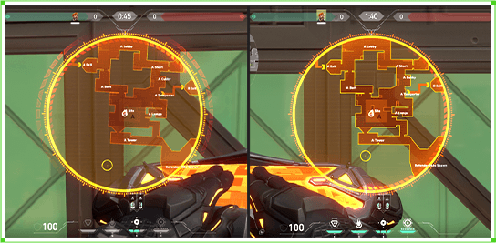
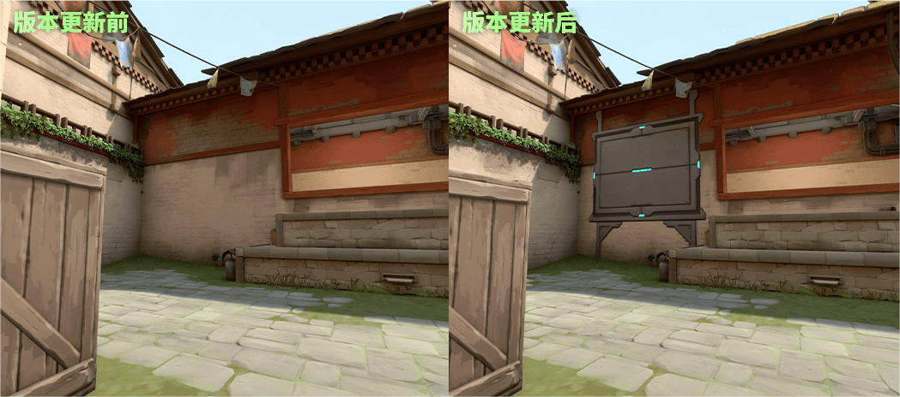
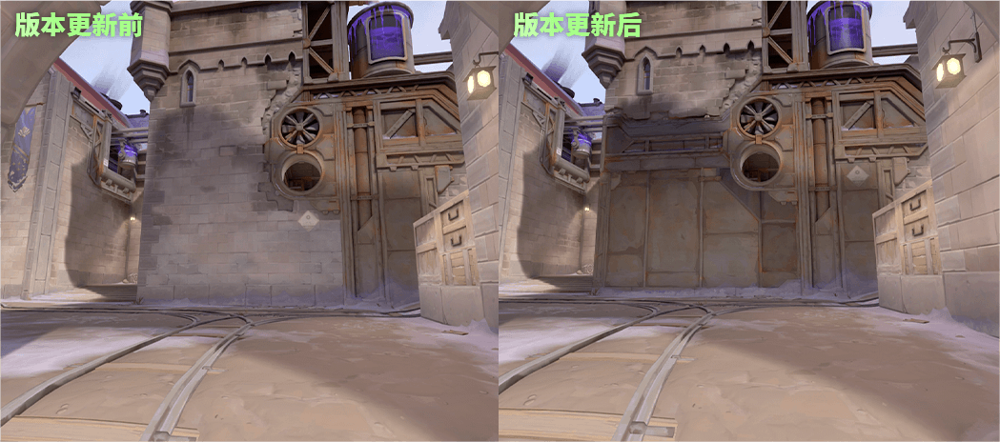
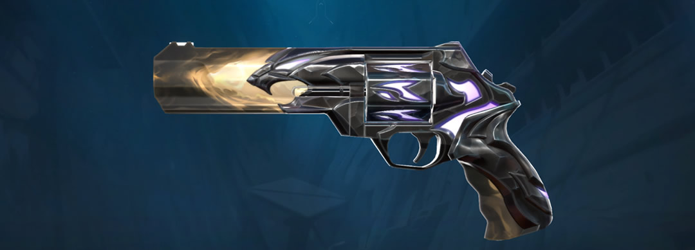

# 无畏契约 · 运营监控周报

> 第8周 (2026-02-16 ~ 2026-02-22) | 公众号: 无畏契约
> 生成时间: 2026-02-22 19:10

## 游戏信息

| 项目 | 内容 |
|------|------|
| 游戏名称 | 无畏契约 |
| 研发商 | Riot Games（拳头游戏） |
| 运营商 | 深圳市腾讯计算机系统有限公司 |
| 游戏类型 | 5V5战术射击端游 |
| 监控公众号 | 无畏契约 |
| 监控周期 | 2026-02-16 ~ 2026-02-22 |
| 数据来源1 | 微信公众号「无畏契约」 |
| 数据来源2 | 官网 https://val.qq.com/main.html |
| 数据来源3 | B站官方账号 https://space.bilibili.com/147546636/ |
| 备注 | 本周为农历春节假期核心阶段（除夕2/16至初六2/22），V26新赛季「时候正好」运营中，VCT CN启点赛已于2/9落幕 |

## 本周总览

**公众号文章数**: 8

**整体评估**: 本周为V26赛季「时候正好」运营期，叠加春节假期。核心运营策略为：(1) 「斗牛2v2」全新限时模式上线，提供春节期间轻量级组队娱乐选项；(2) VCT 2026赛季限定礼包（篆刀）限时发售，赛事IP转化为商业化收入；(3) 春节福利小程序+分阵营全民活动等社交裂变玩法持续运营；(4) 掠影3.0套装+怜悯英雄推广，维持版本内容新鲜度。VCT CN联赛启点赛已于2/9圆满落幕（AG/XLG/EDG出线圣地亚哥大师赛），本周进入赛后传播期。整体呈现'新模式+限定商业化+春节社交'的组合拳运营。

**本周要点**:

- 【斗牛2v2】大年初四（2/19）限时上线全新2v2匹配模式「斗牛」，纯枪法对决无技能，春节组队新玩法
- 【VCT 2026赛季限定】大年初四（2/20）上线VCT 2026赛季限定礼包，含「篆刀」近战武器+盘盘+动态卡面，限时发售
- 【掠影3.0套装】全新武器套装「掠影3.0」及回火礼包上线，延续经典掠影系列
- 【新英雄怜悯】新英雄「怜悯」已上线，官方发布推广视频
- 【春节福利小程序】搜索「无畏契约春节福利」小程序，完成任务获取皮蛋币可兑换R点和7款红包封面

### 监控维度统计

| 维度 | 优先级 | 动态数 |
|------|--------|--------|
| 玩法内容 | 🔴 高 | 4 |
| 活跃活动 | 🔴 高 | 3 |
| 商业化 | 🔴 高 | 3 |
| 内容营销 | 🟡 中 | 2 |
| 电竞赛事 | 🟡 中 | 2 |
| 其他重大事件 | ⚪ 低 | 1 |

## 玩法内容（🔴 高）

> 重大版本更新（新玩法、角色、地图、武器等T0）、不定期玩法活动（T1）

### 1. [T0] 限时模式「斗牛2v2」大年初四上线

- **日期**: 2026-02-19
- **详情**: 2月19日（大年初四）更新后，全新限时2v2匹配模式「斗牛」正式上线。该模式不依赖英雄技能，纯拼枪法对决，拉上搭子2人即可开黑。官方公众号发布「马住新年好搭子，一起双排，欢乐斗牛！」推广文章，强调春节轻量级组队娱乐定位。这是无畏契约首次推出2v2正式匹配模式。
- **来源**: [更新公告：大年初四，斗牛2v2匹配限时上线！](https://new.qq.com/rain/a/20260219A03BXP00)
- **玩家反馈**: 玩家对纯枪法模式反响积极，认为适合春节休闲组队

### 2. [T1] 新英雄「怜悯」正式上线

- **日期**: 2026-02-16
- **详情**: 官网首页显示「怜悯，来了！」推广视频（51秒），新英雄怜悯已在V26赛季中正式上线。同时铁臂迎来增强调整：Q-闪点爆破投射物速度提升20%（2000→2400），E-山崩地陷宽度从7.5米提升至8米。版本平衡性持续优化。
- **来源**: [【无畏契约】怜悯，来了！](https://val.qq.com/main.html)
- **玩家反馈**: 怜悯英雄的技能机制引发战术讨论，铁臂增强获得坦克位玩家好评

### 3. [T1] 新武器「追猎」加入武器库

- **日期**: 2026-02-16
- **详情**: V26新赛季加入全新武器「追猎」，官网发布2分27秒武器介绍视频。追猎定位介于鬼魅与正义之间，在半起局中为技能运用和枪法对拼都提供更多选择，丰富了经济博弈的战术空间。
- **来源**: [【无畏契约】追猎 // 武器介绍](https://val.qq.com/main.html)

### 4. [T2] 「爆能大乱斗」限时模式持续运营

- **日期**: 2026-02-16
- **详情**: 全新快节奏5v5限时模式「爆能大乱斗」持续开放。每回合随机分配英雄（同队不重复），无需拥有英雄即可使用，装备免费，技能可在回合中持续充能，地图各处散落终极能量球。2/19更新中对爆能大乱斗的装备进行了调整。
- **来源**: [全新限时模式「爆能大乱斗」](https://val.qq.com/)
- **玩家反馈**: 随机英雄机制广受欢迎，降低了新手入门门槛

## 活跃活动（🔴 高）

> 提高玩家活跃或留存的活动（节庆活动、限时任务、邀请好友等）

### 1. [T0] 春节福利小程序：皮蛋币兑换R点+红包封面

- **日期**: 2026-02-16
- **详情**: 搜索「无畏契约春节福利」微信小程序，打瓦完成任务获取皮蛋币，可兑换R点和7款超精美红包封面。通过微信小程序+游戏内任务联动，同时拉动微信生态流量和游戏内活跃。红包封面数量有限，手慢无。
- **来源**: [更新公告中提及春节福利小程序](https://new.qq.com/rain/a/20260219A03BXP00)
- **玩家反馈**: 红包封面社交裂变传播效果显著

### 2. [T1] 全民活动：「瓦，分阵营啦！」

- **日期**: 2026-02-16
- **详情**: 官网首页推出「全民活动：瓦，分阵营啦！」社区互动活动，玩家可选择阵营参与对决，增强社区归属感和竞争氛围。该活动贯穿V26赛季，本周春节期间持续运营。
- **来源**: [全民活动：瓦，分阵营啦！](https://val.qq.com/main.html)

### 3. [T1] 新年好搭子·斗牛双排号召

- **日期**: 2026-02-22
- **详情**: 公众号发布「马住新年好搭子，一起双排，欢乐斗牛！」推文，号召玩家在春节期间找到搭子一起体验2v2斗牛模式。文案突出「马年开黑不缺席」主题，结合春节社交属性拉动组队率。
- **来源**: [「马」住新年好搭子，一起双排，欢乐「斗牛」！](https://new.qq.com/rain/a/20260222A04HFF00)

## 商业化（🔴 高）

> 促进玩家消费的活动（IP联动、新皮肤上架、充值活动、售价变化等）

### 1. [T0] VCT 2026赛季限定礼包「篆刀」上线

- **日期**: 2026-02-20
- **详情**: 大年初四（2月20日）早上八点，VCT 2026赛季限定礼包正式上线主打商城。礼包包含「篆刀」近战武器、盘盘、动态卡面等独家内容。限时发售，下架后不会进入现售商店或夜市。以宝石璀璨光芒辉映冠军荣耀为主题，B站官方账号同步发布展示视频。该系列为电竞赛事IP衍生商业化产品，购买可支持VCT赛事生态。
- **来源**: [《无畏契约》锁定初四 VCT 2026赛季限定，篆刀明日登场](http://news.17173.com/content/02192026/215944921.shtml)
- **玩家反馈**: 篆刀近战武器设计获得玩家好评，限定属性提升购买意愿

### 2. [T1] 「掠影3.0」套装及回火礼包上线

- **日期**: 2026-02-16
- **详情**: 官网首页展示「掠影//3.0套装及回火礼包」已上线商城。掠影系列是无畏契约最经典的武器皮肤系列之一，3.0版本延续了掠影系列的科技感设计，配套回火礼包提供升级所需材料。回火礼包作为附加消费项，提升了套装的整体客单价。
- **来源**: [掠影//3.0套装及回火礼包](https://val.qq.com/main.html)
- **玩家反馈**: 掠影系列忠实粉丝积极购入3.0版本

### 3. [T2] V26赛季战斗通行证视觉更新

- **日期**: 2026-02-19
- **详情**: 2/19更新中同步更新了全新活动通行证与战斗通行证的视觉效果（1月8日至3月9日赛季）。战斗通行证为V26赛季核心付费内容之一，视觉升级提升了通行证吸引力。
- **来源**: [V26赛季战斗通行证](https://val.qq.com/)

## 内容营销（🟡 中）

> 创作者计划、热门内容、KOL直播等

### 1. [T1] B站官方账号高频视频输出

- **日期**: 2026-02-16
- **详情**: B站官方账号（无畏契约，UID:147546636）本周持续发布内容：VCT 2026篆刀限定展示（7万播放）、斗牛2v2模式预告（8.3万播放）、圣地亚哥大师赛赛制介绍（1.9万播放）、马年新春大事件合集（10万播放）等。通过B站视频矩阵实现内容覆盖。
- **来源**: [无畏契约B站官方账号](https://space.bilibili.com/147546636/)

### 2. [T2] 掌上无畏契约APP推广

- **日期**: 2026-02-16
- **详情**: 官网首页持续推广「掌上无畏契约」APP，主打查战绩、找搭子、拿福利、看每日商店四大功能。作为端游的移动端配套工具，增强玩家离线参与度和商城曝光。
- **来源**: [掌上无畏契约正式上线](https://val.qq.com/main.html)

## 电竞赛事（🟡 中）

> 重大赛事节点、高关注度赛事

### 1. [T0] VCT CN联赛启点赛落幕，AG/XLG/EDG出线圣地亚哥大师赛

- **日期**: 2026-02-16
- **详情**: 2月9日，V26无畏巡回广州站暨VCT CN联赛启点赛在广州保利世贸博览馆落幕。最终AG以3-2战胜XLG获得冠军，K1ra获赛事MVP。AG、XLG和EDG三支队伍获得圣地亚哥大师赛参赛资格。启点赛采用全新三败赛制，12支VCT CN联赛队伍经过三周鏖战，赛事热度较高。本周为赛后传播和内容产出期。B站发布圣地亚哥大师赛赛制介绍视频。
- **来源**: [V26无畏巡回广州站启点赛赛事落幕](https://space.bilibili.com/147546636/)
- **玩家反馈**: AG黑马之旅引发热议，K1ra选手人气飙升

### 2. [T1] 2026圣地亚哥大师赛赛制公布

- **日期**: 2026-02-16
- **详情**: B站官方发布「2026圣地亚哥大师赛赛制介绍」视频（1分45秒，1.9万播放），公布了VCT 2026年度首个国际大赛的赛制细节。AG、XLG和EDG将代表CN赛区出征，赛事关注度持续升温。
- **来源**: [2026圣地亚哥大师赛赛制介绍](https://space.bilibili.com/147546636/)
- **玩家反馈**: CN赛区玩家期待三支队伍的国际赛表现

## 其他重大事件（⚪ 低）

> 线下活动、品牌联动等

### 1. [T1] 无畏巡回广州站线下活动（赛后效应）

- **日期**: 2026-02-16
- **详情**: V26无畏巡回首站广州线下活动于1月22日至2月9日在广州保利世贸博览馆举办。虽主体活动已于上周结束，但本周仍有赛后内容传播、选手采访、精彩集锦等二次传播。无畏巡回作为VCT CN赛区的线下品牌活动，首次落地广州，对提升无畏契约在华南地区的品牌影响力有重要意义。官网首页仍保留「无畏巡回 首站福利」入口。
- **来源**: [无畏巡回 首站福利](https://val.qq.com/main.html)
- **玩家反馈**: 现场观赛玩家好评如潮，带动了周边商品销售

## 关注建议

- **[P0]** 重点关注: 限时模式「斗牛2v2」大年初四上线 — 竞品分析 | 2026-02-19
- **[P0]** 重点关注: 春节福利小程序：皮蛋币兑换R点+红包封面 — 竞品分析 | 2026-02-16
- **[P0]** 重点关注: VCT 2026赛季限定礼包「篆刀」上线 — 竞品分析 | 2026-02-20
- **[P1]** 跟踪玩家反馈: 限时模式「斗牛2v2」大年初四上线 — 用户研究 | 持续
- **[P1]** 跟踪玩家反馈: 春节福利小程序：皮蛋币兑换R点+红包封面 — 用户研究 | 持续
- **[P1]** 跟踪玩家反馈: VCT 2026赛季限定礼包「篆刀」上线 — 用户研究 | 持续

---

*数据来源: 微信公众号「无畏契约」 | 官网 https://val.qq.com/main.html | B站官方账号 https://space.bilibili.com/147546636/*

*游戏竞品运营监控 · 第8周 | 2026.02.22*