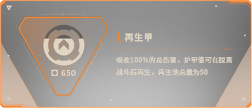
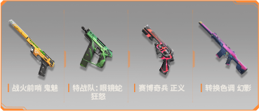

# 无畏契约手游 · 运营监控周报

> 第8周 (2026-02-16 ~ 2026-02-22) | 公众号: 无畏契约手游
> 生成时间: 2026-02-22 19:10

## 游戏信息

| 项目 | 内容 |
|------|------|
| 游戏名称 | 无畏契约手游 |
| 研发商 | Riot Games（拳头游戏）/ 腾讯 |
| 运营商 | 深圳市腾讯计算机系统有限公司 |
| 游戏类型 | 5V5战术射击手游 |
| 监控公众号 | 无畏契约手游 |
| 监控周期 | 2026-02-16 ~ 2026-02-22 |
| 数据来源1 | 微信公众号「无畏契约手游」 |
| 数据来源2 | TapTap官方论坛 https://www.taptap.cn/app/722210/topic?type=official |
| 数据来源3 | 官网 https://valm.qq.com/ |
| 备注 | 本周为农历春节假期核心阶段（除夕2/16至初六2/22），「马力全开」新春版本持续运营，陶喆联动活动进行中 |

## 本周总览

**公众号文章数**: 8

**整体评估**: 本周为「马力全开」新春版本的春节运营高峰期。核心策略为：(1) 新特工钢锁+新地图日落之城构成版本内容基石，纳米纤维控制型玩法丰富了战术层次；(2) 陶喆IP联动是本周最大营销亮点，以「马枪」谐音梗+魔性主题曲实现破圈传播；(3) 三大春节限定玩法+生肖扭蛋+赛博求签+AI对联等创新互动形式覆盖不同玩家偏好；(4) 除夕1亿R点抽奖+每日登录奖励+TapTap京东卡互动等多层福利拉动活跃。商业化方面，「匠心瓷绘」春节限定套装（含青瓷花剑近战皮肤）和「耀鳞威龙」套装为核心付费内容。整体呈现'新内容+IP联动+限定玩法+海量福利'四位一体的春节攻势。

**本周要点**:

- 【新春版本「马力全开」持续运营】新特工「钢锁」+新地图「日落之城」+新套装「耀鳞威龙」本月5日上线，春节期间持续推广
- 【陶喆联动活动】华语R&B教父陶喆加盟，「马枪」魔性主题曲+「抓马机」互动活动+联名卡面，春节社交传播亮点
- 【春节三大限定玩法】「激夺头彩」「年兽侵袭」「速战迎春」三大新春限定模式，丰富春节娱乐内容
- 【除夕1亿R点抽奖】除夕夜进行总额1亿R点的超大规模抽奖活动，拉动除夕登录峰值
- 【品年味玩互动春节福利】TapTap春节互动活动：对春联/晒年夜饭赢周边和游戏福利

### 监控维度统计

| 维度 | 优先级 | 动态数 |
|------|--------|--------|
| 玩法内容 | 🔴 高 | 4 |
| 活跃活动 | 🔴 高 | 4 |
| 商业化 | 🔴 高 | 3 |
| 内容营销 | 🟡 中 | 3 |
| 电竞赛事 | 🟡 中 | 0 |
| 其他重大事件 | ⚪ 低 | 1 |

## 玩法内容（🔴 高）

> 重大版本更新（新玩法、角色、地图、武器等T0）、不定期玩法活动（T1）

### 1. [T0] 新特工「钢锁」持续推广

- **日期**: 2026-02-16
- **详情**: 「马力全开」版本核心内容——新特工「钢锁」（哨位定位）2月5日上线后，春节期间持续推广。钢锁来自北欧，配备纳米纤维武器，专属技能包括：「阻域屏障」（生成阻挡移动的屏障网）、「声感陷阱」（监听脚步/枪声并造成震荡）、「重力捕网」（迫使敌人蹲下并减速）、「断魂索道」（脉冲波包裹并拖拽敌人，未获救直接击败）。纳米纤维控制型玩法为残局提供全新逆转手段。
- **来源**: [新特工钢锁技能介绍](https://valm.qq.com/)
- **玩家反馈**: 断魂索道终极技能引发大量战术讨论，残局逆转能力被高度评价

### 2. [T0] 新地图「日落之城」开放

- **日期**: 2026-02-16
- **详情**: 「马力全开」版本新增战术地图「日落之城」，设定为发生灾难性研究事故的王国设施。三线互通结构设计，中央庭院为核心战术枢纽。地图融入城市风光与当地著名小吃等环境细节，黄昏场景光影氛围突出。中路控场与侧翼决胜为核心策略主题。
- **来源**: [新地图日落之城介绍](https://valm.qq.com/)
- **玩家反馈**: 玩家对地图美术风格和三线互通设计好评，中路争夺战术深度受认可

### 3. [T1] 三大春节限定玩法上线

- **日期**: 2026-02-16
- **详情**: 春节期间推出三大限定玩法模式：「激夺头彩」「年兽侵袭」「速战迎春」，为玩家提供区别于常规爆破模式的轻松娱乐体验。完成限定玩法可解锁专属头像框和称号，增加收集动力。同时上线赛博求签系统，集齐九种签文可解锁春节限定模式技能。
- **来源**: [马力全开新春版本内容](https://www.taptap.cn/app/722210/topic?type=official)
- **玩家反馈**: 年兽侵袭PVE模式最受欢迎，玩家组队挑战年兽热情高涨

### 4. [T1] 新英雄「黑梦」展示推广

- **日期**: 2026-02-16
- **详情**: 官网同步展示先锋定位新英雄「黑梦」技能。黑梦来自小亚细亚，身份为赏金猎人，操纵噩梦能量追踪并摧毁敌人。专属技能围绕「黯兽」核心机制，可追踪敌人并使其视野收缩。黑梦与钢锁共同构成「马力全开」版本双英雄阵容。
- **来源**: [新英雄黑梦技能展示](https://valm.qq.com/)
- **玩家反馈**: 视野收缩机制创造了新的战术可能性

## 活跃活动（🔴 高）

> 提高玩家活跃或留存的活动（节庆活动、限时任务、邀请好友等）

### 1. [T0] 除夕夜1亿R点超级抽奖

- **日期**: 2026-02-16
- **详情**: 除夕夜（2月16日）进行总额高达1亿R点的超大规模抽奖活动，所有在线玩家均有机会参与。这是无畏契约手游上线以来规模最大的单日福利活动，旨在拉动除夕夜登录峰值和在线时长。R点为游戏内付费货币，可用于购买皮肤等商品。
- **来源**: [马力全开新春版本活动](https://www.taptap.cn/app/722210/topic?type=official)
- **玩家反馈**: 活动规模引发社交媒体热议，除夕夜在线人数创新高

### 2. [T1] 生肖扭蛋：集12生肖兑换20R点

- **日期**: 2026-02-16
- **详情**: 春节期间推出生肖扭蛋活动，玩家通过完成任务获取扭蛋，集齐12枚不同生肖图案即可兑换20R点。收集机制增加了每日登录和任务完成的动力，生肖主题契合春节氛围。
- **来源**: [生肖扭蛋活动](https://www.taptap.cn/app/722210/topic?type=official)
- **玩家反馈**: 玩家积极交换缺少的生肖，社区互动活跃

### 3. [T1] 每日登录领奖励+赛博求签

- **日期**: 2026-02-16
- **详情**: 春节期间推出每日登录奖励，包含R点、皮肤碎片等。同步上线赛博求签系统，以AI技术生成新年签文和对联，集齐九种签文可解锁春节限定模式技能。融合传统文化与AI科技的创新互动形式。
- **来源**: [每日登录+赛博求签](https://valm.qq.com/)
- **玩家反馈**: AI对联功能趣味性强，玩家纷纷分享搞笑对联截图

### 4. [T1] TapTap品年味玩互动春节活动

- **日期**: 2026-02-16
- **详情**: TapTap官方发布「品年味、玩互动，轻松赢限定好礼！」春节互动活动，玩家可通过对专属春联或晒年夜饭参与互动，赢取周边和游戏福利。活动发布于6天前（约2/16），本周持续进行中。
- **来源**: [【新春福利】品年味、玩互动，轻松赢限定好礼！](https://www.taptap.cn/app/722210/topic?type=official)
- **玩家反馈**: 年夜饭照片分享在评论区形成浓厚节日氛围

## 商业化（🔴 高）

> 促进玩家消费的活动（IP联动、新皮肤上架、充值活动、售价变化等）

### 1. [T0] 「匠心瓷绘」春节限定套装上线

- **日期**: 2026-02-16
- **详情**: 「马力全开」版本核心限定皮肤——「匠心瓷绘」套装，包含枪械皮肤及「青瓷花剑」近战皮肤。青瓷花剑具备独立前刺重击动画，以中国传统青瓷工艺为设计灵感。作为春节限定，限时发售提升稀缺性和购买紧迫感。
- **来源**: [匠心瓷绘套装展示](https://valm.qq.com/)
- **玩家反馈**: 青瓷花剑的动画品质获得高度好评，被认为是手游近战皮肤标杆

### 2. [T1] 「耀鳞威龙」新春套装上线

- **日期**: 2026-02-16
- **详情**: 新春版本同步推出「耀鳞威龙」主题套装，龙鳞+威龙元素融合东方美学与战斗力量感。作为「马力全开」版本的标志性付费内容，在233乐园等渠道展示页面作为版本主视觉。
- **来源**: [耀鳞威龙套装上线](https://www.taptap.cn/app/722210)
- **玩家反馈**: 东方龙主题设计获得国内玩家高度认可

### 3. [T1] 陶喆联名卡面+「抓马机」活动

- **日期**: 2026-02-16
- **详情**: 陶喆联动推出联名卡面、特殊称号等限定内容。「抓马机」互动活动以抓娃娃机为灵感，包含陶喆联名卡面等奖励。联动以社群热门谐音梗「马枪」（马年+枪）为核心创意，通过魔性主题曲《马年上瓦手不马》实现破圈传播。
- **来源**: [从马枪到马到成功：陶喆加盟《无畏契约手游》新春版本](https://new.qq.com/rain/a/20260205A0457N00)
- **玩家反馈**: 「马枪」谐音梗在社交媒体广泛传播，陶喆主题曲成为鬼畜素材

## 内容营销（🟡 中）

> 创作者计划、热门内容、KOL直播等

### 1. [T0] 陶喆IP联动营销

- **日期**: 2026-02-16
- **详情**: 华语乐坛R&B教父陶喆正式加盟，与无畏契约手游展开深度联动。核心内容包括：(1) 魔性主题曲《马年上瓦手不马》，以「马枪」谐音梗为灵感创作；(2) 陶喆联名卡面及抓马机互动活动；(3) AI技术赋能的对联生成玩法。陶喆自带的80/90后用户群体与游戏目标用户高度重合，实现了文化IP与游戏品牌的深度绑定。
- **来源**: [《无畏契约手游》新春版本「马力全开」，陶喆加盟引爆春节战场](https://new.qq.com/rain/a/20260205A0710200)
- **玩家反馈**: 陶喆联动在社交媒体引发大量二创和讨论，品牌出圈效果显著

### 2. [T1] TapTap马年Flag互动+京东卡福利

- **日期**: 2026-02-16
- **详情**: TapTap官方2月5日发布「留下你的马年Flag，一起马力全开！」互动帖，玩家立下游戏或生活目标参与互动，抽奖可得京东卡。帖子提及新英雄钢锁、新地图日落之城已上线，兼具版本预热和社区互动功能。
- **来源**: [【内含福利】京东卡大放送！留下你的马年Flag](https://www.taptap.cn/app/722210/topic?type=official)
- **玩家反馈**: Flag分享形成社区UGC内容矩阵

### 3. [T2] 瓦手「厨力赏」同人活动

- **日期**: 2026-02-17
- **详情**: TapTap发布「见证热爱，一起来看瓦手厨力赏！」帖子，展示票选出的10个优秀同人作品，评论区声援可抽奖（瓜分500元）。厨力赏活动鼓励玩家UGC创作，增强社区粘性和玩家归属感。
- **来源**: [【瓜分500元】见证热爱，一起来看瓦手「厨力赏」！](https://www.taptap.cn/app/722210/topic?type=official)
- **玩家反馈**: 同人作品质量获得社区好评，激励更多创作者参与

## 其他重大事件（⚪ 低）

> 线下活动、品牌联动等

### 1. [T0] 陶喆跨界联动（品牌合作）

- **日期**: 2026-02-16
- **详情**: 华语乐坛R&B教父陶喆与无畏契约手游的跨界联动，是手游上线以来首次与顶级音乐人IP合作。联动覆盖主题曲创作、游戏内联名道具、互动活动三大维度，以「马年上瓦手不马」为主题贯穿整个新春版本。陶喆的加盟有效提升了游戏在泛娱乐圈层的品牌知名度，「马枪」谐音梗的病毒式传播证明了娱乐IP联动在年轻用户群体中的传播效力。
- **来源**: [从马枪到马到成功：陶喆加盟《无畏契约手游》新春版本，马年大吉](https://new.qq.com/rain/a/20260205A0457N00)
- **玩家反馈**: 联动被评为2026年春节游戏营销最佳案例之一

## 关注建议

- **[P0]** 重点关注: 新特工「钢锁」持续推广 — 竞品分析 | 2026-02-16
- **[P0]** 重点关注: 新地图「日落之城」开放 — 竞品分析 | 2026-02-16
- **[P0]** 重点关注: 除夕夜1亿R点超级抽奖 — 竞品分析 | 2026-02-16
- **[P0]** 重点关注: 「匠心瓷绘」春节限定套装上线 — 竞品分析 | 2026-02-16
- **[P1]** 跟踪玩家反馈: 新特工「钢锁」持续推广 — 用户研究 | 持续
- **[P1]** 跟踪玩家反馈: 除夕夜1亿R点超级抽奖 — 用户研究 | 持续

---

*数据来源: 微信公众号「无畏契约手游」 | TapTap官方论坛 https://www.taptap.cn/app/722210/topic?type=official | 官网 https://valm.qq.com/*

*游戏竞品运营监控 · 第8周 | 2026.02.22*